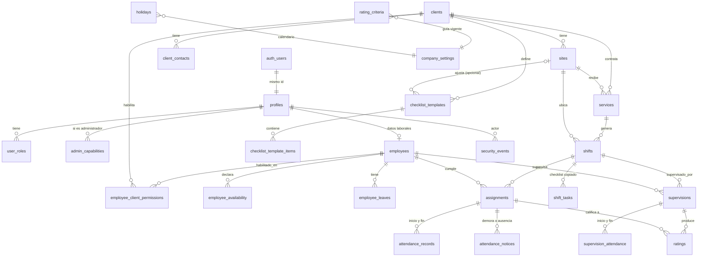

# Base de datos

Fuente: `04_Modelo_de_Datos.md` (`Docs/Plan_Maestro/` fuera de este repo), completo. Este
archivo resume lo que ya está aplicado en `App_dev` y cómo trabajar sobre `supabase/`; el modelo
completo (todas las tablas, RLS, vistas, RPC) sigue siendo la fuente de verdad y se cita por
sección. Se actualiza en el mismo PR que agregue o cambie algo de lo que describe (crece
paquete a paquete, F4 en adelante).

## Motor y entornos

Postgres 17 (`17.6.1.166` verificado en `App` y `App_dev`, ADR-021) en dos proyectos Supabase de
la organización `bpcfjqvpdfmepiohltbz`: `App` (producción, ref `fysuppdadwvabrjpnnoh`) y
`App_dev` (desarrollo y staging, ref `anesttvrnpsaaaxaquce`). Sin Supabase local (ADR-014): las
migraciones se escriben y se aplican contra `App_dev` con `pnpm db:push`; Docker se prende solo
como herramienta para correr pgTAP y los tests de la Edge Function (ADR-023). Detalle de cuentas
y variables en `docs/environments.md`.

## Diagrama de entidades (04 sección 1)

Reproducido de `04_Modelo_de_Datos.md` sección 1 (DOC-004, P04.6): mismo diagrama, no se
duplica ni se actualiza por separado -- si el modelo cambia una relación, este bloque se copia de
nuevo desde ahí en el mismo PR.



## Convenciones (04 sección 0)

| Convención     | Regla                                                                                                                                                                                                                                                                                                                                                         |
| -------------- | ------------------------------------------------------------------------------------------------------------------------------------------------------------------------------------------------------------------------------------------------------------------------------------------------------------------------------------------------------------- |
| Esquemas       | `public` para las tablas y vistas de negocio; `app` para funciones auxiliares de permisos, trazabilidad y utilidades. Nunca al revés.                                                                                                                                                                                                                         |
| Nombres        | Identificadores en inglés, `snake_case`, tablas en plural. Las etiquetas que ve el usuario van en español con voseo.                                                                                                                                                                                                                                          |
| Claves         | `id uuid default gen_random_uuid()` en todas las tablas, salvo `profiles` (mismo `id` que `auth.users`) y `company_settings` (fila única).                                                                                                                                                                                                                    |
| Trazabilidad   | `created_at timestamptz default now()`, `updated_at timestamptz` (mantenido por el trigger `app.set_updated_at`), `created_by uuid`, `updated_by uuid` en toda tabla de negocio.                                                                                                                                                                              |
| Baja lógica    | `deleted_at timestamptz null` en los maestros. Nada se borra físicamente; las políticas RLS de roles no administrativos filtran `deleted_at is null`.                                                                                                                                                                                                         |
| Fechas y horas | Instantes en `timestamptz` (UTC en disco). Fechas de calendario en `date`, franjas en `time`, interpretadas siempre en `America/Argentina/Buenos_Aires` (única zona del sistema, ADR-019) con `app.local_ts(date, time)`. La hora de cada registro la pone `now()` dentro de la función SQL, nunca el reloj del cliente. Sin turnos que crucen la medianoche. |
| Estados        | Enumeraciones de Postgres (sección siguiente). Las transiciones válidas se verifican dentro de las funciones RPC. Los estados derivados ("sin cubrir", "sin registro", "próximo", "salida anticipada") se calculan en vistas y no se persisten.                                                                                                               |
| Coordenadas    | `latitude`/`longitude numeric(9,6)`, `accuracy_m numeric(7,1)`. Sin PostGIS: no hay cálculos geográficos en la Base.                                                                                                                                                                                                                                          |
| Acceso         | Todo acceso del frontend pasa por PostgREST con RLS. Las operaciones con reglas usan funciones `security definer` que verifican rol y capacidad adentro, con `search_path` fijo. Nunca `service_role` en el navegador.                                                                                                                                        |

## Esquema `app`

Funciones auxiliares de permisos, trazabilidad y utilidades (04 sección 5). No contiene tablas.

De `0001_extensions_and_schema_app.sql` (DB-001):

| Función                          | Firma                                          | Uso                                                                                                                                                                                                                                                                                                                                                                                                        |
| -------------------------------- | ---------------------------------------------- | ---------------------------------------------------------------------------------------------------------------------------------------------------------------------------------------------------------------------------------------------------------------------------------------------------------------------------------------------------------------------------------------------------------- |
| `app.set_updated_at()`           | `() returns trigger`                           | Trigger `before update`: fija `updated_at = now()`. Se agrega en cada tabla de negocio con esa columna, desde `0003` en adelante.                                                                                                                                                                                                                                                                          |
| `app.local_ts(p_date, p_time)`   | `(date, time) returns timestamptz` `immutable` | Instante UTC de una fecha y hora locales de Argentina. Base de las columnas generadas `starts_at`/`ends_at` de `shifts` (04 sección 2.3, migración `0007`). Inmutable porque la zona no tiene horario de verano desde 2009 (ADR-019): el desplazamiento (`-03:00`) es constante todo el año, se verificó con una fecha de enero y una de julio (`supabase/tests/0001_extensions_and_schema_app.test.sql`). |
| `app.valid_weekdays(p_weekdays)` | `(smallint[]) returns boolean` `immutable`     | Verdadero si el arreglo no es nulo, tiene al menos un valor, todos entre 0 (domingo) y 6 (sábado), sin repetidos. Usada por el check de `services.weekdays` (04 sección 2.3, migración `0007`, todavía no escrita).                                                                                                                                                                                        |

De `0003_profiles_roles_capabilities.sql` (DB-003, DB-004, DB-005; todas con
`set search_path = public, app, pg_temp`, como exige `03_Plan_Maestro_Tecnico.md` sección 15):

| Función                                | Firma                                               | Uso                                                                                                                                     |
| -------------------------------------- | --------------------------------------------------- | --------------------------------------------------------------------------------------------------------------------------------------- |
| `app.jwt_roles()`                      | `() returns app_role[]` `stable`                    | Roles de la sesión actual (claim `roles` del JWT, sección 7.1). Arreglo vacío si no hay ninguno.                                        |
| `app.jwt_capabilities()`               | `() returns text[]` `stable`                        | Capacidades de la sesión actual (claim `capabilities`, solo se completa para `admin`). Arreglo vacío si no hay ninguna.                 |
| `app.has_role(p_role)`                 | `(app_role) returns boolean` `stable`               | True si la sesión tiene ese rol.                                                                                                        |
| `app.is_admin()`                       | `() returns boolean` `stable`                       | True si la sesión es `owner` o `admin`.                                                                                                 |
| `app.has_capability(p_capability)`     | `(admin_capability) returns boolean` `stable`       | True para `owner` siempre; para `admin`, si la capacidad está en el JWT.                                                                |
| `app.require_role(variadic p_roles)`   | `(app_role[]) returns void` `stable`                | Corta con `FORBIDDEN` si la sesión no tiene ninguno de los roles indicados.                                                             |
| `app.require_admin()`                  | `() returns void` `stable`                          | Corta con `FORBIDDEN` si la sesión no es `owner` ni `admin`.                                                                            |
| `app.require_capability(p_capability)` | `(admin_capability) returns void` `stable`          | Corta con `FORBIDDEN` si la sesión no tiene la capacidad indicada.                                                                      |
| `app.handle_new_user()`                | `() returns trigger` `security definer`             | Trigger `after insert on auth.users`: crea la fila de `profiles` (nombre y apellido desde `raw_user_meta_data`; si faltan, queda `''`). |
| `app.prevent_last_owner_removal()`     | `() returns trigger`                                | Trigger `before delete or update on user_roles`: rechaza (`LAST_OWNER`) quitar el rol `owner` a la última persona que lo tiene.         |
| `app.custom_access_token_hook(event)`  | `(jsonb) returns jsonb` `stable` `security definer` | Hook de Auth (sección siguiente).                                                                                                       |

De `0004_company_holidays_security_events.sql` (DB-006):

| Función                                                                             | Firma                                                                                       | Uso                                                                                                                                                                                                                                                                                                                                                                                                                    |
| ----------------------------------------------------------------------------------- | ------------------------------------------------------------------------------------------- | ---------------------------------------------------------------------------------------------------------------------------------------------------------------------------------------------------------------------------------------------------------------------------------------------------------------------------------------------------------------------------------------------------------------------- |
| `app.log_security_event(p_event_type, p_actor_id, p_target_id?, p_details?, p_ip?)` | `(security_event_type, uuid, uuid, jsonb, inet) returns security_events` `security definer` | Inserta una fila en `security_events` y la devuelve (04 sección 5). Uso interno: solo la llaman funciones `security definer` del sistema (dueñas: `postgres`, igual que la función); no es una RPC de la sección 9, así que se le revocó el `execute` que Postgres concede a `public` por defecto -- verificado en `App_dev` que `authenticated` recibe `permission denied for function log_security_event` (`42501`). |

De `0007_services_shifts_assignments.sql` (DB-009):

| Función                        | Firma                                                | Uso                                                                                                                                                                                                                                                                                                                                       |
| ------------------------------ | ---------------------------------------------------- | ----------------------------------------------------------------------------------------------------------------------------------------------------------------------------------------------------------------------------------------------------------------------------------------------------------------------------------------- |
| `app.sync_assignment_window()` | `() returns trigger`                                 | Trigger: mantiene `assignments.shift_date`/`"window"` (rango `[)` en UTC de la franja efectiva). `before insert or update of shift_id, start_time, end_time on assignments` recalcula la fila propia; `after update of shift_date, start_time, end_time on shifts` recalcula las asignaciones vigentes del turno (04 sección 2.3, P-053). |
| `app.current_employee_id()`    | `() returns uuid` `stable` `security definer`        | `auth.uid()` si la sesión tiene fila en `employees` (cualquiera sea su `status`), `null` si no. `security definer` porque `employees` ya tiene RLS habilitada y la función se evalúa dentro de políticas de otras tablas desde `0012`.                                                                                                    |
| `app.shares_shift(p_shift_id)` | `(uuid) returns boolean` `stable` `security definer` | True si la sesión tiene una asignación vigente (`removed_at is null`) en ese turno (P-103, "ver compañeros").                                                                                                                                                                                                                             |

De `0010_supervisions_ratings.sql` (DB-012):

| Función                            | Firma                                                | Uso                                                                                                                             |
| ---------------------------------- | ---------------------------------------------------- | ------------------------------------------------------------------------------------------------------------------------------- |
| `app.supervises_shift(p_shift_id)` | `(uuid) returns boolean` `stable` `security definer` | True si la sesión tiene una supervisión no cancelada sobre ese turno. Pendiente desde `0007` porque dependía de `supervisions`. |

Con esto queda completa la sección 5 del modelo (todas las funciones auxiliares de `app` ya
existen).

De `0011_views.sql` (DB-013), auxiliar nuevo -- no está en la lista de la sección 5 del modelo,
se agrega para las columnas derivadas de las vistas que necesitan "hoy" en Argentina:

| Función       | Firma                      | Uso                                                                                                                                             |
| ------------- | -------------------------- | ----------------------------------------------------------------------------------------------------------------------------------------------- |
| `app.today()` | `() returns date` `stable` | Fecha de hoy en `America/Argentina/Buenos_Aires` (ADR-019). Usada por `v_employees` (licencia vigente) y `v_my_day` (ventana de 7 días, P-093). |

Además, `0001` agrega la extensión `btree_gist` (esquema `extensions`), que usan las
restricciones de exclusión de `employee_leaves` (`0006`) y `assignments` (`0007`).

## Personas y acceso (04 sección 2.1, migración `0003`)

`profiles` (una fila por persona con usuario; `id` = `auth.users.id`, la crea
`app.handle_new_user()`), `user_roles` (roles por persona, PK `(profile_id, role)`, ADR-007) y
`admin_capabilities` (capacidades por administrador, PK `(profile_id, capability)`, ADR-006). El
owner tiene todas las capacidades implícitamente y no aparece en esta tabla. La regla "siempre
queda al menos un owner" la aplica el trigger `app.prevent_last_owner_removal()` (código de error
`LAST_OWNER`, antes de borrar o actualizar la última fila `owner` de `user_roles`).

**RLS habilitada, todavía sin políticas.** Las tres tablas nacen con
`alter table ... enable row level security` en la misma migración que las crea, aunque las
políticas de la sección 7.2 llegan recién en `0012_rls_policies.sql` (DB-014). Esto no es
opcional: se verificó en `App_dev` que el ACL por defecto del esquema `public` ya concede
`select/insert/update/delete` a `anon` y a `authenticated` en cuanto `postgres` crea una tabla
ahí (`select * from pg_default_acl where defaclnamespace = 'public'::regnamespace`), así que sin
`enable row level security` inmediato cualquier tabla nueva quedaría expuesta por PostgREST desde
el momento en que la migración se aplica y hasta que 0012 agregue las políticas -- inaceptable
porque `App_dev` también sirve de staging. **Toda migración de acá en adelante que cree una tabla
tiene que habilitar RLS en el mismo archivo**, aunque sus políticas lleguen después. Mientras no
hay políticas, el acceso queda denegado a todos salvo el dueño de la tabla y los roles con el
atributo `bypassrls` (`postgres`, `service_role`; se comprobó con
`select rolname, rolbypassrls from pg_roles` que ni `authenticated`/`anon` ni
`supabase_auth_admin` lo tienen).

`authenticated` tiene `usage` sobre el esquema `app` desde esta migración (antes no tenía ni eso,
verificado con `has_schema_privilege`): sin ese grant de esquema, ninguna política RLS que use
`app.has_role(...)` (o cualquier otra función auxiliar) podría evaluarse desde una sesión
autenticada en `0012`, sin importar el `execute` de la función en sí (Postgres ya concede
`execute` a `public` -- y por lo tanto a `anon`/`authenticated` -- al crear una función nueva,
salvo que se revoque explícitamente). No se le da a `anon`, que no participa de ninguna política
basada en rol (sección 7.2: "anon solo `v_public_branding`").

## Hook de Auth: `app.custom_access_token_hook` (04 sección 7.1, DB-004; endurecido en 0016)

Agrega los claims `roles` (siempre) y `capabilities` (solo si el rol `admin` está entre los
roles de la persona) a cada JWT, leyendo `user_roles`/`admin_capabilities`. **Desde
`0016_hardening.sql`**, antes de leer esas tablas verifica que exista una fila en `profiles` con
`is_active = true` y `deleted_at is null` para ese `user_id`; si no (inactivo, dado de baja, o
-- caso defensivo -- la fila de `profiles` todavía no existe), arma `roles`/`capabilities` vacíos
sin lanzar excepción: el hook nunca corta el login del sistema entero, solo le deja a esa persona
un JWT sin ningún rol (`RequireRole` y las políticas RLS la mandan a COM-05 "sin acceso"). Antes
de esa migración, una persona desactivada seguía recibiendo roles en cualquier JWT que se le
emitiera hasta que se le revocaran las sesiones aparte. Habilitado en
`supabase/config.toml` (`[auth.hook.custom_access_token]`, `uri =
"pg-functions://postgres/app/custom_access_token_hook"`) y aplicado a `App_dev` con
`pnpm exec supabase config push` (`docs/environments.md` tiene el detalle de cuentas y el
comando para que Mike lo aplique a `App` cuando corresponda).

Sigue el patrón oficial de Supabase para el "Custom Access Token Hook"
(<https://supabase.com/docs/guides/auth/auth-hooks/custom-access-token-hook>): firma
`(event jsonb) returns jsonb` que devuelve el mismo `event` con `claims` modificado
(`jsonb_set`), y los grants que solo permiten invocarlo a `supabase_auth_admin`:

```sql
grant usage on schema app to supabase_auth_admin;
grant execute on function app.custom_access_token_hook(jsonb) to supabase_auth_admin;
revoke execute on function app.custom_access_token_hook(jsonb) from public, anon, authenticated;
```

Verificado en `App_dev`: `authenticated` recibe `permission denied for function
custom_access_token_hook` (`42501`) al intentar llamarlo.

**Diferencia deliberada con el ejemplo oficial:** la documentación de Supabase no marca su
función de ejemplo `security definer` y en cambio le da a `supabase_auth_admin` acceso directo a
la tabla que consulta. Acá no alcanza, porque esta base habilita RLS en cuanto crea cada tabla
(sección anterior) y `supabase_auth_admin` **no** tiene el atributo `bypassrls` (verificado con
`select rolbypassrls from pg_roles`; sí lo tienen `postgres` y `service_role`). Por eso
`app.custom_access_token_hook` es `security definer`: corre con los permisos de quien aplicó la
migración, sin pasar por RLS, y no hace falta darle a `supabase_auth_admin` acceso directo a
`user_roles`/`admin_capabilities`.

## Configuración y seguridad (04 sección 2.6, migración `0004`)

`company_settings` (singleton, `id smallint primary key check (id = 1)`: nombre, logo -- bucket
`branding` --, teléfono de soporte, texto de consentimiento de ubicación, `updated_by`/
`updated_at`; sin `created_at`/`created_by`, mismo criterio que `admin_capabilities` en `0003` --
`updated_at` nace `not null default now()` en vez de en null, porque es el único rastro temporal
de la fila). La fila la crea el seed (`DB-019`/`DB-020`), no esta migración: `App_dev` queda con
la tabla vacía hasta ese paquete (probado con el chequeo de RLS sin políticas).

`holidays` (`id`, `holiday_date unique`, `name`, traza + `deleted_at`; ni `holiday_date` ni
`name` se anotaron `not null` porque el modelo tampoco lo hace para esta tabla, a diferencia de
otras fechas del sistema como `shifts.shift_date`). `generate_shifts` (`0013`) la va a usar para
no crear turnos de servicios con `works_on_holidays = false`.

`security_events` (`id`, `event_type not null`, `actor_id`/`target_id` -- ambos referencian
`profiles.id`, igual criterio que `user_roles.granted_by` en `0003`: el nombre ya dice que
apuntan a una persona --, `details jsonb`, `ip inet`, `created_at`). Tabla de solo inserción: sin
`updated_at`/`updated_by`/`deleted_at`. Índices de 04 sección 8: `(created_at desc)` y
`(actor_id)`. Se escribe únicamente a través de `app.log_security_event(...)` (sección anterior),
desde funciones `security definer` del sistema o desde la Edge Function `admin-users` (conexión
`service_role`, que hace `insert` directo porque `bypassrls` la exime de RLS sin pasar por esta
función).

Las tres tablas nacen con RLS habilitada y sin políticas (llegan en `0012`, DB-014).

### Registro del inicio de sesión (04 sección 2.6, P-104; migración `0019`, AUTH-009)

`app.log_sign_in()`: trigger `after insert on auth.sessions` que inserta un evento `sign_in` en
`security_events` en cada inicio de sesión real (`04` sección 2.6, P-104). `06_API.md` sección 1
dejaba la vía PROPUESTA entre dos alternativas (trigger sobre `auth.sessions` o Edge Function
`log-sign-in`); se confirmó el trigger con evidencia en vivo contra `App_dev`:

- El rol con el que corren las migraciones puede crear el trigger (probado con `create trigger`
  dentro de una transacción con `rollback`).
- Columnas reales de `auth.sessions` en esta versión de GoTrue (Postgres 17.6.1.166):
  `id`, `user_id`, `created_at`, `updated_at`, `factor_id`, `aal`, `not_after`, `refreshed_at`,
  `user_agent`, `ip`, `tag`, `oauth_client_id`, `refresh_token_hmac_key`,
  `refresh_token_counter`, `scopes`. El evento guarda `actor_id` (`user_id`), `ip` y, en
  `details`, el `session_id` y el `user_agent`.
- `auth.sessions` es la tabla correcta: un login real (`grant_type=password`) contra una cuenta
  del seed creó una fila nueva; un refresco posterior del token (`grant_type=refresh_token`) de
  esa misma sesión actualizó la fila existente (mismo `id`) en vez de crear una nueva. Un trigger
  `after insert` dispara entonces una vez por sesión real (una por dispositivo/pestaña), no en
  cada refresco automático del cliente (`autoRefreshToken`). La Admin API (creación de usuario,
  reseteo de contraseña, cierre de sesión) no inserta filas en `auth.sessions`, así que la Edge
  Function `admin-users` (F7) no va a disparar `sign_in` espurios.

**Lo central de la tarea: un fallo al registrar el evento no puede cortar el login.**
`security_events.actor_id` referencia `profiles(id)` sin `on delete`/`on update` especial: si esa
fila no existiera todavía cuando se crea la sesión (no debería pasar -- `app.handle_new_user()`
crea `profiles` en la misma transacción del alta en `auth.users`, y toda alta pasa por la Edge
Function `admin-users` o `scripts/seed-dev.ts` -- pero "no debería" no es "no puede"), la llamada
a `app.log_security_event(...)` cortaría por violación de clave foránea. Por eso
`app.log_sign_in()` envuelve esa llamada en su propio bloque `exception when others`: cualquier
error se atrapa ahí, se deja un `raise warning` en los logs de Postgres (mensaje
`app.log_sign_in: ...`) y la función igual devuelve `new`, así el `insert` original en
`auth.sessions` -- y con él, todo el login -- se completa sin enterarse de que el registro del
evento falló. Probado en vivo (transacción con `rollback`, sin dejar rastro): con un `user_id`
sin `profiles` correspondiente, el `insert` en `auth.sessions` vive igual y `security_events`
queda en cero filas para ese actor.

Riesgo de una actualización futura de GoTrue: el trigger vive en `auth.sessions`, objeto del
esquema `auth` gestionado por Supabase -- mismo riesgo que corre `trg_handle_new_user` sobre
`auth.users` desde `0003` (DB-004). Si GoTrue agrega/renombra una columna que el trigger usa, la
función sigue existiendo pero falla en tiempo de ejecución (atrapado por el `exception`, sin
avisar); se detecta revisando los `WARNING` en Logs > Postgres Logs del panel, o notando que
`security_events` deja de sumar filas `sign_in` pese a haber logins. Si GoTrue recrea
`auth.sessions` entera (`drop table` + `create table`, no solo `alter table`), el trigger
desaparece con la tabla y no vuelve a crearse solo: se detecta con `select tgname from pg_trigger
where tgrelid = 'auth.sessions'::regclass` después de cualquier actualización de versión de
Supabase notificada por la plataforma, y hace falta una migración nueva para recrearlo.

## Clientes y sedes (04 sección 2.2, migración `0005`)

`clients` (`legal_name not null`, `trade_name`, `cuit unique`, `admin_address`,
`latitude`/`longitude numeric(9,6)`, `status client_status not null default 'active'` --
decisión menor: el modelo no anota un valor por defecto, pero toda alta de pantalla nace
operable --, `notes`, traza + `deleted_at`). `CUIT_IN_USE` (06_API.md sección 15) sale de la
restricción `unique` sobre `cuit`, sin `check` de formato: el modelo describe "11 dígitos" en
prosa, no como un `check` explícito (a diferencia de, por ejemplo,
`employee_availability.end_time`), así que esa validación queda para el formulario (zod) y no
para la base.

`client_contacts` (`client_id not null`, `name not null`, `role_title`, `phone`, `email`,
`is_primary not null default false`, traza + `deleted_at`). Índice único parcial
`client_contacts_one_primary_per_client_idx` sobre `(client_id) where is_primary and
deleted_at is null`: a lo sumo un contacto principal por cliente entre los vigentes; los
contactos no principales no tienen límite.

`sites` (`client_id not null`, `name not null`, `address not null`, `city`,
`latitude`/`longitude`, `contact_name`/`contact_phone`, `access_instructions`,
`building_hours`, `phone_restricted`/`photos_not_allowed not null default false` -- informativos,
P-029 --, `restrictions_notes`, `status site_status not null default 'active'` -- mismo criterio
que `clients.status` --, traza + `deleted_at`). Nombre único por cliente entre las sedes vigentes
(`sites_client_id_name_key`, índice parcial `where deleted_at is null`, `SITE_NAME_IN_USE`).
`unique (id, client_id)` (además de la primary key en `id`) para que `services` y `shifts`
(`0007`, DB-009) puedan declarar la FK compuesta `(site_id, client_id) references
sites (id, client_id)` y así la base garantice que la sede referenciada pertenece de verdad al
cliente referenciado. Índice `sites_client_id_idx` (04 sección 8) para el listado y el mapa por
cliente.

Las tres tablas nacen con RLS habilitada y sin políticas (llegan en `0012`, DB-014).

## Empleados (04 sección 2.1, migración `0006`)

`employees` (`profile_id primary key references profiles`, `employee_number not null unique
default nextval('employee_number_seq')` -- editable, P-036 --, `dni not null unique`, `cuil`,
`address`, `birth_date`, `hire_date`, datos de contacto de emergencia, `status employee_status
not null default 'active'` -- decisión menor, mismo criterio que `clients.status` --,
`terminated_at`, `notes`, traza + `deleted_at`). "De licencia" no es un valor de `status`: se
deriva de `employee_leaves` en la vista `v_employees` (`0011`, todavía no escrita).
`employee_number_seq` es una secuencia de Postgres común (`owned by
employees.employee_number`); sus valores no son transaccionales -- un `rollback` no los
"devuelve" -- lo cual es el comportamiento estándar y no afecta a la numeración real (el legajo
es editable).

`employee_client_permissions` (`employee_id`, `client_id`, `created_by`, `created_at`, primary
key `(employee_id, client_id)`; sin `updated_at`/`deleted_at`, tal cual lo lista el modelo).
Lista vacía para un empleado = habilitado para todos los clientes (P-034).

`employee_availability` (`id`, `employee_id not null`, `weekday smallint not null check
(weekday between 0 and 6)`, `start_time`/`end_time not null check (end_time > start_time)`,
traza sin `deleted_at` -- el modelo la trata como "traza" simple, no como maestro, a diferencia
de `employee_leaves`).

`employee_leaves` (`id`, `employee_id not null`, `starts_on not null`, `ends_on` nulo = licencia
abierta, `reason`, traza + `deleted_at`, `check (ends_on is null or ends_on >= starts_on)`).
Restricción de exclusión `employee_leaves_no_overlap` con `btree_gist` (instalada por `0001`):
`exclude using gist (employee_id with =, daterange(starts_on, coalesce(ends_on, 'infinity'),
'[]') with &&) where (deleted_at is null)` -- bloquea dos licencias vigentes superpuestas del
mismo empleado; el `where` es una decisión menor (no la escribe el modelo, pero sigue el mismo
criterio que va a usar la exclusión de `assignments` en `0007` con `removed_at is null`) para que
una licencia corregida (dada de baja lógica) no siga bloqueando el rango de fechas que ocupaba.

Las cuatro tablas nacen con RLS habilitada y sin políticas (llegan en `0012`, DB-014).

## Servicios, turnos y asignaciones (04 sección 2.3, migración `0007`)

El corazón de la operación. `services` (acuerdo recurrente: `client_id not null`, `site_id not
null` -- FK compuesta `(site_id, client_id) references sites (id, client_id)`, igual criterio que
la de `sites` en `0005` --, `weekdays smallint[] not null check (app.valid_weekdays(weekdays))`,
franja `check (end_time > start_time)`, `required_staff smallint not null default 1 check
(between 1 and 10)`, `valid_from`/`valid_to`, `works_on_holidays not null default true` --
decisión menor, P-050 queda POR CONFIRMAR en F10 --, horas informativas, `status service_status
not null default 'active'`, traza + `deleted_at`).

`shifts` (ocurrencia fechada: `service_id` nulo = turno puntual, `client_id`/`site_id not null`
con la misma FK compuesta, `shift_date`/franja/`required_staff` con los mismos checks que
`services`, `status shift_status not null default 'scheduled'`, `generated not null default
false`, `checklist_template_id uuid` **sin FK todavía** -- `checklist_templates` nace en `0008`,
después en el orden de la sección 11; la FK se agrega ahí con `alter table` --, campos de
cancelación con `check` de conjunto -- `cancelled_at`/`cancelled_by`/`cancel_reason` obligatorios
los tres cuando `status = 'cancelled'` --, traza + `deleted_at`). Columnas generadas `starts_at`/
`ends_at timestamptz generated always as (app.local_ts(shift_date, start_time/end_time)) stored`
(ADR-019; probado con una fecha de enero y otra de julio, mismo desplazamiento `-03:00`, sin
horario de verano). Unicidad parcial `shifts_service_id_shift_date_key` sobre `(service_id,
shift_date) where service_id is not null and deleted_at is null` (ADR-010): un turno **cancelado**
(`status = 'cancelled'`, `deleted_at` sigue `null`) **sigue bloqueando** el día -- la restricción
solo excluye `deleted_at is null`, no el `status` --; un turno **dado de baja lógica** (`deleted_at`
no nulo) sí libera el día. Índices de 04 sección 8: `(shift_date)`, `(site_id, shift_date)`,
`(status) where status in ('scheduled','assigned','in_progress')` (el par `(service_id,
shift_date)` ya lo cubre el índice único parcial, no se duplica).

`assignments` (empleado × turno: `start_time`/`end_time time null` -- franja propia opcional,
P-046 --, con un `check` propio (`end_time > start_time` cuando ambas puntas vienen indicadas,
decisión menor: el modelo no lo pide explícito) que en la práctica queda de respaldo porque el
constructor de `tstzrange` del trigger ya rechaza antes una franja invertida con `22000`, ver test;
`status assignment_status not null default 'expected'`; baja lógica con `removed_at`/`removed_by`/
`removed_reason`, los dos últimos obligatorios cuando el primero no es nulo; **sin** `deleted_at`
-- el modelo la lista como "Traza" simple --; `shift_date date not null`/`"window" tstzrange not
null` denormalizadas, con la columna citada entre comillas dobles porque `window` es palabra
reservada de SQL, verificado al aplicar la migración: `syntax error at or near "window"`).

El trigger `app.sync_assignment_window()` mantiene `shift_date`/`"window"`: `before insert or
update of shift_id, start_time, end_time on assignments` recalcula la fila propia leyendo el
turno referenciado (franja efectiva = la propia si existe, si no la del turno; rango `"[)"` --
media abierta -- para que dos turnos consecutivos sin hueco, por ejemplo 08-12 y 12-16, no se
consideren superpuestos); `after update of shift_date, start_time, end_time on shifts` recalcula
las asignaciones **vigentes** que referencian ese turno cuando cambia la fecha o la franja
(`update_shift_time`, fase 10/11, todavía no escrita). Verificado en `App_dev`: al correr el
turno de 08:00 a 07:00, la asignación sin franja propia pasa de `[11:00,15:00)` a `[10:00,15:00)`
UTC (07:00-12:00 ART) mientras que la asignación con franja propia (09:00-10:00 ART) no se mueve.
**Corregido en `0016_hardening.sql` (P04.5 tramo B):** hasta esa migración, la rama de `shifts`
recalculaba también las asignaciones quitadas (`removed_at not null`) -- el comentario de la
función y el de esta migración ya decían "vigentes", pero el código no filtraba por eso todavía.
`0016` agrega `and a.removed_at is null` al `where` de esa rama; probado en transacción deshecha
con una asignación vigente y otra quitada del mismo turno: al mover el turno, solo la vigente
recalculó su `window`, la quitada conservó el valor con el que quedó al quitarse.

Restricción de exclusión `assignments_no_overlap` (P-053) `exclude using gist (employee_id with
=, "window" with &&) where (removed_at is null)`: bloquea que el mismo empleado tenga dos
asignaciones vigentes con ventanas superpuestas (verificado: dos turnos que se pisan -> `23P01`;
adyacentes o con franja propia que evita el cruce -> entran; una asignación quitada libera el
rango). Unicidad parcial `assignments_shift_id_employee_id_key` sobre `(shift_id, employee_id)
where removed_at is null`: un empleado no puede tener dos asignaciones vigentes del mismo turno,
_independiente_ de si las franjas se pisan o no (verificado con dos franjas que no se solapan:
igual la rechaza la unicidad, no la exclusión). Índices de 04 sección 8: `(employee_id,
shift_date)`, `(shift_id) where removed_at is null`.

`app.current_employee_id()` (`auth.uid()` si existe fila en `employees`, sea cual sea su
`status`) y `app.shares_shift(p_shift_id)` (asignación vigente del usuario en ese turno) nacen acá
porque ya existen `employees`/`shifts`/`assignments`; ambas `security definer` por el mismo motivo
que el hook de `0003` (evaluarse dentro de políticas de otras tablas desde `0012` sin pasar de
nuevo por RLS). `app.supervises_shift` queda para `0010` (necesita `supervisions`).

Las tres tablas nacen con RLS habilitada y sin políticas (llegan en `0012`, DB-014).

## Checklists y tareas (04 sección 2.4, migración `0008`, ADR-011)

`checklist_templates` (`client_id not null`, `site_id null` -- FK compuesta `(site_id, client_id)
references sites (id, client_id)`, con `MATCH SIMPLE` la restricción no se evalúa cuando `site_id`
es nulo --, `name not null` -- decisión menor, el modelo no lo anota pero toda plantilla necesita
nombre --, `is_active not null default true`, traza + `deleted_at`). Único parcial
`checklist_templates_client_site_key` sobre `(client_id, coalesce(site_id,
'00000000-0000-0000-0000-000000000000')) where deleted_at is null`: una plantilla por cliente y
una por sede como máximo, entre las vigentes.

`checklist_template_items` (`template_id not null`, `position not null` -- decisión menor, igual
criterio que `name` arriba --, `title not null`, `description`, `is_required not null default
true` P-059, traza + `deleted_at`). Unicidad `(template_id, position) deferrable initially
deferred`: permite reordenar dos ítems en un solo `update` (intercambiar posiciones) sin que la
restricción se dispare a mitad de camino -- probado con un `update ... case id when ...`; para
verlo fallar dentro de un test pgTAP (que nunca hace `commit`) hace falta forzar `set constraints
... immediate` después del insert duplicado, porque un constraint diferido recién se evalúa al
terminar la transacción o cuando se pide explícitamente.

`shift_tasks` (copia del checklist en el turno, ADR-011: `shift_id not null`, `position`,
`title not null`/`is_required not null` copiados sin default propio, `status task_status not null
default 'pending'`, `not_done_reason` obligatorio si `status = 'not_done'` (check), traza **sin**
`deleted_at` -- el modelo la lista solo "Traza"). Índice `(shift_id, position)` (04 sección 8).

Este archivo también agrega la FK que había quedado pendiente en `0007`:
`shifts.checklist_template_id references checklist_templates (id)` (sin `checklist_templates` no
existía todavía cuando se creó `shifts`).

Las tres tablas nacen con RLS habilitada y sin políticas (llegan en `0012`, DB-014).

## Asistencia (04 sección 2.3, migración `0009`, ADR-009)

`attendance_records` (inicio y fin por asignación: `assignment_id not null`, `kind
attendance_kind not null`, `recorded_at not null` -- la pone `now()` dentro de la RPC, nunca el
reloj del cliente --, coordenadas `numeric(9,6)`/`numeric(7,1)` opcionales -- solo si el empleado
concede el permiso, ninguna pantalla de la Base las muestra --, `source attendance_source not
null`, `recorded_by`, `reason` obligatorio cuando `source = 'admin'` (check), `unique
(assignment_id, kind)`: un `check_in` y un `check_out` por asignación). Índice `(assignment_id)`
(04 sección 8).

`attendance_notices` (avisos de demora y ausencia: `assignment_id not null`, `kind notice_kind not
null`, `minutes_late` obligatorio y en `1..600` cuando `kind = 'delay'` (check), `reason_code
absence_reason` obligatorio cuando `kind = 'absence'` (check), `reason_text` obligatorio cuando
`reason_code = 'other'` (check), `reported_by`, `source not null`). Varios avisos por asignación
permitidos (probado: demora + dos ausencias sobre la misma asignación, las tres filas quedan).
Índice `(assignment_id, created_at desc)` (04 sección 8, "último aviso").

Solo estructura: las reglas de negocio (ventana de aviso, transición de la asignación) las
verifican las RPC de asistencia (`0014`, fase 13/14). Las dos tablas nacen con RLS habilitada y
sin políticas (llegan en `0012`, DB-014).

## Supervisiones (04 sección 2.5, migración `0010`)

`supervisions` (una por turno y supervisor entre las no canceladas: `shift_id not null`,
`supervisor_id not null references employees (profile_id)`, `status supervision_status not null
default 'assigned'`, `assigned_by`/`assigned_at not null default now()` -- decisión menor, mismo
criterio que otras columnas `created_at`-like con default `now()` --, `not_done_reason` obligatorio
si `status = 'not_done'` (check), `cancel_reason` obligatorio si `status = 'cancelled'` (check),
`general_notes`, `criteria_snapshot jsonb`, traza **sin** `deleted_at`). Único parcial
`supervisions_shift_id_supervisor_id_key` sobre `(shift_id, supervisor_id) where status <>
'cancelled'` (P-086, sin supervisión espontánea): cancelar una libera el par para una nueva.
Índices `(supervisor_id, status)`, `(shift_id)` (04 sección 8).

`supervision_attendance` (inicio y fin de la supervisión, por sede: mismas columnas y mismo
criterio que `attendance_records` -- hora del servidor, coordenadas opcionales sin validar,
ADR-009 --, `unique (supervision_id, kind)`).

`ratings` (calificación por asignación: `supervision_id not null`, `assignment_id not null`,
`score smallint not null check (between 1 and 5)`, `comment`, traza sin `deleted_at`,
`updated_by` distingue ediciones administrativas, `unique (supervision_id, assignment_id)`). La
RPC `rate_employee` (`0015`, todavía no escrita) va a verificar que `assignment_id` pertenezca al
turno de la supervisión; esta migración no agrega ese `check` porque cruza dos tablas y el modelo
lo deja para "RPC y trigger" si hace falta. Índice `(assignment_id)` (04 sección 8).

`rating_criteria` (guía de texto, sin puntaje por criterio: `position`, `title not null`,
`description`, `valid_from not null default current_date`, `valid_to null` -- cerrar un criterio
es poner `valid_to`, no se borra, P-087 --, traza sin `deleted_at`).

`app.supervises_shift(p_shift_id)` (existe supervisión no cancelada del usuario sobre ese turno)
nace acá porque necesitaba esta tabla; queda pendiente desde `0007`. Con esto se completa la
sección 5 del modelo.

Las cuatro tablas nacen con RLS habilitada y sin políticas (llegan en `0012`, DB-014).

## Vistas (04 sección 4, migración `0011`, DB-013)

Las diez vistas de `04_Modelo_de_Datos.md` sección 4, todas `with (security_invoker = true)`: la
visibilidad de FILAS la deciden las políticas RLS de las tablas base (`0012`), no la vista -- la
vista solo proyecta y calcula columnas derivadas.

Agrega `app.today()` (`() returns date` `stable`), auxiliar nuevo que no está en la lista de
`04` sección 5: fecha de hoy en `America/Argentina/Buenos_Aires` (ADR-019), para no repetir
`(now() at time zone 'America/Argentina/Buenos_Aires')::date` en cada vista que la necesita
(licencia vigente de `v_employees`, ventana de 7 días de `v_my_day`).

| Vista                  | Filas                                                                                                             | Columnas derivadas (decisión de implementación)                                                                                                                                                                                                                                                                                                                                                                                                                                                                                                                                                                                                           |
| ---------------------- | ----------------------------------------------------------------------------------------------------------------- | --------------------------------------------------------------------------------------------------------------------------------------------------------------------------------------------------------------------------------------------------------------------------------------------------------------------------------------------------------------------------------------------------------------------------------------------------------------------------------------------------------------------------------------------------------------------------------------------------------------------------------------------------------- |
| `v_employees`          | `employees` join `profiles`                                                                                       | `effective_status` = `on_leave` si hay una `employee_leaves` vigente hoy (`deleted_at is null`, `starts_on <= hoy <= coalesce(ends_on, hoy)`), si no `employees.status`. `roles`: `array_agg` de `user_roles.role` (orden del enum, no alfabético: `owner, admin, supervisor, employee`).                                                                                                                                                                                                                                                                                                                                                                 |
| `v_shifts_board`       | `shifts` join `clients`/`sites`, conteos de `assignments`                                                         | `assigned_count`/`present_count`/`finished_count`/`absent_count`/`delayed_count` sobre asignaciones vigentes (`removed_at is null`). `display_status`: `uncovered` si `status not in (in_progress, completed, cancelled)` y `assigned_count < required_staff` y (`now() > starts_at` o hay alguna asignación vigente `absence_notified`); `upcoming` si `status in (scheduled, assigned)` y `starts_at` está entre ahora y ahora + 2 horas; si no, el `status` real. La fórmula exacta de `uncovered` es una decisión de implementación (04 la describe en prosa, sin álgebra booleana) documentada en el comentario de la migración.                     |
| `v_assignments_board`  | `assignments` join `shifts`/`clients`/`sites`/`profiles`, `attendance_records`                                    | Franja efectiva: `coalesce(start_time/end_time, turno)` y `lower/upper(assignments."window")`. `display_status = no_record` si `status in (expected, delay_notified)` y ya pasó el inicio efectivo (P-071). `minutes_late`/`minutes_early_leave` (P-076): minutos entre el registro y la hora efectiva, solo si el registro llegó después del inicio (o antes del fin, para early leave) -- `minutes_late` no está en `02_Decisiones.md`, se implementó por simetría con `minutes_early_leave`, que sí. Incluye asignaciones quitadas (`removed_at not null`): la fila queda para historia (04 sección 2.3), quien consuma la vista filtra si las quiere. |
| `v_my_day`             | `assignments` propias (`employee_id = auth.uid()` en la definición, no solo por RLS) de hoy y los próximos 7 días | `is_today`, `tasks_total`/`tasks_done` (conteo de `shift_tasks`), `changed_since_last_seen` (P-092): compara `greatest(coalesce(updated_at, created_at))` de la asignación y del turno contra `profiles.last_seen_changes_at` (`coalesce` con `-infinity` si nunca abrió Hoy: todo se marca como cambiado).                                                                                                                                                                                                                                                                                                                                               |
| `v_supervisions_admin` | `supervisions` join `shifts`/`clients`/`sites`/`profiles`                                                         | `ratings_count`, `ratings_avg` (`numeric(3,2)`, promedio simple del turno -- P-088: los promedios por empleado son módulo F).                                                                                                                                                                                                                                                                                                                                                                                                                                                                                                                             |
| `v_my_supervisions`    | `supervisions` propias (`supervisor_id = auth.uid()` en la definición)                                            | `assigned_employees`: `jsonb` con los empleados asignados vigentes del turno (id, nombre, estado).                                                                                                                                                                                                                                                                                                                                                                                                                                                                                                                                                        |
| `v_public_branding`    | `company_settings` (fila `id = 1`)                                                                                | Solo `name`, `logo_path`, `support_phone` (04 sección 7.2): no expone `location_consent_text` ni `updated_by`/`updated_at`. Única vía de `anon` hacia `company_settings`.                                                                                                                                                                                                                                                                                                                                                                                                                                                                                 |
| `v_people_basic`       | `profiles`                                                                                                        | Solo `profile_id`, `first_name`, `last_name`, `avatar_path` (04 sección 7.2, P-103): la vista recorta columnas; qué personas ve cada rol lo decide la RLS de `profiles`.                                                                                                                                                                                                                                                                                                                                                                                                                                                                                  |
| `v_clients`            | `clients`, conteos de `sites`/`services`                                                                          | `sites_count` (sedes vigentes, `deleted_at is null`, sin filtrar por estado), `active_services_count` (`services.status = active` y vigente).                                                                                                                                                                                                                                                                                                                                                                                                                                                                                                             |
| `v_search`             | `employees`+`profiles`, `clients`, `sites` (unión)                                                                | PROPUESTO (06_API.md sección 3): forma común `kind` (`employee`/`client`/`site`), `id`, `title`, `subtitle`, `search_text` (concatenación en minúsculas, pensada para `.ilike('search_text', '%término%')` desde el cliente). Forma a confirmar con EMP-012 (F9) si hace falta full-text search de verdad.                                                                                                                                                                                                                                                                                                                                                |

Detalle completo (fixtures, casos borde probados) en `supabase/tests/0011_views.test.sql` y
`supabase/tests/0011_views_my_day_supervisions_search.test.sql`.

## Políticas RLS (04 sección 7.2, migración `0012`, DB-014)

Tabla por tabla, sobre las 23 tablas de negocio (más dos políticas de `anon` sobre
`company_settings`, ver abajo). Convenciones:

- Roles y capacidades se leen del JWT con `app.is_admin()`, `app.has_role(...)`,
  `app.has_capability(...)`, sin subconsultas contra `user_roles`/`admin_capabilities` (04 sección
  7.1: el hook ya los puso en el token). Las subconsultas que sí aparecen resuelven "¿esta fila
  pertenece a un turno mío?" contra `assignments`/`supervisions`/`shifts` (equivalente por-fila de
  `app.shares_shift`/`app.supervises_shift` cuando la tabla no tiene un `shift_id` propio).
- Donde la escritura es "RPC" en `04` sección 7.2 (turnos, asignaciones -- salvo notas propias --,
  asistencia, tareas, supervisiones, calificaciones), esta migración no agrega política de
  insert/update/delete para ningún rol: esas RPC (fases 10 a 15) son `security definer` y no
  necesitan grant de `authenticated`.
- Ningún rol tiene política de `delete`: nada se borra físicamente (P-014, P-105); la baja es
  siempre `update` (`deleted_at`, `removed_at`, `status`).
- Las tablas con `deleted_at` filtran `deleted_at is null` en las políticas de supervisor/empleado
  (04 sección 0); owner/admin ven todo, incluidas las filas dadas de baja lógica.
- `to authenticated` en todas las políticas salvo las dos de `anon` sobre `company_settings`.

**Límite real de "solo columnas" en Postgres (decisión de Mike, tramo A de P04.5).** RLS es por
fila, no por columna. `04` sección 7.2 pide, para `profiles` (empleado: compañeros) y
`clients`/`client_contacts` (empleado: clientes de sus turnos), exponer "solo columnas" limitadas
a quien de otro modo vería la fila completa. Como las diez vistas de `0011` son `security_invoker`
(para que la RLS de las tablas base decida qué filas se ven), la única manera de que
`v_people_basic` muestre compañeros es que la política de `profiles` le dé al empleado acceso de
FILA a esas personas -- no hay forma de restringir, encima, las columnas que ve _solo para esas
filas_ sin un grant de columnas distinto por fila (que Postgres no ofrece). Resolución, distinta
según la tabla:

- `profiles`: se mantiene el acceso de fila del empleado a los perfiles de sus compañeros de turno
  (`profiles_select_employee_teammates`), sin restricción de columna en este tramo. **Riesgo
  residual aceptado por Mike:** un cliente API que consulte `profiles` en crudo para la fila de un
  compañero puede leer `contact_email`/`phone` además de nombre y foto (lo único que el frontend
  muestra, vía `v_people_basic`).
- `client_contacts`: acá sí se cierra el acceso del empleado -- `client_contacts_select_shift_party`
  es solo para `supervisor`. Los datos de contacto (teléfono, email) de la gente del cliente no los
  necesita un empleado, a diferencia del nombre del cliente en `clients`, que sí conserva su acceso
  de fila para empleado (mismo riesgo residual que `profiles`, pero acotado a
  `legal_name`/`trade_name`/`cuit`/etc., de menor sensibilidad que un teléfono o email personal).

**Guard de rol en las políticas "propias" de supervisión (decisión de consistencia, tramo A).**
`supervisions_select_own`, `supervision_attendance_select_own` y `ratings_select_own_supervision`
verifican `app.has_role('supervisor')` además de `supervisor_id = auth.uid()`. Sin ese chequeo, a
alguien a quien le quitaron el rol supervisor le seguirían apareciendo sus supervisiones,
asistencias y calificaciones pasadas por esta vía -- no es una brecha grave (ya fue supervisor de
esa fila, no ve datos ajenos), pero rompe el patrón del resto de las políticas de rol no
administrativo del archivo, que siempre exigen el rol vigente en el JWT antes de mirar la relación
de fila.

**`company_settings` y `anon`.** Es la única tabla con una política para `anon`
(`company_settings_select_anon`, `using (true)`): necesaria para que `v_public_branding` funcione
bajo `security_invoker`. A diferencia de `profiles`/`clients`, acá no hay riesgo residual de
"fila ajena con más columnas de las debidas": `company_settings` es un singleton (una sola fila
para todo el mundo), así que el recorte de columnas para `anon` (`name`, `logo_path`,
`support_phone`) sí se puede lograr con un grant de columnas más adelante (`0017_grants.sql`,
DB-017, tramo B) sin el problema de "misma fila, columnas distintas según quién mira" que sí tienen
`profiles`/`clients`. Hasta que ese grant llegue, `anon` ve la fila completa de `company_settings`
por el ACL por defecto del esquema (nota de seguridad de `0003`); `v_public_branding` igual solo
proyecta las tres columnas públicas.

**Columnas de `profiles` y `assignments.notes`: resuelto en `0017_grants.sql` (DB-017, tramo B).**
El `update` propio de `profiles` (`profiles_update_own`) y el `update` de `assignments.notes` por
el empleado (`assignments_update_own_notes`) están limitados por fila en `0012` (`id =
auth.uid()`; `employee_id = auth.uid()` y turno no `completed`); la restricción de columna llegó
con `0017`: `grant update (notes) on assignments to authenticated` alcanza solo (no hay otro caso
que necesite más columnas por esa vía), pero `profiles` necesitó además un trigger
(`app.enforce_profile_self_update_columns`) porque el mismo rol de Postgres (`authenticated`)
tiene que poder editar todas las columnas cuando es owner/admin y solo cinco cuando es la propia
persona -- ver la sección "Grants" más abajo para el detalle completo de por qué un grant de
columna solo no alcanza ahí.

Detalle completo (RLS por rol, con las filas exactas esperadas sobre fixtures) en
`supabase/tests/0012_rls_policies.test.sql`,
`supabase/tests/0012_rls_policies_clients_sites_services_shifts.test.sql`,
`supabase/tests/0012_rls_policies_assignments_attendance_tasks.test.sql`,
`supabase/tests/0012_rls_policies_supervisions_ratings_settings.test.sql` y
`supabase/tests/0012_rls_policies_employees_writes.test.sql` (EMP-013, F9: el `update` de
`employees` -- incluido que el legajo es editable y sigue siendo único en un `update`, no solo en
el `insert` -- y el `update`/`delete` de `employee_client_permissions`, `employee_availability` y
`employee_leaves`, que `0012_rls_policies.test.sql` no había cubierto; además `v_employees` y
`v_search` respetando esa misma RLS a través de `security_invoker` cuando se consultan como una
persona con rol `employee`). Estos dos criterios de
aceptación de F4 tienen un test explícito: un empleado autenticado no lee `ratings` (ni siquiera la
propia, P-084) ni asignaciones de turnos ajenos (P-103: sí lee las propias y las de compañeros del
mismo turno); `anon` no lee ninguna tabla de negocio salvo lo que expone `v_public_branding`. Desde
`0017_grants.sql` (tramo B) esto además se cumple a nivel de ACL, no solo de RLS: `anon` ni
siquiera tiene el privilegio de tabla sobre el resto (ver la sección "Grants" más abajo).

## RPC de usuarios, roles y capacidades (04 sección 9, migración `0013`, DB-015)

Las únicas tres RPC de la fase 4 (04 sección 11: "las RPC de negocio... no se escriben en la fase
4"; estas tres son la excepción explícita, listadas en `04` sección 9). Viven en el esquema
`public` (no `app`): `supabase/config.toml` solo expone `public`/`graphql_public` a PostgREST.

| RPC                                                                                         | Quién                                                                                                                                                               | Qué hace                                                                                                                                                                                                                                                                                                                                                                        |
| ------------------------------------------------------------------------------------------- | ------------------------------------------------------------------------------------------------------------------------------------------------------------------- | ------------------------------------------------------------------------------------------------------------------------------------------------------------------------------------------------------------------------------------------------------------------------------------------------------------------------------------------------------------------------------- |
| `set_user_roles(p_profile_id uuid, p_roles app_role[])`                                     | Owner sin restricciones (sujeto a `LAST_OWNER`); admin con `manage_users` solo si el conjunto resultante no incluye `owner`/`admin` y la persona no los tenía antes | Reemplaza el conjunto de roles de una persona (`delete` + `insert`, dispara `app.prevent_last_owner_removal` cuando corresponde). `ROLE_REQUIRES_EMPLOYEE` si el conjunto incluye `employee`/`supervisor` sin fila en `employees`. Devuelve `app_role[]` (no hay una única fila de tabla que devolver: la operación toca varias filas de `user_roles`). Evento `roles_changed`. |
| `set_admin_capability(p_profile_id uuid, p_capability admin_capability, p_enabled boolean)` | Solo owner                                                                                                                                                          | Upsert sobre `admin_capabilities`. `ADMIN_ROLE_REQUIRED` (código propio, no está en la tabla de `06` sección 15) si `p_profile_id` no tiene rol `admin`. Evento `capabilities_changed`.                                                                                                                                                                                         |
| `mark_changes_seen()`                                                                       | Cualquier autenticado, sobre la propia fila                                                                                                                         | `update profiles set last_seen_changes_at = now() where id = auth.uid()`. Sin parámetros.                                                                                                                                                                                                                                                                                       |

`ROLE_REQUIRES_EMPLOYEE` y `ADMIN_ROLE_REQUIRED` no tenían mensaje en voseo asignado en `06_API.md`
sección 15 (el primero solo estaba citado como código en la sección 2.2); se redactaron como
decisión menor: "Ese rol necesita datos de empleado cargados primero." y "Esa persona no tiene rol
de administrador." respectivamente.

Detalle completo en `supabase/tests/0013_rpc_users.test.sql` (25 aserciones).

## RPC de turnos (04 sección 9, 06 sección 7, migración `0023`, SHIFT-001 a SHIFT-005, P10.1)

Las cinco RPC de `create_shift`, `generate_shifts`, `update_shift_time`, `cancel_shift`,
`reload_shift_tasks`. El plan nombraba este archivo `0013_rpc_shifts.sql` (04 sección 11), pero
ese número ya lo usa `0013_rpc_users.sql` desde P04.5 (las migraciones no reservan números,
decisión del 21 sep 2026); toma el siguiente libre, `0023`. Viven en `public` (no `app`):
`supabase/config.toml` solo expone `public`/`graphql_public` a PostgREST.

Dos auxiliares internos en `app` (uso exclusivo de estas RPC, `execute` revocado a
`public`/`anon`/`authenticated`, mismo criterio que `app.log_security_event`):

| Función                                              | Qué hace                                                                                                                                                                                                                                                          |
| ---------------------------------------------------- | ----------------------------------------------------------------------------------------------------------------------------------------------------------------------------------------------------------------------------------------------------------------- |
| `app.checklist_template_for(p_client_id, p_site_id)` | Devuelve el `id` de la plantilla vigente: la de la sede si existe, si no la del cliente, `null` si no hay ninguna (P-058).                                                                                                                                        |
| `app.copy_checklist_to_shift(p_shift_id)`            | Reemplaza `shift_tasks` del turno por los ítems de la plantilla vigente (borra e inserta de nuevo) y fija `shifts.checklist_template_id` (P-061, ADR-011). La usan `create_shift`, `generate_shifts` y `reload_shift_tasks` para no triplicar la lógica de copia. |

| RPC                                                                                                       | Quién                    | Qué hace                                                                                                                                                                                                                                                                                                                                                                                                                                                                                                                                                                                                                                                                                                                                                                                                                                            |
| --------------------------------------------------------------------------------------------------------- | ------------------------ | --------------------------------------------------------------------------------------------------------------------------------------------------------------------------------------------------------------------------------------------------------------------------------------------------------------------------------------------------------------------------------------------------------------------------------------------------------------------------------------------------------------------------------------------------------------------------------------------------------------------------------------------------------------------------------------------------------------------------------------------------------------------------------------------------------------------------------------------------- |
| `create_shift(p_client_id, p_site_id, p_date, p_start, p_end, p_required_staff, p_service_id?, p_notes?)` | O, A                     | Turno puntual o manual (P-045). `CLIENT_NOT_ACTIVE`/`SITE_NOT_ACTIVE` si el cliente o la sede no están activos; `INVALID_TIME_RANGE` si `end <= start`. Copia el checklist vigente. Devuelve `jsonb`: `{"shift": <fila>, "warnings": [...]}`; `"HOLIDAY"` (informativo, no bloquea) si la fecha es feriado.                                                                                                                                                                                                                                                                                                                                                                                                                                                                                                                                         |
| `generate_shifts(p_year, p_month)`                                                                        | O; A + `generate_shifts` | Genera los turnos faltantes del mes para los servicios `active` vigentes con cliente y sede activos: respeta `weekdays`, vigencia, feriados (`works_on_holidays`) y la unicidad `(service_id, shift_date)`; nunca toca un turno existente (P-044, ADR-010). Copia el checklist en cada turno creado. Idempotente. Devuelve `jsonb`: `{"created", "skipped", "holidays_skipped"}` (enteros). Opera sobre **todos** los servicios activos del sistema para ese año/mes, sin filtro por cliente (06 sección 6) -- ver "Rendimiento" más abajo sobre cómo se midió con `App_dev` en uso.                                                                                                                                                                                                                                                                |
| `update_shift_time(p_shift_id, p_start, p_end)`                                                           | O, A                     | Cambia la franja de un turno (04 sección 6.1). Permitido en `scheduled`/`assigned` (cambia inicio y fin); en `in_progress` solo el fin (si `p_start` difiere del actual, `SHIFT_NOT_EDITABLE`); nunca en `completed`/`cancelled` (`SHIFT_COMPLETED`/`SHIFT_CANCELLED`). `INVALID_TIME_RANGE` si `end <= start`. El trigger `app.sync_assignment_window` (0007) recalcula la ventana de las asignaciones vigentes; si eso deja a un empleado con dos asignaciones superpuestas, Postgres dispara `exclusion_violation` (`23P01`) sobre `assignments_no_overlap` -- la RPC lo anticipa con un bloque `exception when exclusion_violation` y lo traduce a `ASSIGNMENT_OVERLAP` con mensaje en voseo (pendiente anotado desde P04.4, verificado en vivo el 21 sep 2026, ver "Pendiente" de `12_Registro_de_Progreso.md`). Devuelve la fila de `shifts`. |
| `cancel_shift(p_shift_id, p_reason)`                                                                      | O; A + `cancel_shifts`   | Motivo obligatorio (`CANCEL_REASON_REQUIRED`); `SHIFT_CANCELLED`/`SHIFT_COMPLETED` si ya está en ese estado. Cancela las supervisiones `assigned`/`in_progress` de ese turno. Las asignaciones **no** se tocan: quedan para historia (P-049). Devuelve la fila de `shifts`.                                                                                                                                                                                                                                                                                                                                                                                                                                                                                                                                                                         |
| `reload_shift_tasks(p_shift_id)`                                                                          | O; A + `edit_checklists` | Reemplaza las tareas del turno por las de la plantilla vigente (ADR-011). Solo si el turno sigue `scheduled`/`assigned` (si no, `SHIFT_NOT_EDITABLE`). Devuelve `setof shift_tasks` (mismo criterio que `set_user_roles`, 0013, para operaciones que reemplazan un conjunto de filas, no una única "fila afectada").                                                                                                                                                                                                                                                                                                                                                                                                                                                                                                                                |

Decisiones menores (06 sección 15 no traía mensaje en voseo para varios de estos códigos, mismo
caso que `ROLE_REQUIRES_EMPLOYEE`/`ADMIN_ROLE_REQUIRED` en `0013_rpc_users.sql`): se redactaron
`SHIFT_CANCELLED` ("Este turno está cancelado."), `SHIFT_COMPLETED` ("Este turno ya terminó."),
`SHIFT_NOT_EDITABLE` ("El turno ya está en curso: solo se puede cambiar la hora de fin." /
"Este turno no admite ese cambio en su estado actual.", según el caso), `CANCEL_REASON_REQUIRED`
("Indicá el motivo.") y `SHIFT_NOT_FOUND` ("No encontramos ese turno." -- ni siquiera está en la
lista de códigos de `06` sección 7, pero hace falta uno para "ese turno no existe"; mismo hint que
ya usaba `app.sync_assignment_window`, 0007).

Detalle completo en `supabase/tests/0023_rpc_shifts.test.sql` (40 aserciones: `create_shift`,
`update_shift_time` incluida la traducción de `ASSIGNMENT_OVERLAP`, `cancel_shift`,
`reload_shift_tasks`, permisos por rol) y `supabase/tests/0023_rpc_shifts_generate.test.sql`
(17 aserciones: `generate_shifts`, ver más abajo por qué no fija los totales exactos del sistema).
`supabase/tests/0023_service_005.test.sql` (SERVICE-005, 6 aserciones) completa lo que
`0007`/`0012` no cubrían de `services`: la FK compuesta funciona de verdad (no solo existe en el
catálogo) y la RLS de escritura niega a supervisor y empleado.

### Por qué los pgTAP de `generate_shifts` no fijan los totales exactos del sistema

`generate_shifts` opera sobre **todos** los servicios `active` vigentes del sistema para el
año/mes pedido, sin filtro por cliente (06 sección 6, sin límite de horizonte, P-054). `App_dev`
también es el proyecto de staging con datos reales de uso (`12_Registro_de_Progreso.md`, sección
"Pendiente"): si existe algún servicio real con `valid_to` abierto (vigencia sin fin), también
genera turnos para cualquier mes futuro, incluido el 2199 que usan los tests. Se comprobó en vivo:
una primera versión de los tests, con los totales de `created`/`skipped`/`holidays_skipped`
fijados a mano para las fixtures del archivo, falló porque `generate_shifts(2199, 3)` devolvió
`created: 373` en lugar de los `37` esperados solo de la fixture -- la diferencia son servicios
reales de `App_dev` que también caen en ese mes. Por eso el archivo de test:

- fija con exactitud los conteos **por `service_id`** de la fixture (no dependen de datos ajenos);
- para el total del sistema, verifica un **mínimo** (`cmp_ok(created, '>=', 37, ...)`) y la
  **consistencia interna** (la cantidad de filas nuevas en `shifts` para el mes coincide
  exactamente con `created`, sin importar cuántas sean);
- para la segunda corrida (idempotencia), verifica que `created = 0` exactamente -- esa aserción
  sí es determinística sin importar los datos reales, porque una corrida inmediatamente después de
  otra siempre tiene que crear cero turnos.

## RPC de asignaciones y dotación (04 sección 9, 06 sección 7 y 8, migración `0024`, ASSIGN-002 a ASSIGN-004, P11.1)

Las cuatro RPC de `assign_employee`, `remove_assignment`, `update_assignment_time`,
`update_shift_details`. Ratificado por Mike el 25 sep 2026 (P11.0, `02_Decisiones.md`): P-034
(habilitación por cliente advierte, no bloquea; lista vacía = habilitado para todos), P-046
(franja propia opcional por asignación), P-054 (sin límite de horizonte).

| RPC                                                            | Quién                                                      | Qué hace                                                                                                                                                                                                                                                                                                                                                                                                                                                                                                                                                                                                                                                                                                                |
| -------------------------------------------------------------- | ---------------------------------------------------------- | ----------------------------------------------------------------------------------------------------------------------------------------------------------------------------------------------------------------------------------------------------------------------------------------------------------------------------------------------------------------------------------------------------------------------------------------------------------------------------------------------------------------------------------------------------------------------------------------------------------------------------------------------------------------------------------------------------------------------- |
| `assign_employee(p_shift_id, p_employee_id, p_start?, p_end?)` | O, A (después del inicio del turno: + `manage_attendance`) | Verifica turno no cancelado/completado (`SHIFT_CANCELLED`/`SHIFT_COMPLETED`), empleado activo (`EMPLOYEE_NOT_ACTIVE`), franja propia dentro de la del turno (`ASSIGNMENT_TIME_OUT_OF_SHIFT`), que no esté ya asignado a ese turno (`ALREADY_ASSIGNED`), cupo (`SHIFT_FULL`) y superposición (exclusión gist traducida a `ASSIGNMENT_OVERLAP`). Si el turno ya empezó (`now() >= starts_at`) y quien llama no tiene `manage_attendance`, `SHIFT_STARTED`. Devuelve `jsonb`: `{"assignment": <fila>, "warnings": [...]}` con `NOT_ENABLED_FOR_CLIENT` (P-034), `OUTSIDE_AVAILABILITY` (P-035), `ON_LEAVE` (P-033) -- ninguna bloquea. Si esta asignación completa la dotación, el turno pasa de `scheduled` a `assigned`. |
| `remove_assignment(p_assignment_id, p_reason)`                 | O, A (después del inicio del turno: + `manage_attendance`) | Baja lógica con motivo obligatorio (`REASON_REQUIRED`). `ASSIGNMENT_NOT_FOUND` si no existe o ya fue quitada. `ASSIGNMENT_STARTED` si la asignación ya tiene inicio registrado (`status in ('present','finished')`): no se quita, se cierra con `close_assignment` (F14, todavía no escrita). Si el turno ya empezó y falta `manage_attendance`, `SHIFT_STARTED` (decisión menor, simetría con `assign_employee`: el encargo P11.1 pide cubrir este caso con pgTAP para las dos RPC). Si la dotación queda incompleta, el turno vuelve de `assigned` a `scheduled`.                                                                                                                                                     |
| `update_assignment_time(p_assignment_id, p_start?, p_end?)`    | O, A                                                       | Cambia la franja propia (P-046). Solo antes del inicio efectivo (`lower(assignments."window")`, no el estado -- una asignación puede seguir `expected` pasada su hora si nadie marcó el check-in, P-068): `ASSIGNMENT_STARTED` si ya pasó. `ASSIGNMENT_NOT_FOUND`, `INVALID_TIME_RANGE`, `ASSIGNMENT_TIME_OUT_OF_SHIFT` (fuera de la franja del turno), `ASSIGNMENT_OVERLAP` (exclusión traducida, mismo criterio que `update_shift_time`, 0023). El trigger `app.sync_assignment_window` (0007) recalcula la ventana.                                                                                                                                                                                                  |
| `update_shift_details(p_shift_id, p_required_staff, p_notes)`  | O, A                                                       | Edita dotación y notas administrativas -- corrige `06_API.md` sección 7, que traía "editar notas: update `shifts.notes`" (`0012_rls_policies.sql` no admite escritura directa de `shifts`; pendiente anotado en `12_Registro_de_Progreso.md`, P10.3). `SHIFT_NOT_FOUND`/`SHIFT_CANCELLED`/`SHIFT_COMPLETED`. `REQUIRED_STAFF_RANGE` si `p_required_staff` no está entre 1 y 10 (evita el `check_violation` crudo de `shifts_required_staff_check`, 0007). `REQUIRED_STAFF_BELOW_ASSIGNED` si queda por debajo de los asignados vigentes. Recalcula `scheduled`/`assigned` según la nueva dotación (04 sección 6.1). Devuelve la fila de `shifts`.                                                                       |

Decisiones menores (documentadas también en el reporte de la tarea):

- "Después del inicio del turno" se interpreta como `now() >= shifts.starts_at` (la hora de
  reloj), no el estado `in_progress` -- un turno puede seguir `scheduled`/`assigned` después de su
  hora de inicio si todavía nadie registró el check-in (P-068 permite el check-in en cualquier
  momento del día del turno).
- `ALREADY_ASSIGNED`, `ASSIGNMENT_TIME_OUT_OF_SHIFT`, `ASSIGNMENT_NOT_FOUND`,
  `REQUIRED_STAFF_RANGE`, `REQUIRED_STAFF_BELOW_ASSIGNED` son códigos nuevos, no estaban en `06`
  sección 15 (se agregaron ahí, con los que ya faltaban de `0023`: `INVALID_WEEKDAYS`,
  `SHIFT_CANCELLED`, `SHIFT_COMPLETED`, `SHIFT_NOT_EDITABLE`, `CANCEL_REASON_REQUIRED`,
  `SHIFT_NOT_FOUND`, y también `EMPLOYEE_NOT_ACTIVE`/`NOT_ENABLED_FOR_CLIENT`/
  `OUTSIDE_AVAILABILITY`/`ON_LEAVE`, que ya estaban nombrados en la sección 8 pero sin mensaje en
  voseo).
- `OUTSIDE_AVAILABILITY` no advierte si el empleado no declaró ninguna disponibilidad (mismo
  criterio que `employee_client_permissions` vacía = habilitado para todos, P-034): "no declaró
  nada" no es lo mismo que "nunca está disponible". El modelo no lo dice para disponibilidad, es
  la lectura simétrica más razonable.
- `ON_LEAVE` se evalúa contra `shift_date` (el día del turno que se está asignando), no contra
  "hoy": sin límite de horizonte (P-054) se puede planificar cualquier mes.
- Transiciones `scheduled ↔ assigned` (ASSIGN-004) van dentro de cada RPC, no en un trigger aparte
  -- mismo criterio que `cancel_shift` (0023), que también actualiza `supervisions` dentro de la
  propia función. Un trigger sobre `assignments` correría también en los `insert`/`update` de
  `record_check_in`/`record_check_out`/`notify_*` (F13/F14, todavía no escritas), que no deberían
  mover `shifts.status` entre `scheduled`/`assigned`.

`v_shifts_board` y `v_assignments_board` (04 sección 4, ASSIGN-005): revisadas contra la sección 4
del modelo -- ya traían los derivados que pide (`uncovered`/`upcoming` en la primera, `no_record`
en la segunda, desde `0011_views.sql`/`0018_performance_shifts_board.sql`, DB-013/DB-024). No
hizo falta agregar columnas ni tocar el índice de rendimiento de `0018`; se agrega cobertura
pgTAP de esos derivados junto con las transiciones en `supabase/tests/0024_rpc_assignments.test.sql`.

Detalle completo en `supabase/tests/0024_rpc_assignments.test.sql` (43 aserciones: las cuatro RPC,
las advertencias de `assign_employee`, las transiciones `scheduled ↔ assigned`, `SHIFT_STARTED`/
`ASSIGNMENT_STARTED` con y sin `manage_attendance`, permisos por rol, y que un turno cancelado
conserva sus asignaciones).

### Cómo se verificó sin Docker Desktop disponible (P11.1)

`pnpm db:test` (`supabase test db --linked`) necesita Docker Desktop corriendo (ver
`supabase/tests/README.md`); el 25 sep 2026, al ejecutar esta tarea, Docker Desktop no llegó a
levantar el motor en la máquina de desarrollo (sin proceso `vmmem`/WSL2 activo tras varios
minutos de espera). Verificación alternativa, documentada acá para que quede el rastro: se aplicó
`0024` a `App_dev` con `supabase db push --linked` (limpio, sin `drift`), y se corrió el archivo
de test completo con `supabase db query --linked -f ...` envuelto en una copia temporal que
inserta cada línea de diagnóstico de pgTAP (`has_function`/`throws_ok`/`is`/`isnt`/`finish()`) en
una tabla temporal y la selecciona al final -- `db query` normalmente solo devuelve el resultado
del último `select` del archivo, no de cada uno. Las 43 aserciones de
`0024_rpc_assignments.test.sql` dieron `ok`, dentro de la misma transacción con `rollback` final
(sin dejar rastro en `App_dev`). La copia temporal no se subió al repositorio (vivió en el
scratchpad de la sesión). **Pendiente para quien corra la suite con Docker disponible:** confirmar
`pnpm db:test` completo (todos los `.sql` de `supabase/tests/`), que es la forma oficial y la que
corre en CI.

## RPC de tareas y checklists (04 sección 6.3 y 9, 06 sección 9, migración `0025`, TASK-001, F12 · Checklists y tareas, P12.1)

`clone_checklist_template` y `update_task_status`. `create_shift`, `generate_shifts` y
`reload_shift_tasks` (que copian y recargan el checklist del turno) ya se habían escrito en
`0023_rpc_shifts.sql` (F10); este paquete no las toca.

| RPC                                                  | Quién                                                                   | Qué hace                                                                                                                                                                                                                                                                                                                                                                                                                                                                                                                                                                                                                                                           |
| ---------------------------------------------------- | ----------------------------------------------------------------------- | ------------------------------------------------------------------------------------------------------------------------------------------------------------------------------------------------------------------------------------------------------------------------------------------------------------------------------------------------------------------------------------------------------------------------------------------------------------------------------------------------------------------------------------------------------------------------------------------------------------------------------------------------------------------ |
| `clone_checklist_template(p_client_id, p_site_id)`   | O; A + `edit_checklists`                                                | Crea la plantilla propia de una sede copiando los ítems (mismo orden y obligatoriedad) de la plantilla del cliente (P-058). `CLIENT_NOT_ACTIVE`/`SITE_NOT_ACTIVE` si el cliente o la sede no existen, no están activos o la sede no pertenece al cliente (mismo criterio que `create_shift`, 0023). `SITE_TEMPLATE_EXISTS` (código nuevo) si la sede ya tiene su propia plantilla. `CLIENT_TEMPLATE_NOT_FOUND` (código nuevo) si el cliente todavía no tiene una plantilla propia (`site_id is null`) para copiar. Devuelve la fila de `checklist_templates` nueva.                                                                                                |
| `update_task_status(p_task_id, p_status, p_reason?)` | E (asignación propia `present` en el turno de la tarea); O, A (siempre) | Cambia el estado de una tarea (04 sección 6.3). `TASK_NOT_FOUND` (código nuevo) si no existe. Empleado: necesita una asignación vigente (`removed_at is null`) en el turno de la tarea con `status = 'present'` -- la ventana entre `record_check_in` y `record_check_out` (F13, P-063); si no, `TASK_LOCKED`. Cualquier otro rol sin permiso (supervisor incluido): `FORBIDDEN`. `not_done` exige motivo (`REASON_REQUIRED`); `not_done_reason` se limpia al salir de `not_done`. Completa `status_changed_at`/`status_changed_by`. Sin validación de "transición inválida": 04 sección 6.3 permite moverse libremente entre los cuatro estados de `task_status`. |

## RPC de asistencia del empleado y observación (04 sección 6.1, 6.2, 9, 06 sección 8 y 10, migración `0026`, ATT-001, ATT-002, F13 · App del empleado, P13.1)

`record_check_in`, `record_check_out` y `set_assignment_notes`. Las RPC de avisos y de asistencia
administrativa (`notify_delay`, `notify_absence`, `admin_record_attendance`, `close_assignment`)
son F14, todavía no escritas.

| RPC                                                              | Quién                                            | Qué hace                                                                                                                                                                                                                                                                                                                                                                                                                                                                                                                                                                                                                                                                                                                                                                   |
| ---------------------------------------------------------------- | ------------------------------------------------ | -------------------------------------------------------------------------------------------------------------------------------------------------------------------------------------------------------------------------------------------------------------------------------------------------------------------------------------------------------------------------------------------------------------------------------------------------------------------------------------------------------------------------------------------------------------------------------------------------------------------------------------------------------------------------------------------------------------------------------------------------------------------------- |
| `record_check_in(p_assignment_id, p_lat?, p_lng?, p_accuracy?)`  | E (propia)                                       | Inserta `check_in` con `now()` (P-066). `ASSIGNMENT_NOT_FOUND` si no existe o fue quitada; `NOT_YOUR_ASSIGNMENT` si es de otro empleado; `SHIFT_CANCELLED`/`SHIFT_COMPLETED` según el turno; `NOT_TODAY` si `shifts.shift_date <> app.today()` (P-068: en cualquier momento del día del turno, sin ventanas); `COORDINATES_INCOMPLETE`/`COORDINATES_OUT_OF_RANGE` (códigos nuevos, ver más abajo) para la ubicación opcional (P-067, ADR-009); `ALREADY_CHECKED_IN` si ya había un `check_in`. Asignación (`expected`/`delay_notified`/`absence_notified`) → `present`; turno (`scheduled`/`assigned`) → `in_progress` con el primer inicio del turno.                                                                                                                     |
| `record_check_out(p_assignment_id, p_lat?, p_lng?, p_accuracy?)` | E (propia)                                       | Inserta `check_out` con `now()`. `ASSIGNMENT_NOT_FOUND`, `NOT_YOUR_ASSIGNMENT`, `SHIFT_CANCELLED`, `NOT_CHECKED_IN` si no hay `check_in` previo, `ALREADY_CHECKED_OUT` si ya había `check_out`, mismas `COORDINATES_*` que el inicio. **Sin `NOT_TODAY`**: P-069 (sin cierre automático a fin de día) permite cerrar un turno de hoy un día después, así que el fin no se compara contra `app.today()`. Asignación → `finished`; turno → `completed` solo cuando **ninguna** asignación vigente del turno queda fuera de `finished`/`absence_notified` (04 sección 6.1) -- un turno con dos empleados no se completa hasta que el segundo también cierre o avise ausencia.                                                                                                 |
| `set_assignment_notes(p_assignment_id, p_notes)`                 | E (propia, turno no `completed`); O, A (siempre) | Observación del servicio, una por asignación (P-062, ratificado el 26 sep 2026, P13.0). `ASSIGNMENT_NOT_FOUND` si no existe. Empleado sobre asignación ajena, o cualquier otro rol (supervisor incluido): `FORBIDDEN`; empleado con el turno ya `completed`: `SHIFT_COMPLETED`. Texto vacío o solo espacios se guarda como `null`; por encima de 2000 caracteres, `NOTES_TOO_LONG` (código nuevo, también hay un `check` en la tabla como defensa en profundidad). Reemplaza el mecanismo de escritura directa por PostgREST que habían dejado preparado `0012_rls_policies.sql`/`0017_grants.sql` (política `assignments_update_own_notes` y `grant update (notes)`): esta migración los revoca, `set_assignment_notes` queda como única vía de escritura de esa columna. |

Decisiones menores (documentadas también en el reporte de la tarea):

- Coordenadas: "todas o ninguna" (`COORDINATES_INCOMPLETE`, código nuevo) y rangos físicos de un
  GPS -- latitud -90..90, longitud -180..180, precisión >= 0 (`COORDINATES_OUT_OF_RANGE`, código
  nuevo): `06_API.md` no listaba estos dos códigos, el modelo solo da el tipo de las columnas
  (`numeric(9,6)`/`numeric(7,1)`), no un rango.
- `SHIFT_COMPLETED` se agrega como guarda extra en `record_check_in`, aunque `06` sección 10 solo
  pide "turno no cancelado" para esa RPC: defensa en profundidad, por simetría con el resto de las
  RPC del proyecto (nunca debería darse en la práctica, porque un turno pasa a `completed` recién
  cuando todas sus asignaciones vigentes ya están `finished`/`absence_notified`).
- "Fin posterior al inicio" (04 sección 6.2) no se verifica con una comparación explícita: los dos
  instantes los pone `now()` del servidor (P-066) en momentos distintos de la sesión, así que el
  fin es, por construcción, posterior salvo que el reloj del servidor retroceda entre una llamada y
  la otra -- caso que ninguna otra RPC de este proyecto contempla.
- `set_assignment_notes` usa el mismo árbol de permisos que `update_task_status` (0025): admin
  siempre puede; empleado solo sobre su propia asignación vigente; cualquier otro caso (incluido el
  empleado sobre una asignación ajena) corta con `FORBIDDEN`, no con `NOT_YOUR_ASSIGNMENT` (que
  queda reservado para `record_check_in`/`record_check_out`, donde la propiedad de la asignación es
  la única condición de la RPC).
- Tope de 2000 caracteres para `assignments.notes`: decisión menor, el modelo (P-062) solo pide "un
  campo de texto" sin acotar el largo.

`v_my_day` (04 sección 4, ATT-003): ya existía desde `0011_views.sql` con casi todo lo que pide `08`
F13 (sede, cliente, franja efectiva, estado de asignación y de turno, tareas resumidas, observación,
`changed_since_last_seen`, próximos 7 días); esta migración le agrega `check_in_at`/`check_out_at`
(`create or replace view`, columnas nuevas al final) porque hasta ahora no existía ninguna RPC que
generara esos registros. `mark_changes_seen()` ya existía desde `0013_rpc_users.sql` (fase 4) y
sigue igual.

Detalle completo en `supabase/tests/0026_rpc_attendance.test.sql` (49 aserciones: las dos RPC de
asistencia con y sin ubicación, todos los rechazos, las transiciones de asignación y de turno
-- incluido un turno con dos empleados que no se completa hasta que el segundo también cierra --,
`set_assignment_notes` por rol y con el turno completed, `v_my_day` por rol con los 7 días y
`changed_since_last_seen` antes y después de `mark_changes_seen`, y que el empleado no puede
escribir `attendance_records` ni `assignments.notes` directo por PostgREST). También se actualizaron
dos tests de `0012`/`0017` que asumían el mecanismo de escritura directa de `notes` que esta
migración reemplaza (`0012_rls_policies_assignments_attendance_tasks.test.sql`,
`0017_grants.test.sql`).

Decisiones menores (documentadas también en el reporte de la tarea):

- El permiso de `clone_checklist_template` es exactamente `app.require_capability('edit_checklists')`
  (el owner siempre tiene todas las capacidades, `app.has_capability`, 0003/0020) -- mismo criterio
  que `reload_shift_tasks` (0023).
- `CLIENT_TEMPLATE_NOT_FOUND` no exige `is_active = true` en la plantilla del cliente: una
  plantilla desactivada sigue siendo "la plantilla del cliente" para copiar (`is_active` es un
  estado de presentación, no una baja lógica; 04 sección 2.4 los distingue de `deleted_at`).
- `SITE_TEMPLATE_EXISTS` se verifica ANTES del insert, en vez de dejar que la unicidad parcial de
  `0008` (`checklist_templates_client_site_key`) lo capture como `23505` crudo -- mismo criterio
  que el resto de las RPC del proyecto.
- La plantilla nueva copia el `name` de la del cliente tal cual, sin sufijo ("(sede)" o similar):
  el modelo no pide un nombre distinto; la pantalla de administración (fuera de este paquete)
  decide cómo mostrarla.
- `update_task_status` no tiene una única llamada a `require_role`/`require_capability` porque el
  permiso depende de datos (06 sección 9: "E con asignación propia `present`, O, A"): la función
  arma su propia rama (`app.is_admin()` siempre puede; `app.has_role('employee')` requiere la
  asignación `present`; cualquier otro caso corta con `FORBIDDEN` antes de llegar a `TASK_LOCKED`,
  que es específicamente "sos empleado pero no es tu ventana", no "no tenés ningún permiso").
- Reordenar ítems de una plantilla en un solo lote (06 sección 9: "Reordenar: update de `position`
  en lote") ya funciona sin RPC nueva: la unicidad `(template_id, position)` de
  `checklist_template_items` nació `deferrable initially deferred` en `0008` (para exactamente este
  caso), así que un `update` con `case` que intercambia la posición de dos ítems, o un upsert en
  lote por PostgREST, no falla a mitad de camino. Verificado con pgTAP en
  `0008_checklists_tasks.test.sql` (ya existía) y con las RLS/grants de `edit_checklists` sobre
  `checklist_templates`/`checklist_template_items` (`0012`/`0017`, sin cambios necesarios en este
  paquete).
- "Una plantilla por cliente y una por sede", "la copia al turno usa la de la sede si existe, si no
  la del cliente" y "`reload_shift_tasks` solo en turnos no empezados" ya tenían pgTAP propio desde
  F4/F10 (`0008_checklists_tasks.test.sql`, `0023_rpc_shifts.test.sql`); no se repiten en este
  paquete. Sí se agregó el que faltaba: "cambiar la plantilla no altera turnos existentes" (P-061),
  en `0025_rpc_tasks.test.sql`.

Detalle completo en `supabase/tests/0025_rpc_tasks.test.sql` (30 aserciones: las dos RPC, sus
códigos de error, permisos por rol -- owner, admin con y sin `edit_checklists`, supervisor,
empleado con asignación `present`/sin asignación/con asignación ya finalizada -- y la prueba de
P-061 sobre `create_shift`).

## Storage: buckets `avatars` y `branding` (04 sección 7.3, migración `0014`, DB-016, ADR-016)

| Bucket     | Ruta                      | Límite | Tipos                                                                               | Lectura                           | Escritura                                                      |
| ---------- | ------------------------- | ------ | ----------------------------------------------------------------------------------- | --------------------------------- | -------------------------------------------------------------- |
| `avatars`  | `{profile_id}/{uuid}.jpg` | 2 MB   | `image/jpeg`                                                                        | Pública (`anon`, `authenticated`) | Propio (primer segmento del path = `auth.uid()`) u owner/admin |
| `branding` | `logo.{ext}`              | 1 MB   | PNG, JPEG, SVG, WebP (decisión menor: el modelo dice "logo.{ext}" sin fijar cuáles) | Pública                           | Owner y admin                                                  |

Políticas sobre `storage.objects` (RLS ya habilitada de fábrica por Supabase en esa tabla; esta
migración solo agrega las políticas de estos dos buckets), con `(storage.foldername(name))[1]`
para extraer el primer segmento del path de `avatars`.

**Hallazgo verificado en `App_dev` (no documentado en `04`):** Supabase agrega de fábrica un
trigger `storage.protect_delete()` sobre `storage.objects` que rechaza cualquier `delete` SQL
directo ("Direct deletion from storage tables is not allowed. Use the Storage API instead."),
independientemente de RLS. Las políticas de `delete` de esta migración se verifican contra
`pg_policies` en los tests, no con un `delete` real.

Detalle completo en `supabase/tests/0014_storage_buckets.test.sql` (19 aserciones).

## Índices (04 sección 8, migración `0015`, DB-018)

Los diecisiete índices de la sección 8 del modelo **ya existían**, creados en la misma migración
que la tabla a la que pertenecen (`0003` a `0010`, cada una con su bloque "Índices de 04 sección
8" -- ver las secciones de arriba). `0015_indexes.sql` no agrega ningún índice nuevo: queda solo
para completar el número de la sección 11 del modelo, con un comentario que lista cada índice y
su migración de origen, y un test (`supabase/tests/0015_indexes.test.sql`, 17 aserciones con
`has_index`) que confirma que los diecisiete siguen existiendo.

## Endurecimientos (migración `0016`, "endurecimientos pendientes" de `04` sección 11, sin tarea `DB-0xx` propia)

Cuatro correcciones sobre lo ya aplicado, revisadas y priorizadas por Mike en el tramo B de
P04.5:

1. **`search_path` fijo** en `app.set_updated_at()`, `app.local_ts(date, time)` y
   `app.valid_weekdays(smallint[])` (las tres funciones de `0001` que habían quedado sin él,
   lección de P04.1). Con `alter function`, **no** recreándolas: `local_ts` la usan las columnas
   generadas `shifts.starts_at`/`ends_at` y `valid_weekdays` el check `services_weekdays_check`.
2. **Formato de documentos:** `clients.cuit` y `employees.cuil` (misma regla, decisión menor: el
   modelo no describe el formato de `cuil`) 11 dígitos (`check (... ~ '^[0-9]{11}$')`, columnas
   nullable, el check permite `null`); `employees.dni` solo dígitos, sin largo fijo (el modelo no
   lo da). Las tres tablas estaban vacías al aplicar la migración: entraron sin `not valid`.
3. **El hook exige usuario activo** -- ver la sección "Hook de Auth" más arriba.
4. **`app.sync_assignment_window`** filtra `removed_at is null` al recalcular las asignaciones de
   un turno cuyo horario cambió -- ver la sección "Servicios, turnos y asignaciones" más arriba.

Los cuatro se probaron antes en transacciones deshechas contra `App_dev`. Detalle completo en
`supabase/tests/0016_hardening.test.sql` (21 aserciones).

## Grants (migración `0017`, DB-017)

Hasta esta migración, `anon` y `authenticated` tenían `DELETE,INSERT,REFERENCES,SELECT,TRIGGER,
TRUNCATE,UPDATE` sobre las 25 tablas de negocio y las diez vistas de `0011` -- el ACL por defecto
del esquema `public` que Supabase deja provisionado (nota de seguridad de `0003`), nunca tocado
porque RLS (`0012`) ya negaba el acceso real fila por fila. `0017_grants.sql` revoca todo, de los
dos roles, sobre todo lo de `public`, y otorga desde cero exactamente lo que corresponde:

- **`anon`:** únicamente `select` en `v_public_branding` y `select` en las columnas `id`, `name`,
  `logo_path`, `support_phone` de `company_settings` (`id` agregada porque `v_public_branding` y
  la consulta directa filtran por `where id = 1`: Postgres exige privilegio de columna también
  sobre las que aparecen en el `where`, no solo en el `select`). A diferencia de `profiles`/
  `clients` (ver más abajo), acá el grant de columna sí logra la restricción real: `company_settings`
  es un singleton, sin el conflicto "propio vs. otro caso" que tienen esas dos tablas.
- **`authenticated`:** `select` en todas las tablas y vistas (RLS decide qué filas ve cada quien);
  `insert`/`update`/`delete` solo en las tablas con escritura directa según `04` sección 7.2 (no
  "RPC") -- las tablas "RPC only" (`user_roles`, `admin_capabilities`, `shifts`,
  `attendance_records`, `attendance_notices`, `shift_tasks`, `supervisions`,
  `supervision_attendance`, `ratings`, `security_events`) quedan sin ningún privilegio de
  escritura, capa adicional de defensa en profundidad sobre la ausencia de política en `0012`.
- **Columnas de `profiles`:** el `grant update` es amplio (todas las columnas editables), porque
  owner/admin necesitan poder editar cualquier columna de cualquier perfil por la misma vía
  (`from('profiles').update(...)` directo) que usa el propio usuario para editar su contacto. El
  candado real de "propio, no admin: solo `contact_email`/`phone`/`avatar_path`/
  `location_consent_at`/`last_seen_changes_at`" lo aplica el trigger nuevo
  `app.enforce_profile_self_update_columns` (`before update on profiles`), que compara `old` contra
  `new` y rechaza (`FORBIDDEN`) si cambió alguna columna fuera de esa lista, cuando quien edita es
  la propia persona (`auth.uid() = old.id`) y no es owner/admin. **Es un límite real de Postgres,
  no una decisión de diseño:** un `grant` es por rol de sesión (`authenticated`), no por rol de
  aplicación ni por fila, así que no hay forma de que el mismo rol tenga "todas las columnas para
  este caso, cinco columnas para aquel otro" solo con `grant`.
- **`assignments.notes`:** acá sí alcanza con `grant update (notes)` solo, sin trigger: owner y
  admin nunca actualizan `assignments` directo (siempre por RPC, ninguna aún escrita), así que no
  hay otro caso que necesite más columnas por esa vía.
- **`execute`** de las tres RPC de `0013`: revocado de `anon`, concedido a `authenticated` (mismo
  patrón que el hook de `0003`).

**`alter default privileges` para tablas y vistas futuras -- pregunta resuelta por Mike.** El
reporte del tramo A dejó abierta la pregunta de si convenía un `alter default privileges` o si la
regla quedaba en "cada migración nueva se ocupa de sus grants". Mike decidió agregar el `alter
default privileges`: la alternativa de que cada migración se acuerde, siempre, sin excepción, es
frágil -- un solo olvido deja una tabla nueva completamente expuesta a `anon` hasta que alguien lo
note. Desde `0017_grants.sql`, toda tabla o vista nueva de `public` creada por el rol `postgres`
(el dueño real de las tablas que aplican las migraciones, verificado con `select tableowner from
pg_tables`) nace **sin ningún privilegio para `anon`** y **con `select` para `authenticated`**
-- RLS sigue siendo, como siempre, la que decide qué filas se ven; este default no reemplaza
escribir la política de la tabla nueva, solo evita que quede expuesta mientras tanto. Hizo falta
un `revoke all ... from authenticated` explícito antes del `grant select`: los `alter default
privileges` de Postgres se acumulan (pueden convivir varias entradas para el mismo rol), y
Supabase ya deja provisionado un default de "todo" para `authenticated`; sin el `revoke` antes,
el `select` nuevo quedaba sumado al "todo" viejo, sin ningún efecto real (se detectó con un test
que crea una tabla nueva dentro de la transacción de prueba y verifica sus privilegios). Los
privilegios de **escritura** (`insert`/`update`/`delete`) para `authenticated` siguen siendo
decisión explícita de cada migración nueva: no tiene sentido un default ahí, porque la mayoría de
las tablas de negocio de los módulos futuros van a ser "RPC" (sin escritura directa), igual que la
mayoría de las de la Base.

Detalle completo en `supabase/tests/0017_grants.test.sql` (14 aserciones: ACL de `anon`/
`authenticated` por catálogo, el trigger de columnas de `profiles`, el `alter default privileges`
probado con una tabla creada dentro de la transacción de prueba).

## Datos de ejemplo: seeds y tipos (DB-019, DB-020, DB-021, P04.6)

Con `0001` a `0018` aplicadas, F4 tiene datos de verdad para probar contra `App_dev`. Tres piezas:

- **`supabase/seed.sql`** (DB-019): datos ficticios de staging (04 sección 10). Idempotente --
  trunca en cascada lo que vuelve a poblar (`clients`, `employees` y todo lo que cuelga de ellos
  por FK), así que correrlo de nuevo sobre `App_dev` no duplica nada.
- **`scripts/seed-dev.ts`** (DB-019): crea (o reutiliza, si ya existen) las 14 personas en
  `auth.users` por la Admin API -- nunca por SQL. Sin dependencias de línea de comandos: lee
  `.env.local` con la flag nativa de Node `--env-file`.
- **`supabase/seed-prod.sql`** (DB-020): mínimo y parametrizado para `App` (producción, F20).
  **Nunca se corre desde este repositorio ni por ningún agente**: queda escrito y probado por su
  lógica (misma estructura que `seed.sql`, revisada contra `App_dev` con `rollback` en vez de
  `commit`), pero lo ejecuta Mike a mano el día de F20, después de crear el usuario dueño en Auth
  (panel de Supabase o `scripts/seed-dev.ts` apuntado a `App` con una sola fila).

Orden de ejecución (`pnpm db:seed`, que encadena los dos pasos; o por separado):

```bash
pnpm db:seed:users   # scripts/seed-dev.ts -- crea las 14 personas en Auth
pnpm db:seed:data    # supabase db query --linked -f supabase/seed.sql -- carga el resto
```

`seed.sql` corta con un mensaje claro (`raise exception` con las 14 personas contadas) si se corre
antes que `seed-dev.ts` contra el mismo proyecto.

**Qué carga `seed.sql`:** el dueño (`extserviciosapp@gmail.com`, P-099), la administradora Andrea
Ríos (siete capacidades en `true`), las supervisoras Paula Lemos y Noelia Vera, diez empleados,
seis clientes con 13 sedes en total (Grupo Norte 3, Clínica del Parque 2, Oficinas Delta 4,
Logística Central 2, Estudio Paredes 1, Textil Morán 1), un contacto principal por cliente, una
plantilla de checklist por cliente (cinco ítems cada una), cuatro criterios de calificación, trece
feriados nacionales del año en curso (nueve de fecha fija y los cuatro trasladables de la Ley
27.399 artículo 6, ya con el traslado aplicado -- ver la decisión menor de "Feriados" más abajo),
dieciséis servicios (diez con un
empleado fijo asignado, seis sin -- a propósito, para poblar el derivado "sin cubrir" de
`v_shifts_board` con datos reales) y los turnos que esos servicios generan para los últimos 14
días corridos más el resto del mes actual y todo el mes siguiente (todo relativo a `app.today()`,
nunca a una fecha fija: el archivo sirve igual sin importar cuándo se corra). Los turnos pasados
con empleado fijo quedan `completed` con asistencia completa (fichada por el propio empleado); los
sin empleado fijo quedan `cancelled` ("sin personal disponible"); los futuros quedan
`assigned`/`scheduled` según tengan o no empleado.

**Escenarios de "hoy" (03 sección 14.3):** cinco turnos puntuales adicionales (`service_id null`,
no compiten por empleado con los turnos recurrentes porque el bloque de generación excluye el día
de hoy) que cubren los estados que pide la sección 14.3 -- en curso con supervisión en curso
(María Gómez, Grupo Norte–San Isidro, supervisada por Paula Lemos), sin registro (Carlos Medina,
Logística Central–Munro, franja ya vencida), ausencia avisada (Diego Fabbri, mismo cliente),
próximo (Patricia Núñez, Estudio Paredes, franja calculada dinámicamente desde la hora real de
Argentina al momento de correr el archivo) y completado (Rocío Aguirre, Oficinas Delta–Olivos).
Más dos supervisiones `completed` en días pasados, cada una con su calificación.

**Decisiones menores tomadas para este paquete** (fuentes: `Mockup/screens_personas.py`,
`screens_planificacion.py`, `screens_asistencia.py`, `screens_incidencias.py`,
`screens_reportes.py`, `screens_sistema.py` -- el código Python que genera el mockup real, según
`01_Auditoria_Inicial.md` la fuente más precisa de datos):

- El mockup solo nombra **nueve** empleados con legajo (María Gómez, Juan Pérez, Sofía Ruiz,
  Carlos Medina, Lucía Torres, Rocío Aguirre, Valeria Paz, Diego Fabbri, Martín Sosa); 04 sección
  10 pide diez. Se agregó **Patricia Núñez** (legajo 045) con el mismo estilo.
- **Textil Morán** (uno de los seis clientes que pide 04 sección 10) no aparece en ningún archivo
  del mockup: se completó con una sede ficticia (San Martín) y un contacto de estilo consistente.
- Las direcciones de sede que sí aparecen en el mockup se usaron tal cual (San Isidro/Av.
  Centenario 1450, Clínica del Parque–Martínez/Av. Santa Fe 1234, Oficinas Delta–Vicente
  López/Laprida 820); el resto son ficticias, con criterio de zona norte del GBA.
- **Feriados:** los de fecha fija del calendario nacional argentino más los cuatro trasladables de
  la Ley 27.399 artículo 6 (Güemes 17/6, San Martín 17/8, Diversidad Cultural 12/10 y Soberanía
  Nacional 20/11), con el traslado a lunes ya aplicado en SQL (martes o miércoles -> lunes
  anterior; jueves o viernes -> lunes siguiente; sábado, domingo o lunes -> sin cambio) -- misma
  regla que `movableHoliday` en `src/features/settings/nationalHolidays.ts` (P07.3). Corregido en
  P07.5: la versión anterior cargaba los cuatro trasladables en su fecha literal (sin trasladar) y
  omitía a Güemes; en `App_dev` esto había dejado dos "Día de la Soberanía Nacional" activos en
  2026 (20/11, mal, y 23/11, el correcto por ley) -- se le dio de baja lógica al del 20/11. Se
  siguen omitiendo los móviles atados a la Pascua (Carnaval, Viernes Santo), cuyo cálculo depende
  del algoritmo de Gauss -- fuera de alcance de este seed, sin efecto real porque todos los
  servicios nacen con `works_on_holidays = true`.
- **Emails ficticios** bajo `@extendiendoservicios.com` (P-010: login por email real, "real o
  provisto por la empresa"; sin mapeo por DNI). Contraseña inicial compartida, obligatoria en
  `SEED_DEV_PASSWORD` (`.env.local`, que git ignora) y **sin valor por defecto a propósito**: los
  datos de estas cuentas son ficticios, pero el acceso a `App_dev` no lo es. Este repositorio es
  público y `App_dev` es el backend de `dev.extendiendoservicios.com`, así que una contraseña
  escrita acá quedaría publicada de forma permanente en el historial de git, y es la de una
  cuenta con rol `owner` de un proyecto vivo. Si la variable falta, `scripts/seed-dev.ts` corta
  y explica cómo cargarla.
- **CUIT/CUIL/DNI ficticios**, sin relación con documentos reales.

**DB-021 (generación de tipos y verificación de diff en CI):** el paso ya estaba escrito en
`.github/workflows/ci.yml` (INFRA-016, P03.3), condicionado a que existan migraciones y tests --
desde `0001`/TEST-001 (P04.1) esa condición ya se cumple, así que el paso se activa solo, sin
tocar el workflow. `pnpm db:types` corrido dos veces seguidas contra `App_dev` (con `0001` a
`0018` aplicadas) da el mismo archivo byte a byte las dos veces: sin diferencia contra lo ya
commiteado en `38006f1` (P04.5) tampoco -- ese commit ya había regenerado `database.types.ts`
después de aplicar `0011` a `0017`, y la migración `0018` (un índice) no cambia el esquema que
expone PostgREST, así que el archivo queda igual.

## Rendimiento (migración `0018`, DB-024)

Revisión pedida por DB-024: `explain (analyze, buffers)` sobre las vistas del tablero, con un
seed ampliado a volumen real -- el `seed.sql` normal (mes actual y siguiente, ~629 turnos) más un
año adicional hacia atrás generado ad hoc para la prueba (mismo patrón que el bloque 9 de
`seed.sql`, sin quedar en el repositorio: se cargó, se midió y se descartó volviendo a correr
`seed.sql`, que trunca y repuebla el conjunto normal). Con eso, `App_dev` llegó a **4629 turnos**
y **~2900 asignaciones** al momento de medir.

**Hallazgo:** `v_shifts_board` (`0011_views.sql`) calcula `assigned_count`/`present_count`/
`finished_count`/`absent_count`/`delayed_count` con una subconsulta lateral
(`... from public.assignments a where a.shift_id = sh.id`) que filtra por estado **dentro** de
cada `count(*) filter (where ...)`, no en el `where` de la subconsulta: necesita ver todas las
asignaciones del turno, vigentes o quitadas. El único índice que ya existía sobre
`assignments.shift_id` (`assignments_shift_id_idx`, 0007) es **parcial** (`where removed_at is
null`), así que Postgres no podía usarlo para esta subconsulta -- se veía como
`Seq Scan on assignments ... Rows Removed by Filter: 2894`, repetido una vez por cada turno del
resultado (`loops=9`, `loops=20` en los dos casos probados: crece con el volumen total de
`assignments`, no con el tamaño del resultado, justo lo que un año de datos deja ver y un seed
chico no). Ejemplo antes/después sobre la misma consulta (turnos activos de una franja de tres
días):

|                              | Antes (sin índice)        | Después (`assignments_shift_id_all_idx`)        |
| ---------------------------- | ------------------------- | ----------------------------------------------- |
| Plan de la subconsulta       | `Seq Scan on assignments` | `Index Scan using assignments_shift_id_all_idx` |
| `Buffers` de esa subconsulta | `shared hit=1060`         | `shared hit=54`                                 |
| `Execution Time` total       | `6.752 ms`                | `1.076 ms`                                      |

**Corrección:** `0018_performance_shifts_board.sql` agrega `assignments_shift_id_all_idx` (btree
simple sobre `assignments (shift_id)`, sin predicado) -- complementa a `assignments_shift_id_idx`
(sigue siendo el mejor índice para "asignaciones vigentes de este turno"), no lo reemplaza. Test
pgTAP en `supabase/tests/0018_performance_shifts_board.test.sql` (3 aserciones: el índice existe,
tiene definición, no es parcial).

**Resto de las vistas revisadas (sin cambios, ya usaban los índices de 04 sección 8 sin `Seq
Scan` sobre tablas grandes):**

- `v_assignments_board` (filtrado por `employee_id` + rango de fecha, pantalla "Mi día"):
  `Bitmap Heap Scan` sobre `assignments_employee_id_shift_date_idx` y `Index Scan` sobre
  `shifts_shift_date_idx`/`attendance_records_assignment_id_idx`.
- `v_my_day` (como un empleado, vía `request.jwt.claims`): `Index Scan` sobre
  `assignments_employee_id_shift_date_idx`, `shifts_shift_date_idx` y
  `shift_tasks_shift_id_position_idx`.
- `v_supervisions_admin` (rango de un mes): arranca por un `Seq Scan on profiles` de 14 filas
  (la tabla completa de personas, trivial a cualquier escala razonable de personal) y de ahí usa
  `supervisions_supervisor_id_status_idx`; sin volumen de supervisiones no hay nada que optimizar
  todavía.
- `v_clients` (listado completo con conteos): `Seq Scan on clients` (6 filas, correcto para un
  listado completo) más `Index Scan` sobre `sites_client_id_idx`/`services_client_id_idx`.

### `generate_shifts`: mes típico en menos de 10 segundos (criterio de F10, P10.1)

Medición pedida por `08_Fases_y_Backlog.md` (F10, criterio de aceptación): "un mes típico del
relevamiento (60 clientes, varias sedes, franjas mañana y tarde) se genera en menos de 10
segundos". Se armó un fixture ad hoc (no quedó en el repositorio: se corrió dentro de una
transacción con `rollback` contra `App_dev`, mismo patrón que las mediciones de DB-024) con **60
clientes, 2 sedes por cliente y 2 servicios por sede** (mañana 08–12, tarde 14–18, lunes a
viernes) -- **240 servicios** en total, cada uno con una plantilla de checklist propia de 5 ítems
por cliente (60 plantillas). `generate_shifts(2199, 4)` (abril, 22 días hábiles) creó **5632
turnos** (con su copia de checklist cada uno; el excedente sobre los 5280 esperados de la fixture,
240 × 22, son servicios reales de `App_dev` que también caen en ese mes -- ver la nota sobre
`generate_shifts` en la sección "RPC de turnos" más arriba) en **6,06 segundos**
(`clock_timestamp()` antes y después de la llamada, medido con `App_dev` en uso normal, sin
ventana de mantenimiento). Dentro del margen de 10 segundos que pide el criterio de aceptación.
No hizo falta ningún índice adicional para esta RPC: usa `shifts_service_id_shift_date_key`
(0007, unicidad parcial ya existente) para el chequeo de "ya existe" y los índices de `clients`/
`sites` por `client_id` (0005) para los `join` de cliente/sede activos.

## Ventana de revocación (migraciones `0020`, `0022`, P07.1)

Decisión de Mike del 23 sep 2026 (ver `12_Registro_de_Progreso.md`), alternativa **(b) + (a)**
frente al hallazgo de P06.2: revocar una sesión, quitar un rol o desactivar a alguien **no** tenía
efecto inmediato. `04` sección 7.1 explica el porqué (PostgREST valida el JWT por firma y
vencimiento, no contra `auth.sessions`): un `access_token` ya emitido seguía leyendo y escribiendo
con sus claims viejos hasta que expiraba.

- **(a)** `jwt_expiry` baja de 3600 a **900** segundos en `supabase/config.toml`: acota a 15
  minutos, como mucho, la demora en que un cambio de rol o capacidad se refleje.
- **(b)** cierra el caso más grave (una persona desactivada) con efecto **inmediato**, sin esperar
  a que el token expire: `app.current_profile_active()` (`0020_permission_functions_active_check.sql`)
  hace una lectura por clave primaria de `profiles.is_active`/`deleted_at` para `auth.uid()`,
  `stable` y `security definer`. `app.has_role`/`app.has_capability` (y por herencia
  `app.is_admin`, `app.require_role`, `app.require_admin`, `app.require_capability` -- y con eso,
  toda RPC y toda política RLS que pase por alguna de esas funciones) exigen ahora también que el
  perfil siga activo. Ninguna de esas llamadas depende de una columna de la fila que se está
  evaluando (siempre son literales, por ejemplo `app.has_role('supervisor')`), así que Postgres
  las reconoce como "pseudo-constantes" y las evalúa **una vez por consulta**, no una vez por
  fila -- no hizo falta reescribir las políticas de `0012` con el patrón `(select ...)` que sí
  hace falta para expresiones que dependen de la fila (por ejemplo `auth.uid() = tabla.columna`).

**Lo que `0020` no alcanzaba a cubrir, corregido en `0022_own_row_policies_active_check.sql`:**
verificado en vivo contra `App_dev` (crear una persona, desactivarla, y comprobar con el mismo
token si `GET /rest/v1/profiles?id=eq....` seguía devolviendo su fila), las políticas de "acceso a
la fila propia" que **no** pasan por ninguna función de rol (`profiles_select_own`,
`profiles_update_own`, `user_roles_select_own`, `admin_capabilities_select_own`,
`employees_select_own`, `employee_client_permissions_select_own`,
`employee_availability_select_own`, `employee_leaves_select_own` -- todas comparan `auth.uid()`
directo contra una columna, porque ver los datos propios no exige ningún rol puntual) seguían
dejando pasar a una persona recién desactivada. `app.current_uid()` devuelve `auth.uid()` solo si
`app.current_profile_active()` es verdadero, si no `null` -- y `null = cualquier_columna` nunca es
verdadero en SQL, así que la política deja de matchear filas. Las ocho políticas de arriba se
recrearon (`drop policy` + `create policy`, no existe `create or replace policy`) con
`app.current_uid()` en vez de `auth.uid()`. El resto de las políticas de "propio" que ya combinan
`auth.uid()` con `app.has_role(...)`/`app.is_admin()` en la misma condición (por ejemplo
`assignments_update_own_notes`, `attendance_records_select_employee`, `supervisions_select_own`)
no se tocaron: ya quedaron cubiertas por el cambio de `0020`.

**Costo medido** (`explain (analyze, buffers)`, como una empleada del seed, antes/después de
`0020`, sobre `select * from public.shifts` -- 629 filas escaneadas, 40 visibles): `Buffers:
shared hit` sube de `1558` a `2208` (+41,7 %), consistente con una lectura extra por fila
(`app.current_profile_active()`, una búsqueda por clave primaria contra `profiles`, siempre en
caché). El tiempo de ejecución no mostró una diferencia consistente entre corridas (250-570 ms en
las dos versiones): el ruido de la conexión por el _pooler_ domina por sobre el costo real
agregado a esta escala. El costo crece linealmente con las filas escaneadas, no con las
visibles -- a vigilar si algún listado llega a escanear tablas de decenas de miles de filas antes
del filtro de RLS.

**Pendiente de P04.6/P04.7, resuelto en el mismo paquete:** `app.enforce_profile_self_update_columns`
(`0017`) pasa a `security definer` (`alter function`, sin tocar el cuerpo) -- antes,
`service_role` no podía actualizar `profiles` por PostgREST (`permission denied for schema app`,
porque el trigger llamaba a `app.is_admin()` sin tener `usage on schema app`). Necesario para que
`deactivate_user`/`reactivate_user` de la Edge Function `admin-users` (ver más abajo) puedan tocar
`profiles.is_active`/`deleted_at` directo.

Tests: `supabase/tests/0020_permission_functions_active_check.test.sql` (12 aserciones: perfil
activo funciona igual que antes, perfil inactivo pierde el acceso con el mismo token, se reactiva
sin necesitar un token nuevo, `service_role` puede actualizar `profiles`) y
`supabase/tests/0022_own_row_policies_active_check.test.sql` (8 aserciones, mismo patrón sobre las
ocho políticas de "propio").

## Edge Function `admin-users` (04 sección 7.1, 06 sección 2.1, ADR-005, USERS-001 a USERS-006)

`supabase/functions/admin-users/index.ts` (Deno). Única función del proyecto que usa la clave
`service_role` (excepción explícita a ADR-004): crear usuario, resetear contraseña, cambiar email
de login, cerrar sesiones, desactivar y reactivar. Nunca reimplementa algo que ya hace una RPC
`security definer` (`0013_rpc_users.sql` sigue siendo el único lugar donde se tocan
`user_roles`/`admin_capabilities` desde el cliente autenticado).

- **Quién puede llamar cada acción, y con qué usuario objetivo**, tal cual `06_API.md` sección
  2.1: owner siempre; admin con `manage_users` solo sobre personas que no tengan (ni vayan a
  tener) el rol `owner` ni `admin`, y solo con roles `employee`/`supervisor` al crear.
  `reactivate_user` es exclusiva del owner.
- **No confía en los claims del JWT del llamador** (`roles`/`capabilities`): los vuelve a leer en
  vivo de `profiles`/`user_roles`/`admin_capabilities` en cada llamada, con el mismo criterio que
  `app.current_profile_active()` -- si confiara en el JWT, sería la propia función que puede dejar
  a alguien sin acceso la que decidiría con datos potencialmente desactualizados.
- **`auth.admin.signOut()` de supabase-js no sirve para "cerrar todas las sesiones de esta
  persona"**, hallazgo verificado en vivo contra `App_dev` (ver `0021_admin_revoke_user_sessions.sql`):
  ese método usa su primer argumento como el `Authorization: Bearer` de la request a
  `/auth/v1/logout`, así que revoca la sesión **dueña de ese token**, no las de un `profile_id`
  cualquiera -- pasarle un uuid ahí manda un JWT inválido y GoTrue devuelve 401 (se veía como
  `500 INTERNAL_ERROR` en `reset_password`/`sign_out_user`/`deactivate_user`, las tres acciones
  que tienen que revocar sesión). `auth.sessions` tampoco está expuesta por PostgREST. Se agregó
  `public.admin_revoke_user_sessions(p_profile_id)`, `security definer`, que borra directo de
  `auth.sessions` -- uso exclusivo de esta Edge Function, `execute` revocado a todos salvo
  `service_role`.
- **Límite de 10 acciones por minuto por persona que actúa** (CONFIRMADO por Mike el 23 sep 2026,
  P07.0). `06_API.md` no fija cómo contarlo ni con qué código; decisión menor de esta tarea: se
  cuenta sobre `security_events` (que de todos modos ya guarda cada acción exitosa, P-104) filtrando
  por `actor_id` y una ventana de 60 segundos, en vez de sumar una tabla nueva solo para contar --
  funciona igual con varias instancias de la función corriendo en paralelo, porque todas leen y
  escriben la misma tabla de Postgres, sin estado en memoria de la función. No es perfectamente
  atómico bajo una carrera exacta de milisegundos (aceptable: es una salvaguarda contra abuso, no
  un control de concurrencia fino). Código estable nuevo, no listado en `06` sección 15:
  `RATE_LIMITED` (429, "Hiciste demasiadas acciones en poco tiempo. Esperá un minuto e intentá de
  nuevo."). Verificado en vivo contra `App_dev`: la 11ª acción de una racha (3 previas + 8) dio
  `429 RATE_LIMITED`.
- **`banned_until = infinity`** (06 sección 2.1, `deactivate_user`): la Admin API de GoTrue no
  acepta el literal `"infinity"` en `ban_duration` (espera una duración que `time.ParseDuration`
  de Go entienda). Decisión menor: se usa `"876000h"` (~100 años) como equivalente práctico.
- **`x-forwarded-for` puede traer varias IP separadas por coma** (una por cada salto de proxy);
  `security_events.ip` es `inet`, que solo acepta una. Hallazgo en vivo: sin recortar a la
  primera, el `insert` fallaba (`invalid input syntax for type inet`) y `logEvent()` se comía el
  error en silencio (mismo criterio que `app.log_sign_in()`: un fallo al auditar no puede tirar
  abajo una acción que ya se hizo de verdad) -- con lo cual ninguna acción quedaba auditada y el
  límite de acciones por minuto, que cuenta sobre esa misma tabla, nunca veía nada para contar.
- **Contrato de respuesta** (decisión menor, `06_API.md` no lo fija para la Edge Function):
  `{ data: {...} }` con `200` si sale bien; `{ error: { message, hint } }` con el status que
  corresponda al código (`401` UNAUTHENTICATED, `403` FORBIDDEN/ORIGIN_NOT_ALLOWED, `404`
  PROFILE_NOT_FOUND, `409` EMAIL_IN_USE/DNI_IN_USE/LAST_OWNER, `429` RATE_LIMITED, `500`
  INTERNAL_ERROR) si no.
- **Origin**: lista blanca en `supabase/functions/_shared/cors.ts` (local, `dev.` y `app.`). Si
  viene declarado y no está en la lista, `403 ORIGIN_NOT_ALLOWED` antes de tocar cualquier dato.
  Sin `Origin` (llamadas de servidor a servidor, no hay nada que verificar) sigue de largo.
- **Estado parcial en `create_user`**: si falla el `insert` en `employees`/`user_roles`/
  `admin_capabilities` después de que el usuario ya se creó en Auth, no hay forma confiable de
  deshacerlo (`auth.admin.deleteUser` falla por diseño mientras exista la fila de `profiles`
  referenciada -- P-014/P-105, nada se borra físicamente). Se minimiza el caso más común
  (DNI repetido) chequeándolo antes de crear el usuario en Auth; si igual falla algo después, el
  `profile_id` para revisar a mano queda en el log de la función (`console.error`), no en la
  respuesta -- ver el punto siguiente.
- **`INTERNAL_ERROR` (500) siempre con un mensaje genérico en español, nunca vacío** (corregido en
  P07.5, defecto de P07.4): antes, `errors.internal(mensaje)` le devolvía a quien llama el
  `mensaje` técnico crudo (el de Postgres/PostgREST, o el de `auth.admin.*`), que en un caso
  concreto (ver el punto de abajo) llegaba directamente VACÍO. Ahora `errors.internal(detalle)`
  siempre construye la respuesta con "Ocurrió un error inesperado. Intentá de nuevo en unos
  minutos." y deja el `detalle` técnico en el log de la función con `console.error` -- nunca en
  la respuesta al cliente (ni detalles de esquema, ni el `profile_id` de un alta a mitad de
  camino, ni nada de Postgres).
- **Bloqueante de P07.4, corregido en P07.5: conteo de dueños activos en `deactivate_user`**.
  `user_roles` tiene DOS claves foráneas hacia `profiles` (`profile_id` y `granted_by`,
  `0003_profiles_roles_capabilities.sql`): el `select('profile_id, profiles!inner(...)')` del
  conteo de dueños activos (para la regla del último dueño, P-017) no le decía a PostgREST cuál
  de las dos usar para el embed, así que devolvía `PGRST201` (ambigüedad) para CUALQUIER intento
  de desactivar a alguien con rol `owner` -- y como además esa consulta usa `head: true`
  (`count: 'exact'`), el `message` del error de PostgREST llegaba vacío, agravando el defecto de
  arriba: la función respondía `500 INTERNAL_ERROR` con mensaje vacío en vez de `409 LAST_OWNER`.
  Mismo patrón que ya documentaba `fetchUsers` en `src/api/users.ts`: se corrige con el hint del
  nombre de la restricción, `profiles!user_roles_profile_id_fkey!inner(...)`. Encontrado por la
  suite e2e `tests/e2e-users/last-owner-cannot-be-deactivated.spec.ts` (P07.4), verificado en vivo
  contra `App_dev` (desactivar al único dueño del seed vuelve a dar `409 LAST_OWNER`) y cubierto
  ahora también por un test Deno sin base real (`actionDeactivateUser` con un cliente simulado,
  ver más abajo).

Tests Deno en `supabase/functions/admin-users/index.test.ts` (`deno test`, sin Docker ni el
proyecto vinculado; TEST-004, ampliados en P07.5). Dos capas:

- `handleRequest` con requests reales, sin base de Postgres real detrás: CORS, sin
  `Authorization`, método distinto de `POST`, Origin no permitido.
- Las funciones de cada acción (`actionCreateUser`, `actionDeactivateUser`,
  `requireOwnerOrManageUsers`, etc. -- exportadas para esto, sin cambiar su comportamiento),
  llamadas directo con un cliente de Supabase simulado que solo entiende la consulta puntual de
  cada escenario (por tabla y por las columnas del `select`, no un mock genérico de PostgREST):
  un admin sin `manage_users` no puede actuar (`FORBIDDEN`), el dueño crea un administrador con
  sus siete capacidades, y no se puede desactivar al último dueño (`LAST_OWNER`, el mismo defecto
  de arriba, cubierto también acá para que no vuelva a filtrarse sin que un test lo note).

El límite de acciones por minuto y el registro en `security_events` se siguen verificando en vivo
contra `App_dev` (crear una persona, desactivarla con el owner, comprobar que su token vigente
deja de leer, reactivarla, confirmar `exp - iat = 900` en un token nuevo, y superar el límite de
10 acciones por minuto, P07.1) -- mockear esa parte se descartó por el riesgo de que el mock
oculte un error real de integración (pasó justamente con el hallazgo de `auth.admin.signOut()` de
arriba). `ci.yml` no corre estos tests Deno (pendiente para `infra-devops`, ver el reporte de
P07.1): el paso propuesto es `deno test --allow-env --allow-net
supabase/functions/admin-users/index.test.ts` después de que exista Deno en el runner.

`supabase/functions/admin-users/index.ts` y `.test.ts`, además de `_shared/cors.ts`, corren en
Deno (no en el proyecto de TypeScript de Vite): excluidos de `eslint.config.js` (`ignores`) y de
`vitest.config.ts` (`exclude`), verificados con `deno check`/`deno test`.

## Enumeraciones (04 sección 3)

Las 15 enumeraciones del modelo, en el esquema `public`, migración `0002_enums.sql`. Agregar un
valor más adelante es `alter type ... add value ...`, sin rehacer nada: así entran los estados de
los módulos futuros.

| Enum                  | Valores (en orden)                                                                                                                                                                           |
| --------------------- | -------------------------------------------------------------------------------------------------------------------------------------------------------------------------------------------- |
| `app_role`            | `owner`, `admin`, `supervisor`, `employee`                                                                                                                                                   |
| `admin_capability`    | `manage_users`, `cancel_shifts`, `edit_ratings`, `edit_checklists`, `manage_attendance`, `generate_shifts`, `manage_supervisions`                                                            |
| `client_status`       | `active`, `suspended`, `closed`                                                                                                                                                              |
| `site_status`         | `active`, `inactive`                                                                                                                                                                         |
| `employee_status`     | `active`, `terminated`                                                                                                                                                                       |
| `service_status`      | `active`, `paused`, `ended`                                                                                                                                                                  |
| `shift_status`        | `scheduled`, `assigned`, `in_progress`, `completed`, `cancelled`                                                                                                                             |
| `assignment_status`   | `expected`, `delay_notified`, `absence_notified`, `present`, `finished`                                                                                                                      |
| `task_status`         | `pending`, `in_progress`, `done`, `not_done`                                                                                                                                                 |
| `attendance_kind`     | `check_in`, `check_out`                                                                                                                                                                      |
| `attendance_source`   | `employee_app`, `admin`                                                                                                                                                                      |
| `notice_kind`         | `delay`, `absence`                                                                                                                                                                           |
| `absence_reason`      | `illness`, `personal`, `procedure`, `transport`, `other`                                                                                                                                     |
| `supervision_status`  | `assigned`, `in_progress`, `completed`, `not_done`, `cancelled`                                                                                                                              |
| `security_event_type` | `sign_in`, `sign_in_failed`, `user_created`, `user_deactivated`, `user_reactivated`, `password_reset_by_admin`, `sessions_revoked`, `roles_changed`, `capabilities_changed`, `email_changed` |

Las etiquetas en español para pantalla están en `04_Modelo_de_Datos.md` sección 3; no se
duplican acá para no desincronizarse.

## Migraciones aplicadas

Ver `supabase/migrations/README.md` para la tabla completa y actualizada. Hasta este paquete:
`0001_extensions_and_schema_app.sql` (DB-001), `0002_enums.sql` (DB-002),
`0003_profiles_roles_capabilities.sql` (DB-003, DB-004, DB-005),
`0004_company_holidays_security_events.sql` (DB-006),
`0005_clients_sites.sql` (DB-007), `0006_employees.sql` (DB-008),
`0007_services_shifts_assignments.sql` (DB-009), `0008_checklists_tasks.sql` (DB-010),
`0009_attendance.sql` (DB-011), `0010_supervisions_ratings.sql` (DB-012),
`0011_views.sql` (DB-013), `0012_rls_policies.sql` (DB-014),
`0013_rpc_users.sql` (DB-015), `0014_storage_buckets.sql` (DB-016),
`0015_indexes.sql` (DB-018), `0016_hardening.sql` y `0017_grants.sql` (DB-017). Con esto queda
completo el modelo de datos de F4 (todas las migraciones de la sección 11 del modelo, `0001` a
`0017`). `0018_performance_shifts_board.sql` (DB-024, P04.6) llega después, fuera de la
numeración de la sección 11 del modelo (que termina en `0017`): es un índice adicional que salió
de la revisión de rendimiento con un seed ampliado, no de un bloque nuevo del modelo de datos --
ver "Rendimiento" más arriba. `0019_security_events_sign_in.sql` (AUTH-009, P06.1) llega todavía
después, ya en F6: `app.log_sign_in()` y el trigger `trg_log_sign_in` sobre `auth.sessions`, que
registra el inicio de sesión en `security_events` -- ver "Registro del inicio de sesión" más
arriba. En F7 (P07.1), sin tarea `DB-0xx` propia (encargo explícito de Mike sobre la ventana de
revocación y la Edge Function `admin-users`): `0020_permission_functions_active_check.sql`,
`0021_admin_revoke_user_sessions.sql` y `0022_own_row_policies_active_check.sql` -- ver "Ventana
de revocación" y "Edge Function `admin-users`" más arriba. En F10 (P10.1, SHIFT-001 a SHIFT-005):
`0023_rpc_shifts.sql` -- las cinco RPC de turnos (`create_shift`, `generate_shifts`,
`update_shift_time`, `cancel_shift`, `reload_shift_tasks`), numerada `0023` porque `0013` ya lo
usa `0013_rpc_users.sql` -- ver "RPC de turnos" más arriba. En F11 (P11.1, ASSIGN-002 a
ASSIGN-004): `0024_rpc_assignments.sql` -- las cuatro RPC de asignaciones y dotación
(`assign_employee`, `remove_assignment`, `update_assignment_time`, `update_shift_details`) -- ver
"RPC de asignaciones y dotación" más arriba. En F12 (P12.1, TASK-001):
`0025_rpc_tasks.sql` -- `clone_checklist_template` y `update_task_status` -- ver "RPC de tareas y
checklists" más arriba.

## Cómo escribir una migración

1. Un archivo por bloque de `04_Modelo_de_Datos.md` sección 11, numerado en ese orden
   (`0003_...`, `0004_...`, ...). Nunca se edita un archivo ya aplicado en `App_dev`: un cambio
   posterior es una migración nueva.
2. Objetos schema-calificados siempre (`public.mi_tabla`, `app.mi_funcion`), sin depender de
   `search_path` implícito.
3. Todo lo que la sección 0 exige (trazabilidad, baja lógica, RLS habilitada, `security_invoker`
   en vistas, `security definer` + `search_path` fijo en RPC) se agrega en el mismo archivo que
   crea el objeto, salvo que el modelo lo separe explícitamente en su propio archivo (por ejemplo,
   las políticas RLS van todas juntas en `0012_rls_policies.sql`). En particular: **toda tabla
   nueva lleva `alter table ... enable row level security` en el mismo archivo que la crea**,
   aunque sus políticas lleguen recién en `0012` -- ver "Personas y acceso" más abajo para por
   qué no es opcional (el ACL por defecto de `public` ya expone las tablas nuevas a
   `anon`/`authenticated`). Toda función nueva de `app` lleva `set search_path` fijo desde que se
   crea (lección de P04.1: las tres funciones de `0001` quedaron sin él; corregido con `alter
function` -- sin recrearlas, ver más abajo -- en `0016_hardening.sql`, P04.5 tramo B).
4. Cada migración trae su/s test/s pgTAP (`supabase/tests/`, ver esa carpeta) antes de darse por
   terminada.
5. `pnpm exec supabase db push --dry-run` para previsualizar, después `pnpm db:push` contra
   `App_dev` (nunca contra `App` sin encargo explícito de F20). `pnpm exec supabase migration
list` tiene que mostrar el archivo igual en local y en remoto.
6. Si el esquema público cambió, `pnpm db:types` (dos veces: la segunda no debe generar diff).

## Cómo correr pgTAP (DB-022, TEST-001)

`pnpm db:test` (`scripts/db-test.sh`) corre `supabase test db`, que ejecuta `pg_prove` dentro de
un contenedor:

- **Local:** con Docker Desktop prendido, verificar primero que el servidor responde
  (`docker version` tiene que devolver también la sección `Server`, no solo `Client`). Si no
  responde, `pnpm db:test` (y por lo tanto `supabase test db --linked`) va a fallar: no hay otra
  vía sin Docker (ADR-023). Con Docker respondiendo, corre contra el proyecto vinculado
  (`App_dev`).
- **CI:** con la variable `SUPABASE_DB_URL_DEV` (secreto de GitHub), corre con `--db-url` contra
  `App_dev`, en un runner que ya trae Docker.

`App_dev` también sirve de staging, así que ningún archivo de test puede dejar cambios: la
convención completa (transacción con `rollback`, `set local role postgres`, `search_path`,
creación de la extensión `pgtap` dentro de esa misma transacción, nombre de archivo, fixtures de
rol) está en `supabase/tests/README.md`.

Con `--linked`, la CLI entra con el rol temporal `cli_login_postgres`, que es miembro de
`postgres` pero **no hereda** sus permisos: por eso cada archivo empieza con
`set local role postgres`. Sin esa línea, las aserciones fallan con
`function plan(integer) does not exist`.

## Tipos para el frontend

`src/lib/database.types.ts` se genera con `pnpm db:types` (`supabase gen types --linked`) contra
el proyecto vinculado. Se regenera siempre que cambia el esquema público y se commitea junto con
la migración; el CI falla si queda diferencia (`git diff --exit-code`, DB-021).
