# Guía de administración (dueño y administradores)

DOC-018. Cómo usar la plataforma de Extendiendo Servicios desde la oficina: cargar clientes, sedes, servicios y personal, armar el cronograma, asignar gente y seguir la operación del día.

Esta guía sirve para el **dueño** y para los **administradores**. Lo que solo puede hacer el dueño, o lo que un administrador puede hacer únicamente si el dueño le dio un permiso, está marcado así:

- **Solo dueño:** el administrador no ve ese botón o esa pantalla.
- **Permiso "…":** el administrador lo ve solo si el dueño le activó ese permiso (ver [Quién puede qué](#quién-puede-qué)).

Las imágenes son de ejemplo, con datos inventados. Esta guía cubre solo la **Plataforma Base**; al final hay una lista de lo que queda afuera.

## Índice

1. [Quién puede qué](#quién-puede-qué)
2. [Entrar, instalar y salir](#entrar-instalar-y-salir)
3. [Recorrido por la pantalla](#recorrido-por-la-pantalla)
4. [Puesta en marcha: en qué orden cargar todo](#puesta-en-marcha-en-qué-orden-cargar-todo)
5. [Clientes y sedes](#clientes-y-sedes)
6. [Tareas de cada servicio (plantillas)](#tareas-de-cada-servicio-plantillas)
7. [Servicios y turnos](#servicios-y-turnos)
8. [Asignar personal](#asignar-personal)
9. [Empleados y supervisores](#empleados-y-supervisores)
10. [Seguir el día: Resumen y Asistencia](#seguir-el-día-resumen-y-asistencia)
11. [Supervisiones y calificaciones](#supervisiones-y-calificaciones)
12. [Configuración](#configuración)
13. [Usar la administración desde el celular](#usar-la-administración-desde-el-celular)
14. [Lo que no incluye la Plataforma Base](#lo-que-no-incluye-la-plataforma-base)
15. [Cuando algo no anda](#cuando-algo-no-anda)

---

## Quién puede qué

Hay dos roles de administración:

- **Dueño:** puede todo. Es la única persona que da permisos a los administradores.
- **Administrador:** puede cargar y operar casi todo, pero algunas acciones necesitan un **permiso** que le da el dueño.

### Los siete permisos de un administrador

El dueño los activa por persona (ver [Usuarios y roles](#usuarios-y-roles)). Sin el permiso, el botón directamente no aparece.

| Permiso                        | Qué habilita                                                                                                                        |
| ------------------------------ | ----------------------------------------------------------------------------------------------------------------------------------- |
| Gestionar usuarios             | Dar de alta empleados y supervisores; resetear contraseñas, cambiar emails, cerrar sesiones y desactivar a empleados y supervisores |
| Cancelar turnos                | **Cancelar turno**                                                                                                                  |
| Editar calificaciones          | Corregir las calificaciones que cargaron los supervisores                                                                           |
| Editar plantillas de tareas    | Crear y cambiar las listas de tareas de clientes y sedes                                                                            |
| Registrar asistencia por otros | **Registrar en nombre** de un empleado; asignar o quitar personal una vez que el turno ya empezó                                    |
| Generar turnos del mes         | **Generar turnos del mes**                                                                                                          |
| Asignar supervisiones          | **Asignar supervisión** y cancelar supervisiones                                                                                    |

### Lo que es solo del dueño

- Dar de alta **administradores** y **editar roles y permisos** de cualquier persona.
- **Reactivar** a una persona dada de baja o desactivada.
- Cambiar el **nombre de la empresa**, el **teléfono de soporte** y el **texto de consentimiento de ubicación**.
- Las pantallas **Feriados**, **Criterios de calificación** y **Eventos de seguridad**.
- Ver el **último ingreso** de cada usuario en la lista de usuarios.

Todo lo demás lo hacen igual el dueño y los administradores: clientes, sedes, servicios, turnos, asignaciones, empleados y supervisores (con el permiso que corresponda), seguimiento del día y consulta de supervisiones.

---

## Entrar, instalar y salir

### Iniciar sesión

1. Abrí la dirección de la plataforma en **Chrome**, **Edge** o **Safari**.
2. Escribí tu **Email** y tu **Contraseña** y tocá **Ingresar**.
3. En computadora entrás a **Resumen**. En celular también (la pantalla se adapta).

La sesión queda abierta en ese dispositivo. En una computadora compartida, cerrala siempre al terminar.

### Si te olvidaste la contraseña

1. En la pantalla de ingreso tocá **¿Olvidaste tu contraseña?**
2. Escribí tu email y tocá **Mandar instrucciones**.
3. Abrí el correo (mirá en **Spam** si no está) y tocá el enlace.
4. Elegí una contraseña nueva de al menos 8 caracteres y volvé a ingresar.

Si no llega el correo, el dueño puede resetear tu contraseña desde **Configuración**, **Usuarios** (ver [Usuarios y roles](#usuarios-y-roles)). Más ayuda: [`troubleshooting.md`](troubleshooting.md#1-ingreso-y-sesión).

### Tu perfil y cambiar la contraseña

Tocá tu foto (arriba a la derecha) y elegí **Mi perfil**.

Ahí podés subir tu foto, cargar tu email de contacto y tu teléfono, y **Cambiar contraseña** (al menos 8 caracteres).

### Instalar la plataforma en el celular

Desde el celular, la primera vez que entrás aparece un cartel para **instalarla**: queda un ícono en la pantalla de inicio y se abre a pantalla completa. En Android, tocá **Instalar** (o los tres puntitos de Chrome y **Instalar aplicación**). En iPhone, abrila en **Safari**, tocá **Compartir**, **Agregar a pantalla de inicio** y **Agregar**. Los pasos completos están en la [guía del empleado](guia-empleado.md#instalar-la-app-en-tu-celular).

### Cerrar sesión

Tocá tu foto (arriba a la derecha) y elegí **Cerrar sesión**. En el celular también está en **Más**.

---

## Recorrido por la pantalla

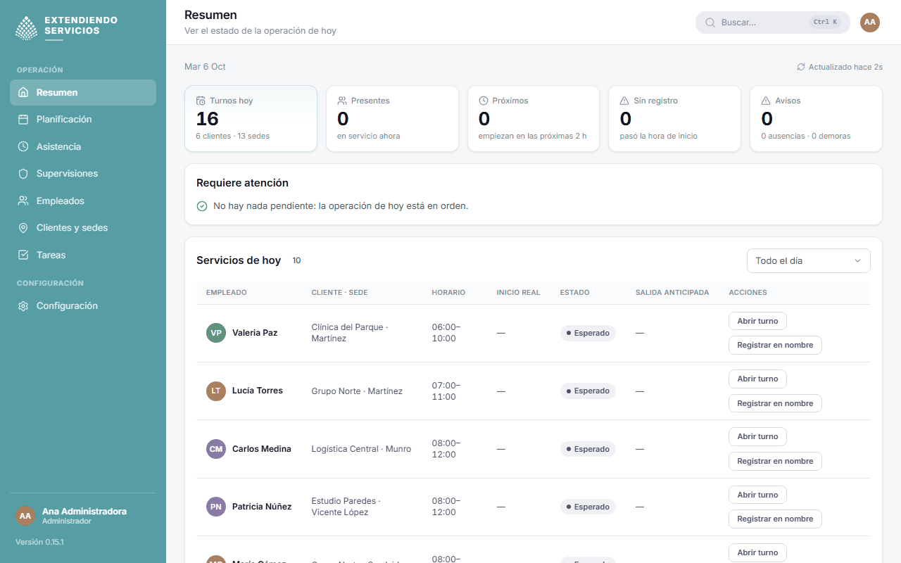

A la izquierda está el **menú**, con ocho secciones:

| Sección              | Para qué sirve                                                        |
| -------------------- | --------------------------------------------------------------------- |
| **Resumen**          | Cómo viene el día de hoy y qué requiere atención                      |
| **Planificación**    | El cronograma por mes, semana y día; crear y generar turnos           |
| **Asistencia**       | Quién llegó, quién avisó y quién no registró                          |
| **Supervisiones**    | Asignar supervisiones y consultar calificaciones                      |
| **Empleados**        | La dotación: empleados y supervisores                                 |
| **Clientes y sedes** | Clientes, sus sedes, contactos y servicios                            |
| **Tareas**           | Las listas de tareas de cada cliente y de cada sede                   |
| **Configuración**    | Usuarios y roles, datos de la empresa, feriados, criterios, seguridad |

Arriba hay un **buscador** (también se abre con las teclas `Ctrl` y `K`) y tu foto, que abre el menú con **Mi perfil** y **Cerrar sesión**. Abajo del menú ves tu nombre, tu rol y la versión de la plataforma.

Las listas que se miran en vivo (Resumen, Asistencia, Planificación del día) se **actualizan solas** cada 30 segundos; dicen "Actualizado hace n s". No hace falta recargar.

---

## Puesta en marcha: en qué orden cargar todo

Si empezás desde cero (o querés revisar que no falte nada), este es el orden que evita volver para atrás:

1. **Empresa** (solo dueño): logo, nombre, teléfono de soporte y texto de consentimiento de ubicación.
2. **Feriados** (solo dueño): cargar los del año.
3. **Criterios de calificación** (solo dueño): la guía que usan los supervisores.
4. **Clientes**, con sus **contactos**.
5. **Sedes** de cada cliente (con ubicación en el mapa si querés verlas ahí).
6. **Tareas:** la lista de tareas de cada cliente (y de las sedes que necesiten una propia).
7. **Servicios** de cada sede: días de la semana, horario y dotación.
8. **Empleados y supervisores**, con su usuario.
9. **Generar los turnos del mes.**
10. **Asignar personal** a cada turno.

Si tenés mucha información para cargar de una vez (decenas de clientes o de empleados), no hace falta cargarla a mano: hay una planilla de Excel y un procedimiento de importación (`docs/carga-inicial.md`).

---

## Clientes y sedes

### Crear un cliente

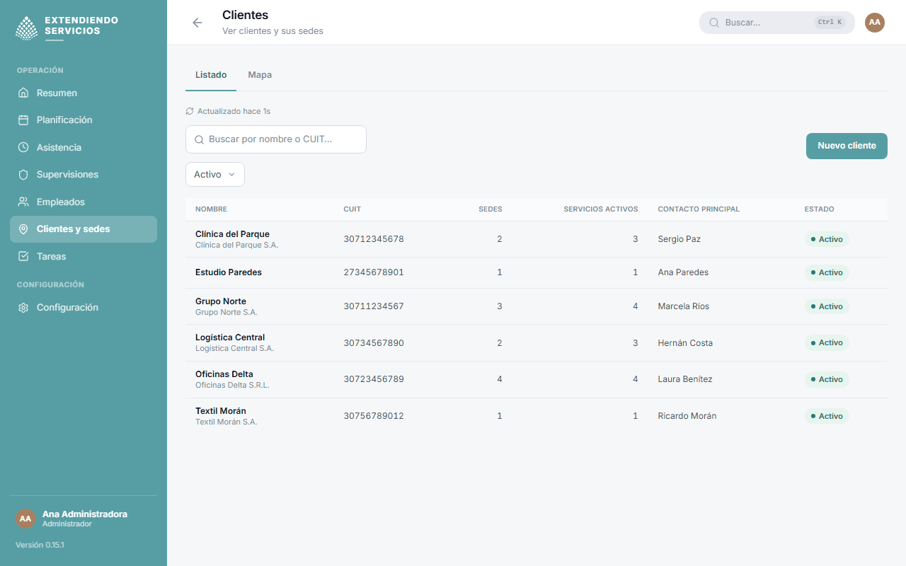

1. Entrá a **Clientes y sedes** y tocá **Nuevo cliente**.
2. Completá:
   - **Razón social** (obligatoria) y **Nombre de fantasía** (el que se muestra en las pantallas).
   - **CUIT** de 11 números, sin guiones.
   - **Estado:** **Activo**, **Suspendido** o **Baja**. Solo un cliente **Activo** admite turnos.
   - **Dirección administrativa** y **Notas**.
   - **Ubicación (opcional):** escribí la dirección en **Buscar dirección** y tocá el botón; el marcador cae en el mapa. Si no es el lugar exacto, movelo a mano.
3. Tocá **Crear cliente**.

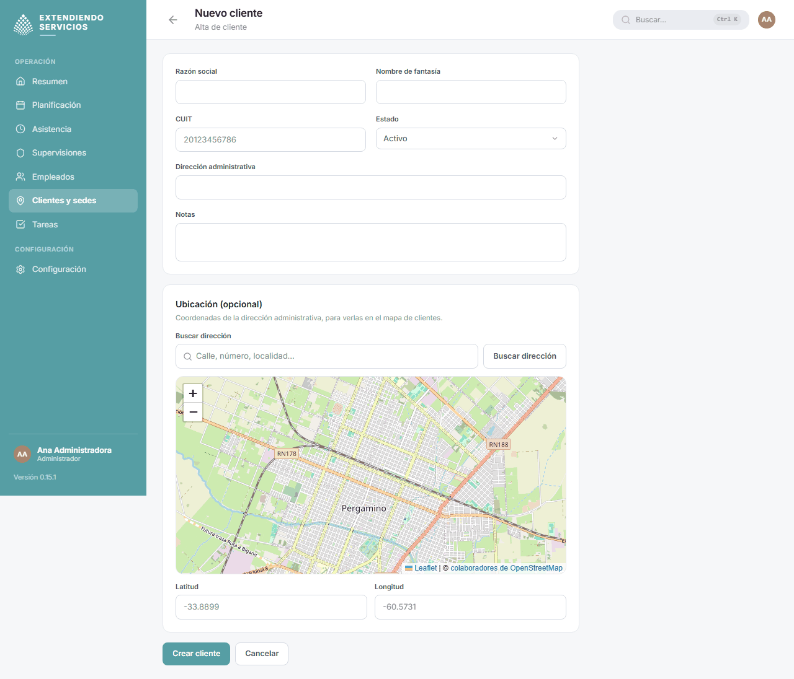

En el listado podés buscar por nombre o CUIT y filtrar por estado. Se ve cuántas sedes y cuántos servicios activos tiene cada cliente y quién es su contacto principal.

### La ficha del cliente

Tocá un cliente. Arriba ves sus datos, con **Cambiar estado** y **Editar**. Abajo hay cuatro pestañas:

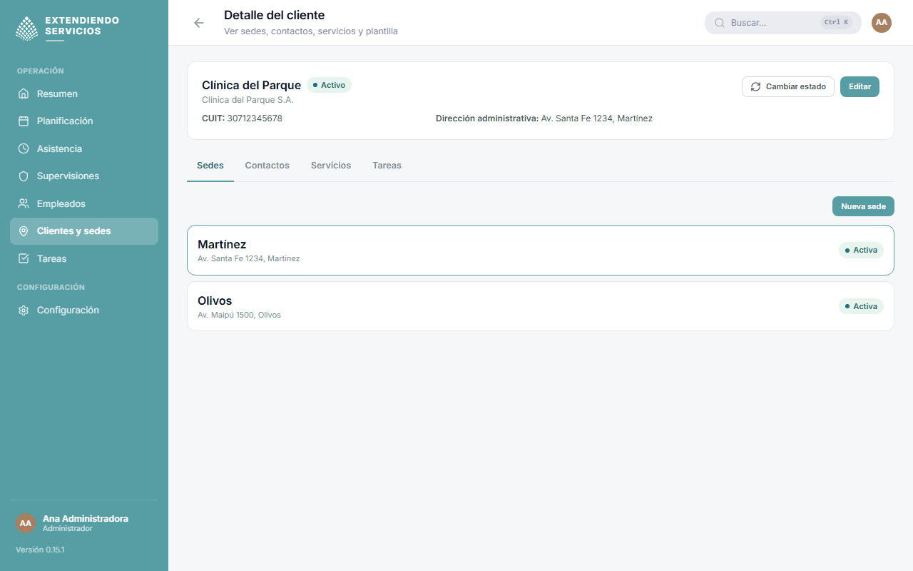

- **Sedes:** sus sedes, con el botón **Nueva sede**.
- **Contactos:** las personas de contacto. **Nuevo contacto** (nombre, cargo, teléfono, email). Podés marcar uno como **Principal**: es el que se ve en el listado.
- **Servicios:** todos los servicios del cliente, con **Nuevo servicio**.
- **Tareas:** la lista de tareas del cliente (ver [Tareas](#tareas-de-cada-servicio-plantillas)).

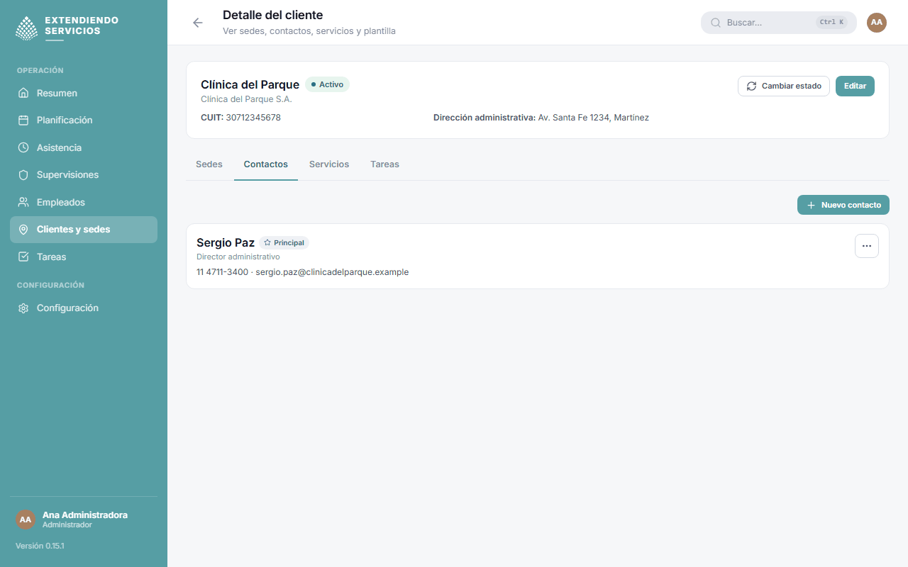

Para dejar de trabajar con un cliente, usá **Cambiar estado**: **Suspendido** si es temporal o **Baja** si es definitivo. No se borra nada: se conserva su historial.

### Crear una sede

1. En la ficha del cliente, pestaña **Sedes**, tocá **Nueva sede**.
2. Completá:
   - **Nombre**, **Estado** (**Activa** o **Inactiva**), **Dirección** y **Localidad**.
   - **Contacto en la sede** y **Teléfono de contacto**: lo ve el empleado en su celular para llamar.
   - **Horario del edificio**, por ejemplo "Lun a vie 7 a 20".
   - **Instrucciones de acceso:** por dónde entrar, a quién avisar.
   - **Restricciones informativas:** **No usar el teléfono en la sede**, **No se permiten fotos**, y **Otras restricciones**. Son avisos para el empleado, no bloquean nada.
   - **Ubicación (opcional):** **Buscar dirección** y ajustar el marcador, para que la sede aparezca en el mapa.
3. Tocá **Crear sede**.

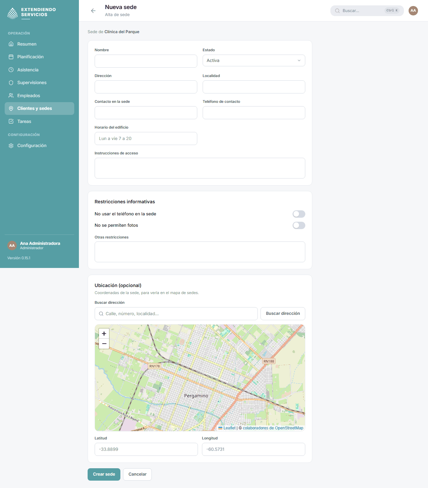

### La ficha de la sede

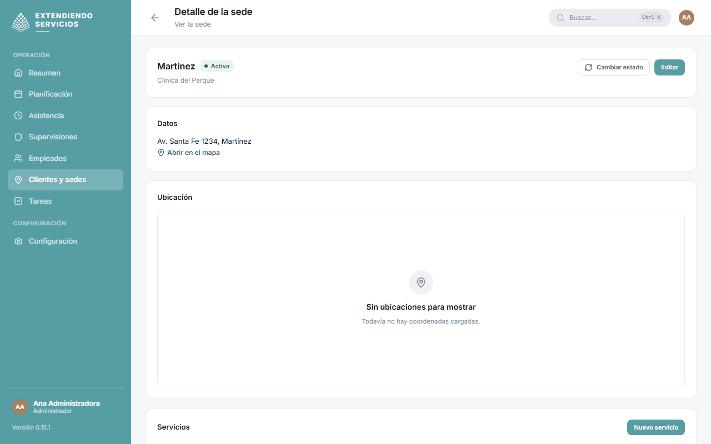

Muestra los datos, el mapa (si cargaste la ubicación), los **servicios** de la sede (con **Nuevo servicio**), la lista de tareas que usa y sus próximos turnos. Desde acá podés **Editar** o **Cambiar estado**.

### Ver todas las sedes en un mapa

En **Clientes y sedes**, la pestaña **Mapa** muestra todas las sedes que tienen ubicación cargada, con un color por estado. Tocá un marcador para ver el cliente, la dirección y los servicios activos. Podés filtrar por cliente. Arriba se indica cuántas sedes quedaron afuera por no tener ubicación.

---

## Tareas de cada servicio (plantillas)

Cada turno nace con una **lista de tareas** (por ejemplo "Barrer y trapear", "Limpiar baños"). Esa lista sale de una **plantilla**: una por cliente, y opcionalmente una propia para una sede que necesite otra cosa. Los empleados marcan esas tareas desde el celular.

**Permiso "Editar plantillas de tareas"** para crear o cambiar.

1. Entrá a **Tareas** y elegí el **Cliente**.
2. En **Ámbito** elegí **Plantilla del cliente**, o una sede: la sede usa la del cliente salvo que le crees una propia.

   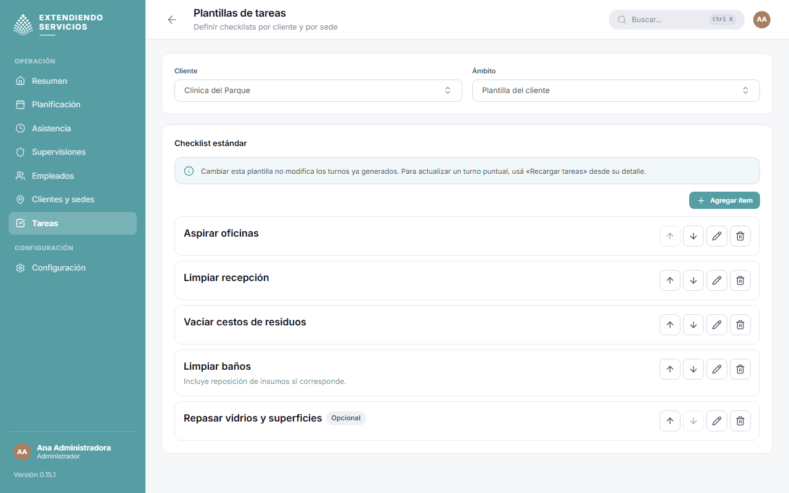

3. Tocá **Agregar ítem**, escribí el **título**, una **descripción** si hace falta, y marcá si es **obligatoria** u opcional. Guardá.
4. Con las **flechas** subís o bajás un ítem. Con el **lápiz** lo editás, con el **tacho** lo quitás.
5. Para que una sede tenga una lista propia, elegí la sede en **Ámbito** y creá su plantilla (parte de la del cliente, y la podés cambiar).

Dos cosas importantes:

- **Cambiar una plantilla no modifica los turnos que ya existen.** Los turnos nuevos nacen con la lista nueva. Para actualizar un turno que todavía no empezó, abrilo y tocá **Recargar tareas**.
- Las tareas **opcionales** no impiden terminar el servicio; las **obligatorias** que queden sin hacer solo generan un aviso al empleado.

---

## Servicios y turnos

Un **servicio** es un trabajo recurrente en una sede (por ejemplo "Limpieza mañana, de lunes a viernes de 6 a 10, con 2 personas"). Un **turno** es un día concreto de ese servicio. Primero se define el servicio, después se **generan los turnos** de cada mes.

### Crear un servicio

1. Entrá a la ficha del cliente o de la sede y tocá **Nuevo servicio**.
2. Completá:
   - **Cliente** y **Sede** (la sede se elige después del cliente).
   - **Nombre** (por ejemplo "Limpieza mañana"), **Estado** (**Activo**, **Pausado** o **Finalizado**: solo un servicio activo genera turnos) y **Dotación** (cuántas personas hacen falta, de 1 a 10).
   - **Días y franja horaria:** tildá los **días de la semana** y elegí **Desde** y **Hasta**. El horario no puede cruzar la medianoche.
   - **Trabaja los feriados:** si está apagado, ese servicio no genera turnos en los feriados.
   - **Vigencia:** desde qué fecha rige y, opcionalmente, hasta cuándo.
   - **Horas mensuales (informativas)** y **Notas**: son datos de referencia.
3. Tocá **Crear servicio**.

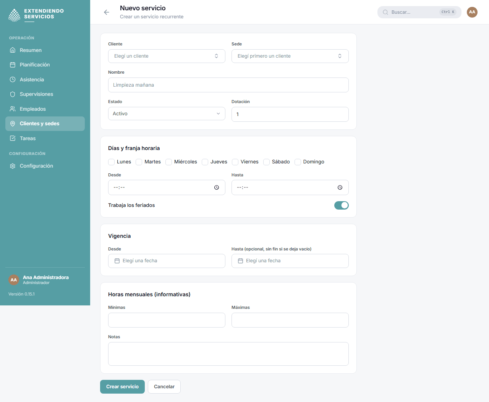

Si más adelante cambiás un servicio, **los turnos ya generados no cambian**: se aplica a los que generes después.

### Generar los turnos del mes

**Permiso "Generar turnos del mes".**

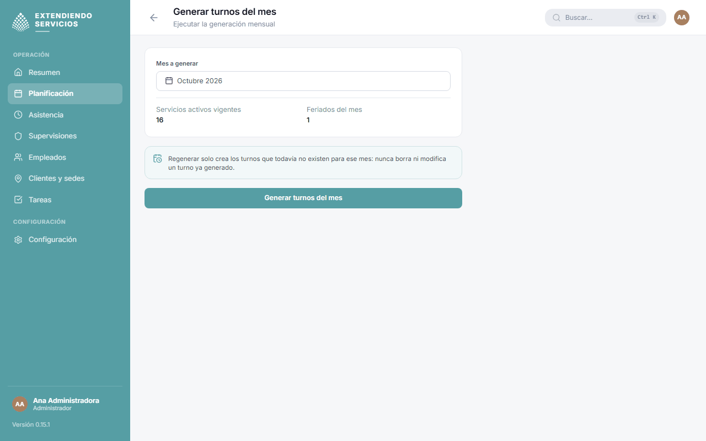

1. Entrá a **Planificación** y tocá **Generar turnos del mes** (o a la pantalla del mismo nombre).
2. Elegí el **Mes a generar**. Ves cuántos servicios activos vigentes hay y cuántos feriados tiene el mes.
3. Tocá **Generar turnos del mes**.
4. Al terminar, un mensaje dice cuántos turnos creó, cuántos omitió porque ya existían y cuántos porque caían en feriado.

Es seguro repetirlo: **solo crea los turnos que todavía no existen**; nunca borra ni modifica uno ya generado.

### Crear un turno puntual

Para un trabajo que no es recurrente (una limpieza especial, un reemplazo):

1. En **Planificación**, tocá **Nuevo turno**.
2. Elegí **Cliente**, **Sede**, **Fecha**, **Desde**, **Hasta** y **Dotación**. Podés agregar **Notas**.
3. Tocá **Crear turno**. Si la fecha es feriado, la pantalla te avisa.

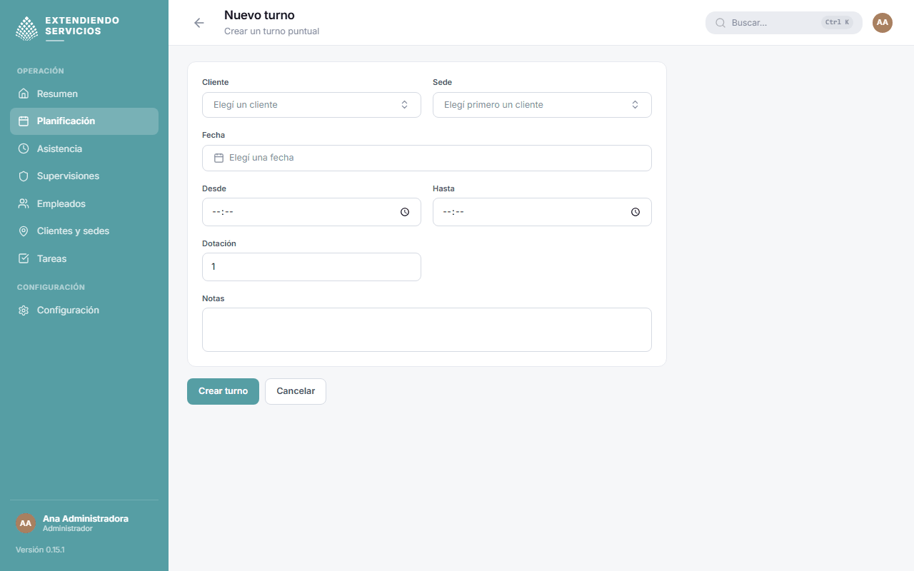

### Ver el cronograma

En **Planificación** hay tres vistas, con las pestañas **Mes**, **Semana** y **Día**.

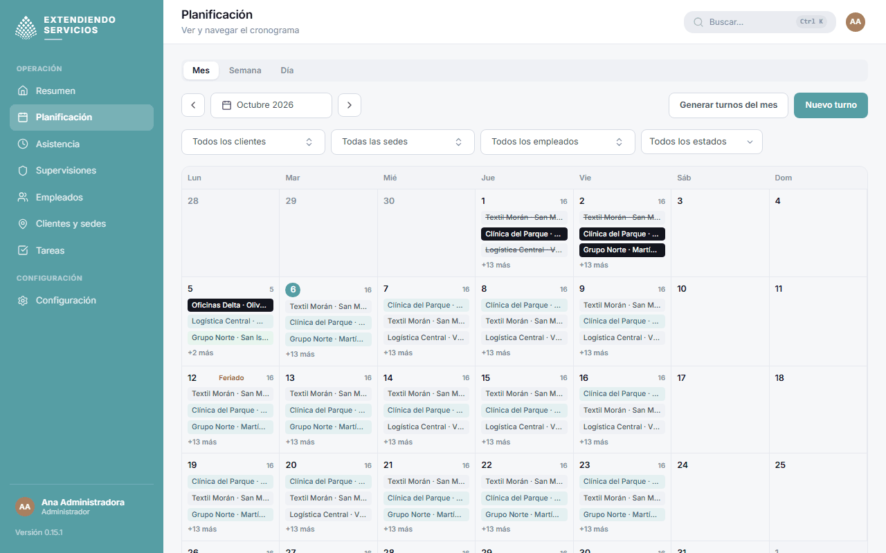

- **Mes:** un calendario con un chip por turno (cliente y sede), con el color del estado y los feriados marcados. Con las flechas o el selector cambiás de mes. Podés filtrar por cliente, sede, empleado y estado. En el celular se convierte en una lista de días.
- **Semana:** una grilla con cada empleado y sus servicios de la semana. Las celdas vacías dicen **Libre**. Sirve para ver la carga de cada persona.

  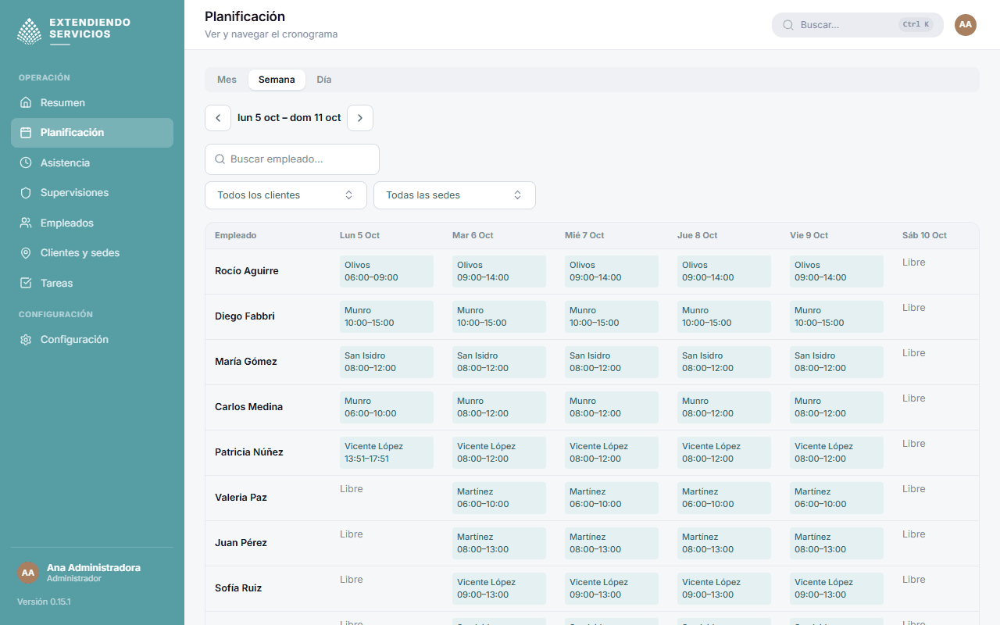

- **Día:** los turnos de una fecha, agrupados por franja horaria, con la **dotación** (asignados sobre requeridos) y el estado. Con **Ver** abrís el turno, con **Editar** cambiás la franja, con **Cancelar** lo cancelás.

  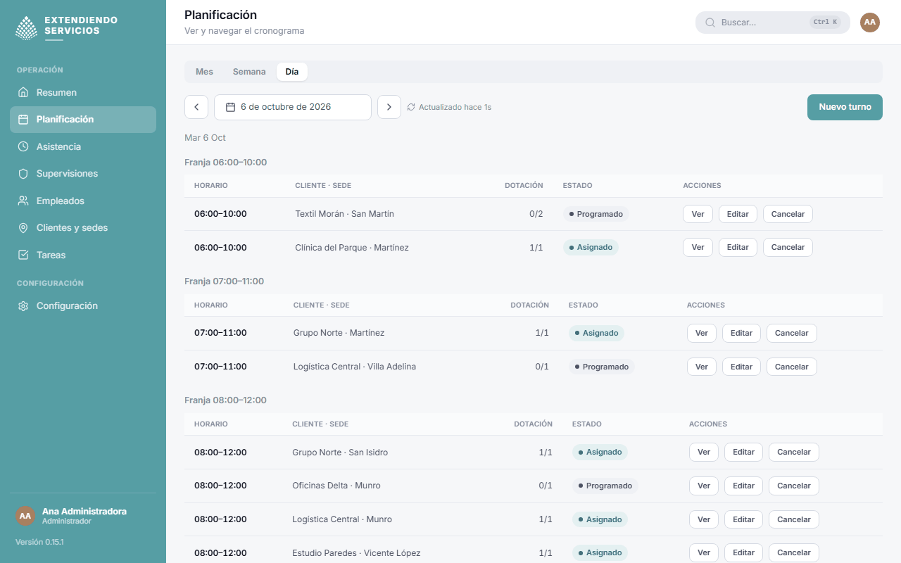

**Estados de un turno:** **Programado** (todavía sin personal), **Asignado**, **En curso**, **Finalizado** y **Cancelado**. Además, un turno aparece como **Sin cubrir** cuando le falta personal.

### El detalle de un turno

Abrí cualquier turno para ver y operar sobre él.

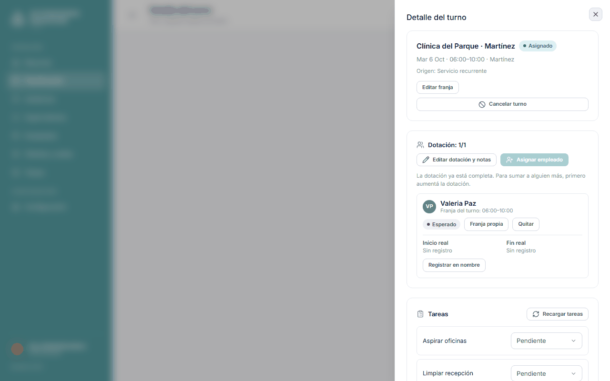

Ves el cliente y la sede, la fecha y la franja, el estado, y de dónde viene (servicio recurrente o turno puntual). Y estas secciones:

- **Dotación:** quiénes están asignados, con su estado, el inicio y el fin reales, los avisos y las observaciones que cargaron.
- **Tareas:** las tareas del turno y su estado.
- **Supervisiones:** quién supervisa ese turno.
- **Notas administrativas.**

Acciones: **Editar franja** (cambiar el horario del turno), **Editar dotación y notas**, **Cancelar turno** (pide un **Motivo de la cancelación**; **Permiso "Cancelar turnos"**), **Asignar empleado**, **Recargar tareas**, **Asignar supervisión**.

Un turno que ya empezó solo permite cambiar la hora de fin. Un turno cancelado se conserva en el cronograma con su motivo.

---

## Asignar personal

1. Abrí el turno (desde **Planificación**, **Resumen** o **Asistencia**).
2. Tocá **Asignar empleado**. Se abre una lista con todas las personas activas y un buscador.

   Cada persona muestra etiquetas que te ayudan a decidir:

   | Etiqueta                            | Qué significa                                                               |
   | ----------------------------------- | --------------------------------------------------------------------------- |
   | **Habilitado y disponible** (verde) | Puede trabajar para ese cliente y está disponible en ese día y horario      |
   | **No habilitado para el cliente**   | Tiene restringidos otros clientes y este no está entre ellos                |
   | **Fuera de su disponibilidad**      | La franja no coincide con la disponibilidad que declaró                     |
   | **De licencia**                     | Tiene una licencia cargada para esa fecha                                   |
   | **Se superpone con …** (rojo)       | Ya está en otro turno que se pisa con este horario: **no se puede asignar** |
   | **También en …** (gris)             | Tiene otro turno ese día, en un horario que no choca                        |

3. Elegí a la persona. Si hace falta, indicá una **Franja propia (opcional)**: otro horario distinto del del turno, solo para ella.
4. Tocá **Asignar**.

Si la persona no está habilitada, está fuera de su disponibilidad o está de licencia, la plataforma **asigna igual y te avisa**: "Asignamos igual, con advertencias". Es un aviso para que decidas vos; si no era lo que querías, usá **Quitar**. En cambio, **una superposición de horarios se rechaza siempre**: "El empleado ya tiene otro turno en ese horario."

Otras acciones sobre una asignación, en el detalle del turno:

- **Franja propia:** cambiar el horario de esa persona.
- **Quitar:** sacar a la persona del turno (pide un motivo).
- Si el turno ya empezó, asignar o quitar requiere el **permiso "Registrar asistencia por otros"**.
- La **dotación** (cuántas personas hacen falta) se cambia con **Editar dotación y notas**.

---

## Empleados y supervisores

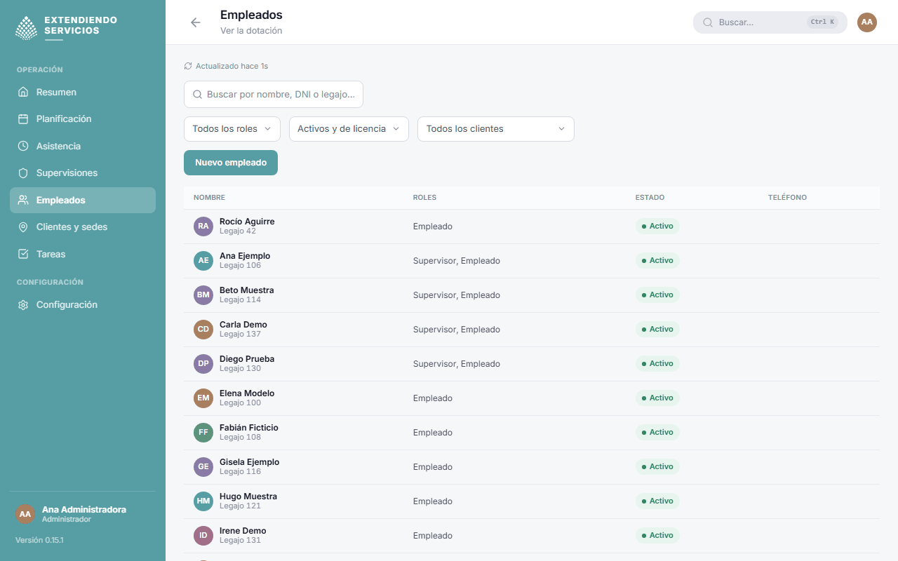

En **Empleados** ves a todo el personal, con su foto, nombre, legajo, roles, estado y teléfono. Se puede buscar por **nombre, DNI o legajo** y filtrar por **rol**, **estado** y **cliente habilitado**.

Un supervisor es una persona con el rol **Supervisor**. Una misma persona puede ser **empleado y supervisor** a la vez: en su celular ve las dos vías.

### Dar de alta un empleado o un supervisor

**Permiso "Gestionar usuarios".**

1. Tocá **Nuevo empleado**.
2. En **Roles** tildá **Empleado**, **Supervisor** o los dos.
3. En **Usuario y contraseña** completá el **Email de login** (con ese email la persona entra a la app) y una **Contraseña inicial** de al menos 8 caracteres. La persona la puede cambiar después desde su perfil. Pasale la contraseña por un **canal seguro**, nunca por un grupo.
4. En **Datos personales**: **Nombre**, **Apellido**, **DNI** (solo números), **CUIL** (11 números), **Teléfono**, **Fecha de nacimiento** y **Domicilio**.
5. En **Datos laborales**: **Legajo** (la plataforma sugiere el siguiente, lo podés cambiar), **Fecha de ingreso** y **Notas**.
6. En **Contacto de emergencia**: nombre, teléfono y vínculo.
7. Tocá **Crear**.

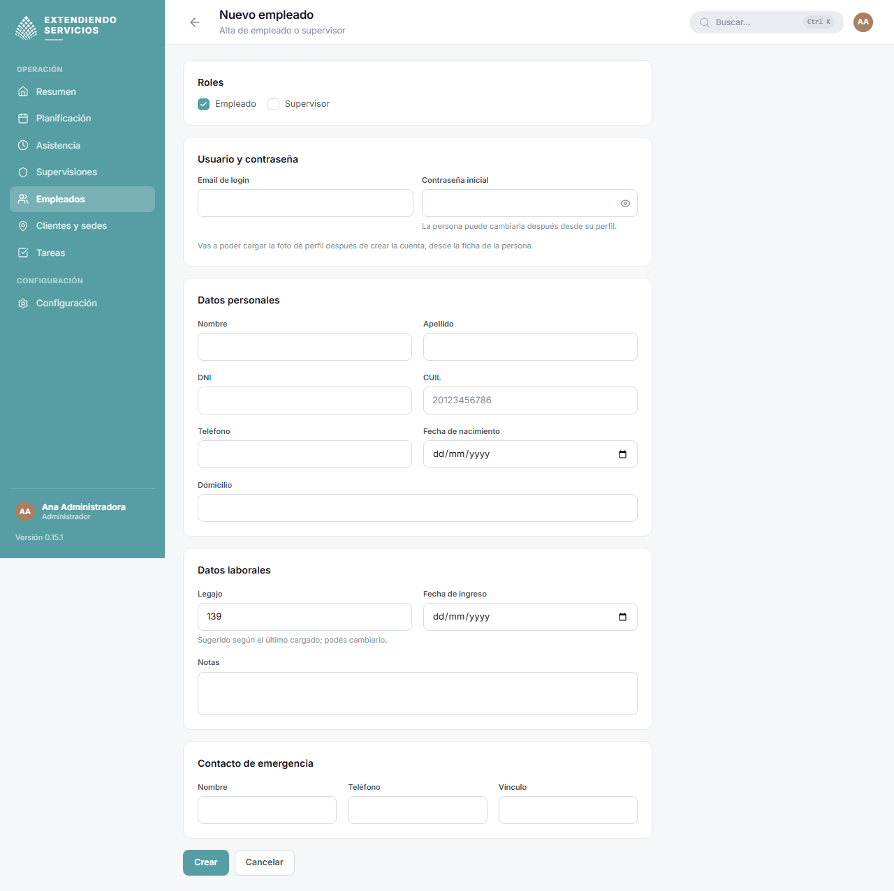

La foto de perfil se carga después, desde la ficha o desde el perfil de la propia persona.

### La ficha de la persona

Tocá a una persona para ver todo sobre ella.

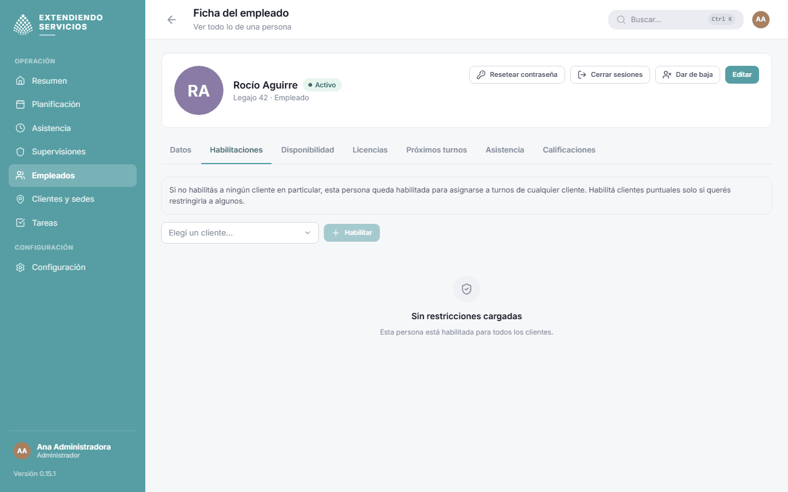

Arriba tenés las acciones: **Resetear contraseña**, **Cerrar sesiones**, **Dar de baja** y **Editar**. Abajo, siete pestañas:

- **Datos:** datos personales, laborales, contacto de emergencia, usuario y roles (con **Editar roles**).
- **Habilitaciones:** a qué clientes puede ir la persona. **Si no habilitás a ningún cliente en particular, queda habilitada para todos.** Habilitá clientes puntuales solo si querés restringirla a algunos: elegí el cliente y tocá **Habilitar**.
- **Disponibilidad:** en qué días y horarios dice poder trabajar. Elegí el día y la franja y tocá **Agregar**. Es una guía: al asignar, la plataforma avisa si la franja no coincide, pero no lo impide.
- **Licencias:** períodos en que no trabaja (vacaciones, enfermedad). **Agregar licencia** con fecha de inicio y de fin. En el cronograma semanal la persona aparece atenuada y, al asignarla, se avisa.
- **Próximos turnos:** lo que tiene asignado. Con **Ver semana** abrís la grilla de esa persona.
- **Asistencia:** el historial de turnos pasados con inicio, fin, avisos y observaciones. Se puede cambiar el rango de fechas.
- **Calificaciones:** las que recibió de los supervisores (solo lo ve Administración; el empleado no las ve).

### Resetear la contraseña, cerrar sesiones y dar de baja

**Permiso "Gestionar usuarios"** en los tres casos.

- **Resetear contraseña:** escribís una contraseña nueva y la pasás a la persona por un canal seguro.
- **Cerrar sesiones:** cierra la sesión de la persona en todos sus dispositivos (por ejemplo, si perdió el celular).
- **Dar de baja:** la persona **no puede iniciar sesión** y queda marcada como baja. **El historial se conserva** y nada se borra. Si tiene que volver, el **dueño** la reactiva (ver [Usuarios y roles](#usuarios-y-roles)).

---

## Seguir el día: Resumen y Asistencia

### Resumen

Es la pantalla de inicio. Muestra cómo viene el día de hoy:

- **Turnos hoy**, con cuántos clientes y sedes.
- **Presentes:** cuántas personas están en servicio ahora.
- **Próximos:** turnos que empiezan en las próximas 2 horas.
- **Sin registro:** personas cuya hora de inicio ya pasó y todavía no registraron.
- **Avisos:** ausencias y demoras avisadas.

Debajo, **Requiere atención** junta lo que hay que resolver ahora. Si no hay nada, dice "No hay nada pendiente: la operación de hoy está en orden." Lo que aparece:

- Personas **sin registro** pasada la hora de inicio.
- Servicios **en curso pasada la hora de fin sin fin registrado**.
- Personas con **ausencia avisada**, con la opción de asignar un reemplazo.
- **Turnos sin cubrir.**

Y **Servicios de hoy**: una fila por persona con el cliente, la sede, el horario, el inicio real, el estado y la salida anticipada. Con el filtro **Todo el día** elegís una franja. Desde cada fila podés **Abrir turno** o **Registrar en nombre**.

**Un aviso que manda un empleado desde su celular aparece acá en menos de un minuto, sin recargar.**

### Asistencia de hoy

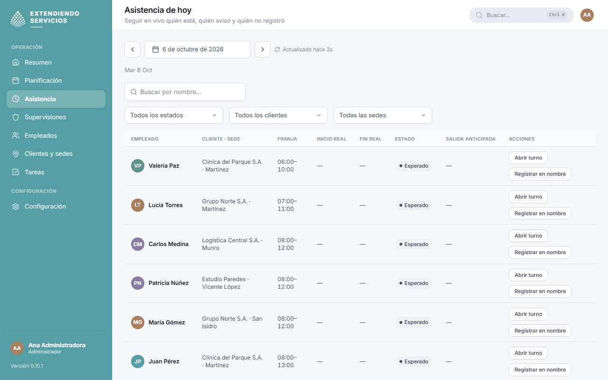

La lista completa del día, para seguir quién está. Cada fila muestra el empleado, el cliente y la sede, la franja, el **Inicio real**, el **Fin real**, el estado y la **Salida anticipada** (cuántos minutos).

Los **estados** son: **Esperado**, **Presente**, **Finalizado**, **Demora avisada** (con los minutos), **Ausencia avisada** (con el motivo) y **Sin registro**. "Sin registro" no lo marca nadie: aparece solo cuando pasó la hora de inicio y la persona no registró nada.

Podés filtrar por estado, cliente y sede, buscar por nombre y cambiar de fecha con las flechas o el calendario. Los días anteriores se ven en solo lectura. Acciones de cada fila: **Abrir turno**, **Registrar en nombre** y **Llamar** (si la persona tiene teléfono cargado).

### Registrar en nombre de un empleado

**Permiso "Registrar asistencia por otros".** Sirve cuando una persona no puede usar la app (sin señal, sin batería, se olvidó) o avisa por teléfono.

1. En **Asistencia**, **Resumen** o el detalle del turno, tocá **Registrar en nombre**.
2. Elegí la **acción**: **Inicio**, **Fin**, **Cierre manual**, **Demora** o **Ausencia** (se ofrecen solo las que corresponden en ese momento).
3. Completá según la acción:
   - **Inicio, fin y cierre manual:** la **Hora** (por omisión, ahora; puede ser cualquiera desde las 00:00 del día del turno hasta ahora, **nunca una hora futura**) y el **Motivo**, que es obligatorio.
   - **Demora:** los minutos (de 1 a 600) y un motivo opcional.
   - **Ausencia:** el motivo de la lista (Enfermedad, Trámite, Problema personal, Problema de transporte, Otro) y, si es "Otro", el detalle. A diferencia del empleado, la administración puede registrar una ausencia **también después** de la hora de inicio.
4. Confirmá.

Queda anotado que lo cargó Administración y quién fue. El **cierre manual** sirve para cerrar un servicio que quedó sin fin registrado.

---

## Supervisiones y calificaciones

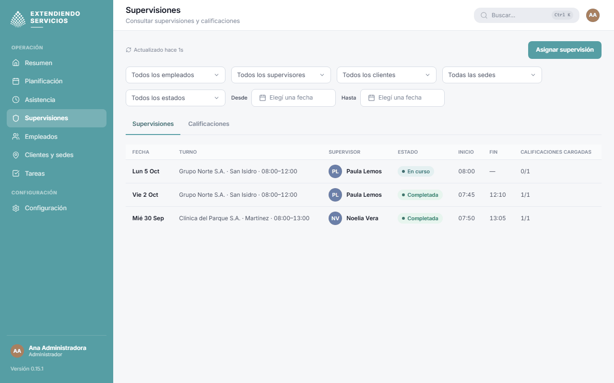

En **Supervisiones** consultás y asignás. La pantalla tiene dos pestañas:

- **Supervisiones:** una fila por supervisión, con la fecha, el turno (cliente, sede, franja), el supervisor, el estado (**Asignada**, **En curso**, **Completada**, **No realizada** o **Cancelada**), el inicio y el fin, y cuántas calificaciones se cargaron sobre el total de empleados.
- **Calificaciones:** una fila por empleado calificado, con la fecha, la sede, el supervisor, el puntaje y el comentario.

Los filtros permiten buscar por empleado, supervisor, cliente, sede, rango de fechas y estado.

### Asignar una supervisión

**Permiso "Asignar supervisiones".**

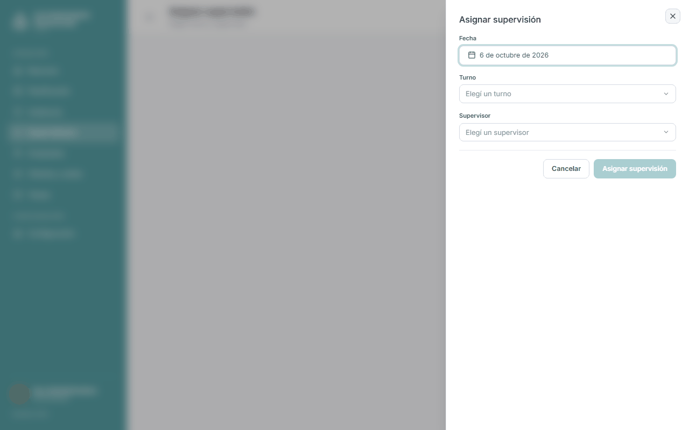

1. En **Supervisiones**, tocá **Asignar supervisión** (también se puede hacer desde el detalle de un turno).
2. Elegí la **Fecha**, el **Turno** (la lista muestra los turnos de esa fecha que no están cancelados ni terminados) y el **Supervisor**.
3. Si el supervisor también está asignado como empleado en ese turno, la pantalla te avisa: conviene elegir a otra persona, porque nadie puede calificarse a sí mismo.
4. Confirmá. La supervisión aparece en **Hoy** del supervisor.

### Ver, cancelar o corregir una supervisión

Tocá una fila para abrir su detalle.

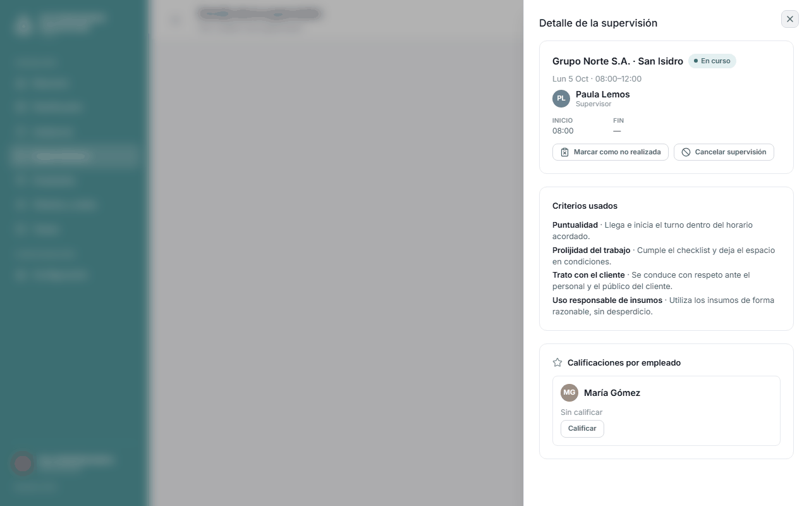

Ves el turno, el supervisor, el estado, los criterios que se usaron y las **calificaciones por empleado**, con el puntaje (de 1 a 5 estrellas), el comentario y quién lo editó y cuándo. Acciones:

- **Marcar como no realizada** y **Cancelar supervisión** (**Permiso "Asignar supervisiones"**).
- **Calificar** o **Editar** una calificación (**Permiso "Editar calificaciones"**). El supervisor solo puede cambiar sus calificaciones mientras dura el turno; Administración puede hacerlo siempre, y queda anotado quién lo hizo.

---

## Configuración

Reúne cinco pantallas, con pestañas arriba: **Usuarios**, **Empresa**, **Feriados**, **Criterios de calificación** y **Eventos de seguridad**. El administrador solo ve **Usuarios** y **Empresa**.

### Usuarios y roles

Lista a todas las personas con acceso, con su rol y su estado (**Activo** o desactivado). Por omisión muestra solo las activas: activá **Mostrar desactivados** para ver también las demás. **Solo dueño:** la columna **Último ingreso**.

En la fila de cada persona, el botón de los tres puntos abre las acciones:

| Acción                          | Quién la hace                                                                                   |
| ------------------------------- | ----------------------------------------------------------------------------------------------- |
| **Resetear contraseña**         | Dueño; administrador con **permiso "Gestionar usuarios"** (solo sobre empleados y supervisores) |
| **Cambiar email**               | Ídem                                                                                            |
| **Cerrar sesiones**             | Ídem                                                                                            |
| **Desactivar** (pide un motivo) | Ídem                                                                                            |
| **Reactivar**                   | **Solo dueño**                                                                                  |
| **Editar roles y capacidades**  | **Solo dueño**                                                                                  |

**Solo dueño: nuevo administrador.** Con **Nuevo administrador** completás nombre, apellido, **Email de login** y una **Contraseña inicial**, igual que para un empleado.

**Solo dueño: dar permisos a un administrador.** En el menú de la persona, **Editar roles y capacidades**. Ahí se tildan los siete permisos (**Gestionar usuarios**, **Cancelar turnos**, **Editar calificaciones**, **Editar plantillas de tareas**, **Registrar asistencia por otros**, **Generar turnos del mes**, **Asignar supervisiones**). Los permisos **se guardan solos** al activarlos. Los roles se guardan con **Guardar roles**; si al guardar le sacás un rol a alguien, se le cierran las sesiones.

### Empresa

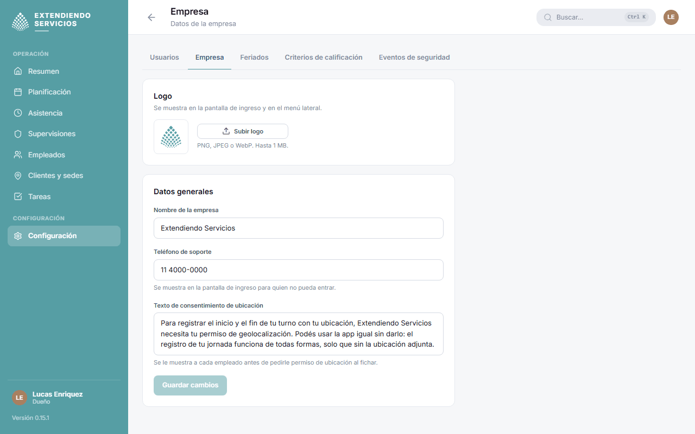

- **Logo:** **Subir logo** (PNG, JPEG o WebP, hasta 1 MB). Se ve en la pantalla de ingreso y en el menú. **Lo pueden cambiar el dueño y los administradores.**
- **Solo dueño:** **Nombre de la empresa**, **Teléfono de soporte** (aparece en la pantalla de ingreso, para quien no pueda entrar) y **Texto de consentimiento de ubicación** (lo lee cada empleado antes de dar su permiso). Se guardan con **Guardar cambios**.

### Feriados (solo dueño)

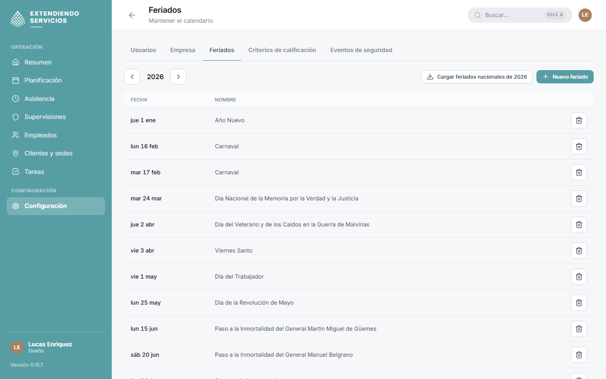

El calendario de feriados, por año. Con **Cargar feriados nacionales de <año>** se agregan de una vez los nacionales; con **Nuevo feriado** sumás uno propio (por ejemplo un feriado local). Los feriados tienen dos efectos: se marcan en el cronograma, y **los servicios que tienen apagado "Trabaja los feriados" no generan turnos esos días**.

### Criterios de calificación (solo dueño)

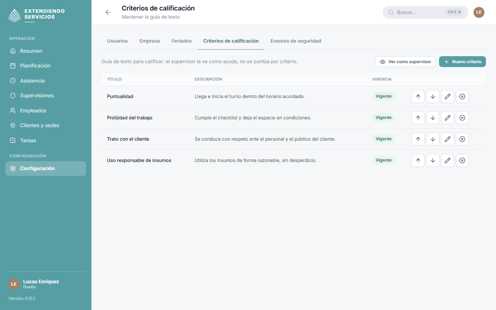

La guía de texto que ven los supervisores cuando califican (por ejemplo "Puntualidad", "Calidad de la limpieza"). **No se les pone puntaje a cada criterio**: el puntaje es uno solo por empleado, de 1 a 5. Con **Nuevo criterio** agregás uno (**Título** y **Descripción**) y lo guardás con **Agregar criterio**; empieza a regir desde ese momento. Para dejar de usar uno, **Cerrar criterio**: las supervisiones que ya empezaron conservan los criterios con los que se hicieron.

### Eventos de seguridad (solo dueño)

Una tabla de consulta con los inicios de sesión y los cambios de acceso (altas, bajas, cambios de roles, resets de contraseña): fecha y hora, qué pasó, quién lo hizo y sobre quién. Se puede filtrar por tipo de evento, persona y fechas. Sirve para revisar quién hizo qué.

---

## Usar la administración desde el celular

La administración se adapta a tablet y celular. En el celular, el menú pasa a una barra de abajo con cinco botones: **Hoy**, **Planificar**, **Asistencia**, **Supervisiones** y **Más** (donde está el resto: empleados, clientes y sedes, tareas y configuración).

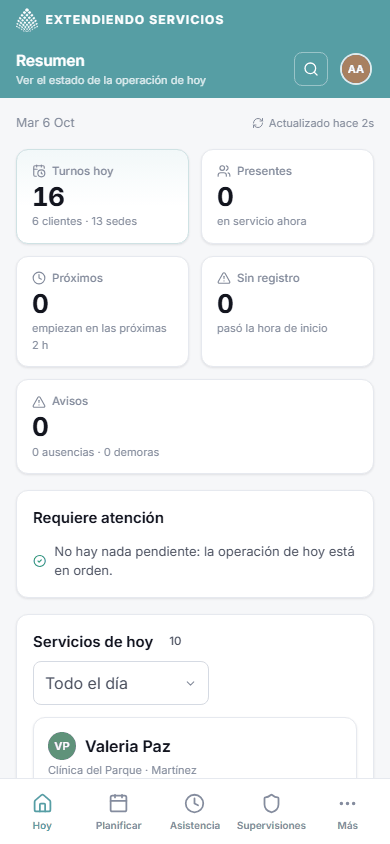

Las tablas se ven como tarjetas, y los paneles ocupan toda la pantalla. Desde el celular podés hacer lo mismo que en la computadora; lo más útil: ver el **Resumen**, **asignar un empleado** a un turno, **registrar en nombre** de otra persona y **asignar una supervisión**.

---

## Lo que no incluye la Plataforma Base

Para evitar malentendidos: las siguientes funciones **no existen** en esta versión. Si las necesitan, se cotizan como ampliación (módulos previstos en el acuerdo):

- **Fotos** como evidencia de tareas o de supervisiones.
- **Notificaciones al celular** (avisos al empleado cuando se le asigna un turno, recordatorios). Hoy el empleado ve sus cambios al abrir la app, en **Cambios desde tu última visita**.
- Provisión y control de **insumos**.
- Cálculo de **horas, puntualidad y reportes** por empleado o cliente, y **exportaciones**.
- Funcionamiento **sin conexión** con sincronización posterior.
- **Mapa de presencia en tiempo real** de los empleados.

---

## Cuando algo no anda

Todos los problemas frecuentes, con su causa y su solución, están en [`troubleshooting.md`](troubleshooting.md). Los más comunes para administración:

- [No me aparece un botón](troubleshooting.md#71-no-me-aparece-un-botón-por-ejemplo-cancelar-turno-o-generar-turnos-del-mes): falta un permiso que da el dueño.
- [Creé un servicio y no aparecen los turnos](troubleshooting.md#75-creé-un-servicio-pero-no-aparecen-los-turnos): hay que generarlos.
- [No puedo asignar a una persona](troubleshooting.md#73-el-empleado-ya-tiene-otro-turno-en-ese-horario): superposición de horarios.
- [Una persona no puede entrar](troubleshooting.md#1-ingreso-y-sesión): reseteo de contraseña, reactivación.
