# Guía del empleado

DOC-019. Cómo usar la aplicación de Extendiendo Servicios desde tu celular: ver tus servicios, registrar cuándo empezás y cuándo terminás, marcar las tareas y avisar si llegás tarde o no vas.

Las imágenes son de ejemplo, con datos inventados. Si algo en tu celular se ve un poco distinto, seguí los pasos igual: los nombres de los botones son los mismos.

## Qué necesitás

- Un celular con **Chrome** (Android 8 o más nuevo) o **Safari** (iPhone con iOS 16.4 o más nuevo).
- Tu **email** y tu **contraseña**. Te las da Administración cuando te da de alta. Podés cambiar la contraseña cuando quieras (ver [Tu perfil](#tu-perfil)).
- La dirección de la aplicación. Te la pasa Administración.

Si ves un cartel amarillo arriba que dice "Entorno de prueba: los datos de esta versión no son reales", estás en la versión de práctica: lo que hagas ahí no cuenta de verdad.

## Instalar la app en tu celular

Instalarla es opcional, pero conviene: queda un ícono en tu pantalla de inicio y se abre a pantalla completa, como cualquier otra app. Es la misma aplicación que en el navegador: no es una app distinta.

### En Android (Chrome)

1. Abrí la dirección de la aplicación en **Chrome**.
2. Cuando aparezca el cartel de instalación, tocá **Instalar**. Si no aparece, tocá los tres puntitos de arriba a la derecha y elegí **Instalar aplicación** (en algunos teléfonos dice **Agregar a la pantalla principal**).
3. Confirmá en el cartel del teléfono.
4. Buscá el ícono **Ext. Servicios** en tu pantalla de inicio y abrilo desde ahí.

### En iPhone (Safari)

En iPhone no hay un botón de instalar: se hace a mano, y **solo desde Safari** (no desde Chrome).

1. Abrí la dirección de la aplicación en **Safari**.
2. Tocá **Compartir** (el cuadrado con la flecha hacia arriba).
3. Elegí **Agregar a pantalla de inicio** y tocá **Agregar**.
4. Abrí la app desde el ícono nuevo. **La primera vez tenés que ingresar de nuevo**: es normal, la app instalada guarda sus datos aparte de Safari.

Si el cartel de instalación te molesta, podés cerrarlo: no vuelve a aparecer por una semana.

## Iniciar sesión

1. Abrí la app.
2. Escribí tu **Email**.
3. Escribí tu **Contraseña**. Si querés ver lo que escribís, tocá el ojito.
4. Tocá **Ingresar**.

Vas a ver tu pantalla **Hoy**. La sesión queda abierta: la próxima vez que abras la app ya vas a estar adentro, sin escribir nada.

Si aparece "El email o la contraseña no son correctos.", revisá lo que escribiste. Si no te acordás de la contraseña, mirá el punto siguiente.

## Si te olvidaste la contraseña

1. En la pantalla de ingreso, tocá **¿Olvidaste tu contraseña?**
2. Escribí tu email y tocá **Mandar instrucciones**.
3. Vas a ver "Revisá tu correo". Abrí tu correo y buscá el mensaje (si no está, mirá en **Spam**).
4. Tocá el enlace del mensaje. Se abre una pantalla para elegir la **Contraseña nueva** (al menos 8 caracteres) y confirmarla.
5. Volvé a ingresar con la contraseña nueva.

Si no te llega el correo, o el enlace no funciona, llamá a Administración: te pueden dar una contraseña nueva. Más ayuda en [`troubleshooting.md`](troubleshooting.md#12-no-llega-el-correo-para-recuperar-la-contraseña).

## Conocé la app

Abajo tenés tres botones:

- **Hoy:** tus servicios de hoy y de los próximos días.
- **El botón redondo del medio (la huella):** **Fichar**, para registrar que empezás o seguir el servicio que ya empezaste.
- **Más:** tu perfil, avisar demora o ausencia, y cerrar sesión.

Si además sos supervisor o supervisora, en **Más** vas a encontrar **Supervisión**, que te lleva a tus supervisiones (ver la [guía del supervisor](guia-supervisor.md)).

## Ver tus servicios

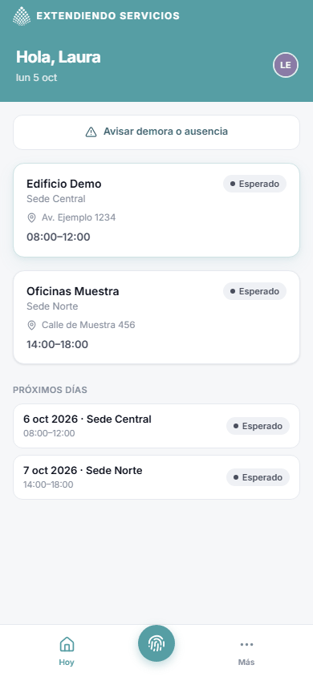

En **Hoy** ves:

- Arriba, un aviso **Cambios desde tu última visita** si Administración te asignó un servicio nuevo, lo cambió de horario o lo canceló desde la última vez que entraste.
- Una tarjeta por cada servicio de hoy, con el cliente, la sede, la dirección, el horario y tu estado: **Esperado**, **Demora avisada**, **Presente** o **Finalizado**. Si un servicio se canceló, dice **Cancelado**.
- **Próximos días:** una lista simple con tus servicios de los próximos siete días.

Si no tenés nada, dice "No tenés servicios hoy".

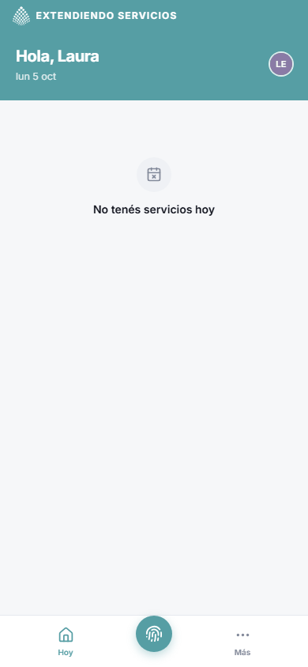

En ese caso no tenés que hacer nada: si creés que te falta uno, avisá a Administración.

### El detalle de un servicio

Tocá una tarjeta para ver todo lo que necesitás saber antes de ir.

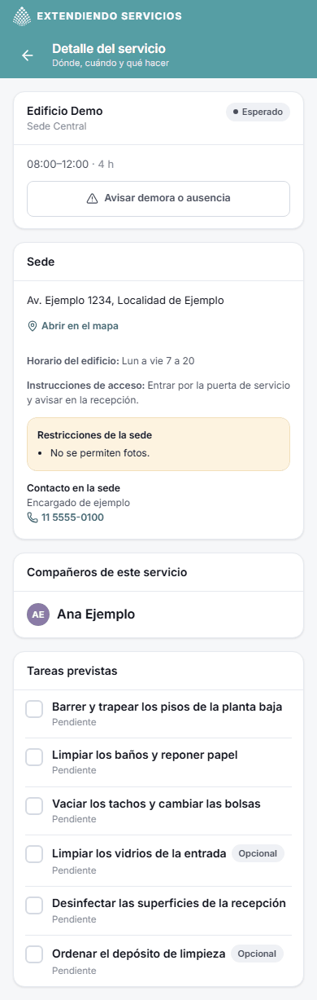

- **Sede:** la dirección (tocá **Abrir en el mapa** para que te lleve el teléfono), el horario del edificio y las instrucciones de acceso.
- **Restricciones de la sede:** por ejemplo "No se permiten fotos" o "No usar el teléfono en la sede". Son avisos para que los tengas en cuenta.
- **Contacto en la sede:** tocá el número para llamar.
- **Compañeros de este servicio:** con quién trabajás.
- **Tareas previstas:** la lista de lo que hay que hacer. Las que dicen **Opcional** no son obligatorias.

## Registrar el inicio

Podés registrar el inicio a cualquier hora del día del servicio. No hace falta estar en la sede para tocar el botón, pero la idea es hacerlo cuando llegás.

1. Tocá el **botón redondo del medio** (Fichar).
2. Si tenés más de un servicio hoy, la app pregunta "¿Cuál vas a empezar?". Elegí el que corresponde.

   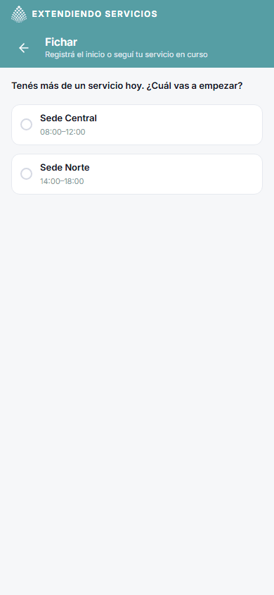

3. **La primera vez**, la app te explica el uso de la ubicación ("Tu ubicación al fichar"). Tenés dos opciones:

   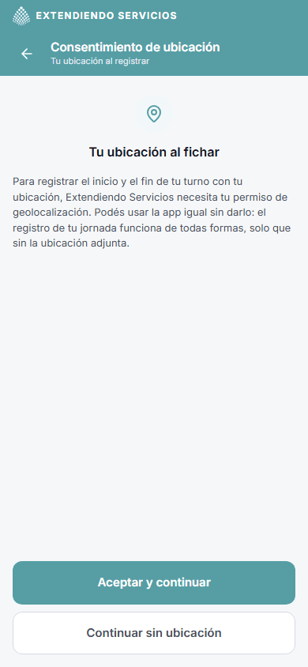

   - **Aceptar y continuar:** el teléfono te va a preguntar si permitís la ubicación. Tocá **Permitir mientras se usa la app**.
   - **Continuar sin ubicación:** no se manda tu ubicación. **Registrar el inicio funciona igual.**

   Podés cambiar de idea después desde tu perfil.

4. Verás el servicio y la hora. La hora que figura ahí es de referencia: **la que vale y queda registrada es la del servidor**, no la del celular.
5. Tocá **Registrar inicio**.

   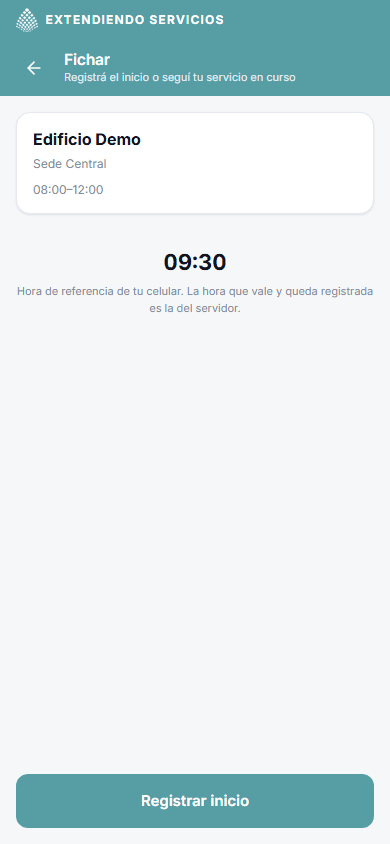

Si aparece "Este turno no es de hoy." o "Ya registraste el inicio.", mirá [los problemas frecuentes](troubleshooting.md#5-registro-de-jornada-avisos-y-tareas-empleados).

## Durante el servicio

Al registrar el inicio entrás a **Servicio en curso**.

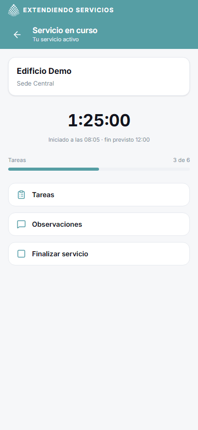

Ahí ves:

- El **cronómetro**, con la hora a la que iniciaste y la hora de fin prevista.
- Cuántas **tareas** hiciste (por ejemplo "3 de 6").
- Tres accesos: **Tareas**, **Observaciones** y **Finalizar servicio**.

Si salís de esta pantalla, volvés tocando el botón del medio (**Fichar**), que te lleva directo al servicio en curso.

### Marcar las tareas

1. Tocá **Tareas**.
2. Tocá el cuadradito de una tarea cuando la terminás: queda tildada en verde y se anota la hora ("Completada 09:00"). Se guarda en el momento.
3. Si te equivocaste, tocá el cuadradito de nuevo para deshacerlo.
4. Si una tarea no se pudo hacer, tocá **No realizada** (a la derecha de la tarea), escribí el **Motivo** y confirmá con **Marcar no realizada**.

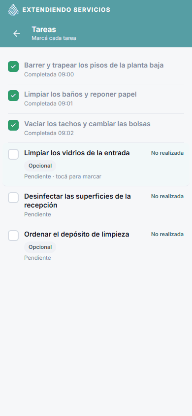

Las tareas solo se pueden marcar mientras el servicio está en curso: después de registrar el inicio y antes de registrar el fin. Las que dicen **Opcional** podés dejarlas sin hacer.

### Cargar una observación

Sirve para contar algo que Administración tenga que saber: un problema, algo que quedó pendiente, un pedido del cliente.

1. En **Servicio en curso**, tocá **Observaciones**.
2. Escribí lo que quieras (hasta 2000 caracteres). Es opcional.
3. Tocá **Guardar**.

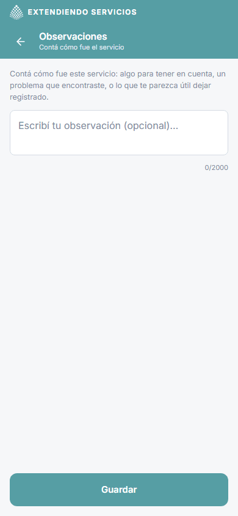

Administración y el supervisor del turno la ven. Podés volver a entrar y corregirla mientras el servicio no esté terminado.

## Registrar el fin

1. En **Servicio en curso**, tocá **Finalizar servicio** (o tocá el botón del medio y después el acceso).
2. Revisá el resumen: la hora de inicio, la hora actual, cuántas tareas completaste y si cargaste una observación.

   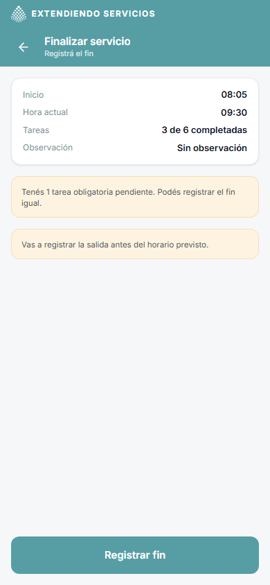

   - Si quedan tareas obligatorias sin hacer, aparece un aviso ("Tenés 1 tarea obligatoria pendiente. Podés registrar el fin igual."). **No te impide terminar.**
   - Si todavía no llegó la hora de fin prevista, aparece "Vas a registrar la salida antes del horario previsto." Es solo informativo.

3. Tocá **Registrar fin**.
4. Vas a ver el **Resumen del servicio**, que es tu comprobante: inicio, fin, duración, tareas y tu observación. Tocá **Volver a Hoy**.

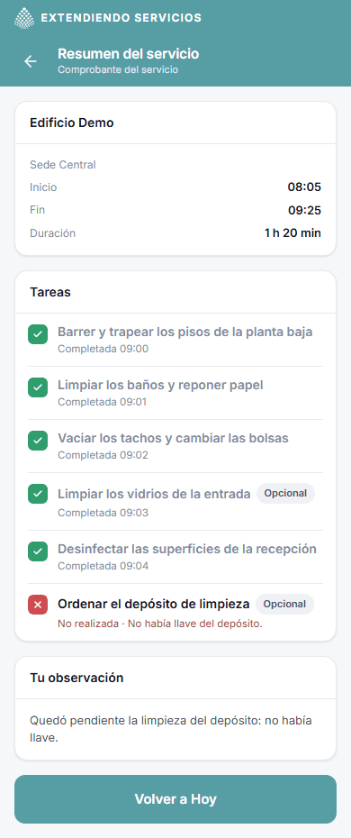

## Avisar demora o ausencia

Solo se puede avisar **antes de la hora de inicio** del servicio. Después, hay que llamar a Administración.

Podés entrar de tres lugares: el botón **Avisar demora o ausencia** de **Hoy**, el mismo botón dentro del detalle de un servicio, o **Más**, **Avisar demora o ausencia**.

1. Elegí el servicio sobre el que querés avisar y tocá **Continuar**.

   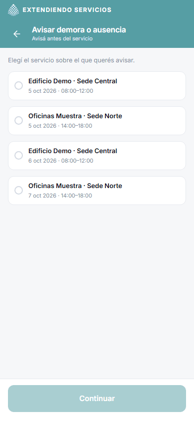

2. Elegí el tipo: **Demora** o **Ausencia**.
   - **Demora:** indicá cuántos minutos estimás que vas a llegar tarde. Podés contar el motivo (opcional).
   - **Ausencia:** elegí el motivo de la lista (Enfermedad, Trámite, Problema personal, Problema de transporte u Otro). Si elegís **Otro**, escribí el motivo.
3. Revisá el resumen y tocá **Confirmar aviso**.

El aviso le llega a Administración enseguida: lo ve en su tablero. En tu pantalla **Hoy** el servicio pasa a **Demora avisada** o **Ausencia avisada**, con el detalle ("Avisaste una demora de 15 min.").

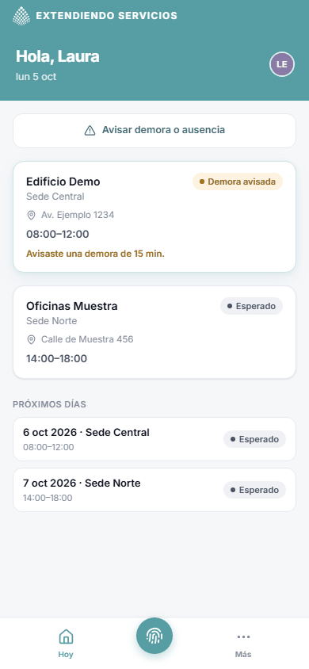

Si ya avisaste una demora, podés después avisar la ausencia. No podés repetir el mismo aviso.

## Tu perfil

En **Más**, tocá **Mi perfil**.

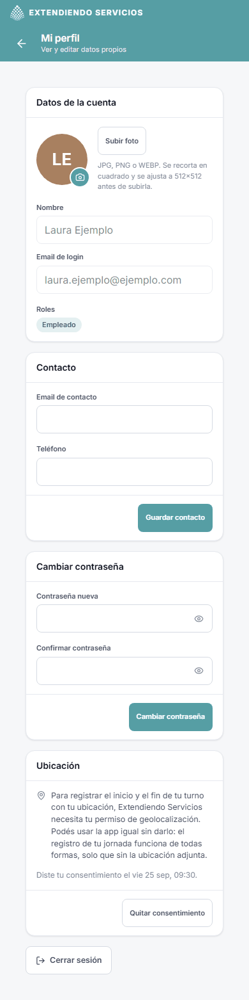

- **Foto:** **Subir foto** (o **Cambiar foto**). Se recorta en cuadrado.
- **Contacto:** tu email de contacto y tu teléfono. Tocá **Guardar contacto**.
- **Cambiar contraseña:** escribí la nueva (al menos 8 caracteres) dos veces y tocá **Cambiar contraseña**.
- **Ubicación:** muestra si diste tu consentimiento. Podés **Dar mi consentimiento** o **Quitar consentimiento** cuando quieras.

Tu nombre y tu email de ingreso no se cambian desde acá: si hay un error, avisá a Administración.

## Cerrar sesión

En **Más**, tocá **Cerrar sesión**. Después vas a tener que volver a ingresar con tu email y tu contraseña. Usalo si prestás o cambiás el celular.

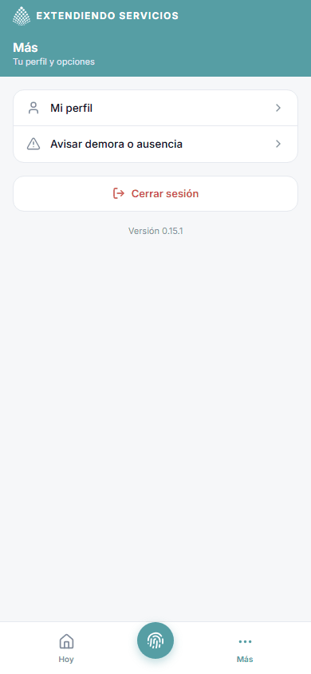

Al pie de **Más** también aparece la versión de la aplicación ("Versión x.y.z"): es útil si tenés que consultar algo con el soporte.

## Cuando algo no anda

- **No tenés internet:** la app abre, pero no muestra tus servicios y los botones para registrar quedan apagados. **Nada se guarda para después**: conectate y volvé a intentar.
- **Se cerró tu sesión o no podés entrar:** mirá [Ingreso y sesión](troubleshooting.md#1-ingreso-y-sesión).
- **El teléfono no te deja dar la ubicación:** registrá el inicio sin ubicación. Más en [Ubicación](troubleshooting.md#2-ubicación).
- **No ves la versión nueva de la app:** cuando haya una, aparece el cartel "Hay una versión nueva de la aplicación". Tocá **Actualizar ahora**. Más en [Instalación y actualización](troubleshooting.md#3-instalación-y-actualización-de-la-app).
- **Te olvidaste de registrar el inicio o el fin:** avisá a Administración. Pueden cargar la hora en tu nombre.

Todos los problemas frecuentes, con su solución, están en [`troubleshooting.md`](troubleshooting.md).
