# Guía del supervisor

DOC-020. Cómo usar la aplicación de Extendiendo Servicios desde tu celular si sos supervisor o supervisora: ver las supervisiones que te asignaron, registrar tu paso por cada sede, calificar a cada empleado y cerrar la supervisión.

Las imágenes son de ejemplo, con datos inventados. Los nombres de los botones son los mismos que vas a ver en tu celular.

## Qué necesitás

- Un celular con **Chrome** (Android 8 o más nuevo) o **Safari** (iPhone con iOS 16.4 o más nuevo).
- Tu **email** y tu **contraseña**, que te da Administración.
- La dirección de la aplicación, que también te pasa Administración.

Si ves un cartel amarillo arriba que dice "Entorno de prueba: los datos de esta versión no son reales", estás en la versión de práctica: lo que hagas ahí no cuenta de verdad.

Las supervisiones **las asigna Administración** (el dueño o un administrador): vos no las creás. Aparecen en tu pantalla **Hoy** cuando te las asignan.

## Instalar la app en tu celular

Es opcional, pero conviene: queda un ícono en la pantalla de inicio y se abre a pantalla completa. Es la misma aplicación que en el navegador.

### En Android (Chrome)

1. Abrí la dirección de la aplicación en **Chrome**.
2. Tocá **Instalar** en el cartel que aparece. Si no aparece, tocá los tres puntitos de arriba a la derecha y elegí **Instalar aplicación** (en algunos teléfonos dice **Agregar a la pantalla principal**).
3. Confirmá en el cartel del teléfono.
4. Abrí la app desde el ícono **Ext. Servicios** de tu pantalla de inicio.

### En iPhone (Safari)

En iPhone no hay un botón de instalar: se hace a mano, y **solo desde Safari** (no desde Chrome).

1. Abrí la dirección de la aplicación en **Safari**.
2. Tocá **Compartir** (el cuadrado con la flecha hacia arriba).
3. Elegí **Agregar a pantalla de inicio** y tocá **Agregar**.
4. Abrí la app desde el ícono nuevo. **La primera vez tenés que ingresar de nuevo**: es normal.

## Iniciar sesión

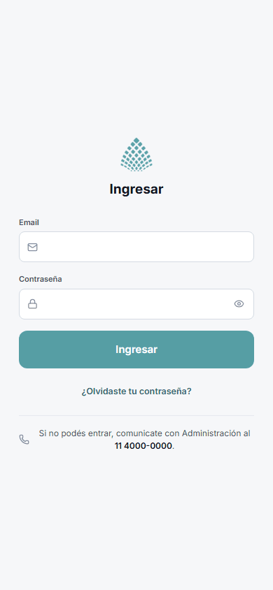

1. Abrí la app.
2. Escribí tu **Email** y tu **Contraseña** (con el ojito podés ver lo que escribís).
3. Tocá **Ingresar**.

Vas a ver tu pantalla **Hoy**. La sesión queda abierta: la próxima vez ya estás adentro.

## Si te olvidaste la contraseña

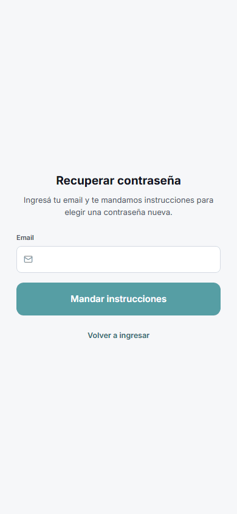

1. En la pantalla de ingreso, tocá **¿Olvidaste tu contraseña?**
2. Escribí tu email y tocá **Mandar instrucciones**.
3. Abrí tu correo (si no está, mirá en **Spam**) y tocá el enlace del mensaje.
4. Elegí una **Contraseña nueva** (al menos 8 caracteres), confirmala y volvé a ingresar.

Si no te llega el correo, llamá a Administración: te pueden dar una contraseña nueva. Más ayuda en [`troubleshooting.md`](troubleshooting.md#12-no-llega-el-correo-para-recuperar-la-contraseña).

## Conocé la app

Abajo tenés cuatro botones:

- **Hoy:** tus supervisiones de hoy y de los próximos días.
- **Supervisiones:** todas las que tenés pendientes, incluso las de fechas más lejanas.
- **Historial:** las que ya cerraste.
- **Más:** tu perfil y cerrar sesión.

Si además sos empleada o empleado, en **Más** vas a encontrar **Mis servicios**, que te lleva a tu jornada como empleado (ver la [guía del empleado](guia-empleado.md)).

## Ver tus supervisiones

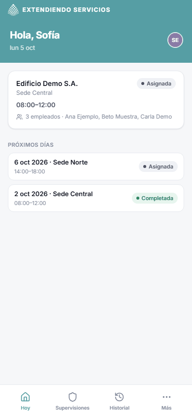

En **Hoy** ves una tarjeta por cada supervisión con:

- El cliente y la sede.
- El horario del servicio.
- El estado: **Asignada**, **En curso**, **Completada** o **No realizada**.
- Cuántos empleados hay para supervisar y sus nombres.

Más abajo, **Próximos días** muestra las de los próximos siete días. Si no tenés ninguna, dice "No tenés supervisiones hoy". La pestaña **Supervisiones** muestra todas las asignadas que todavía no cerraste.

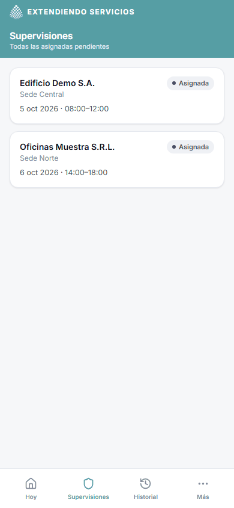

### El detalle de una supervisión

Tocá una tarjeta para ver todo sobre el servicio que vas a supervisar.

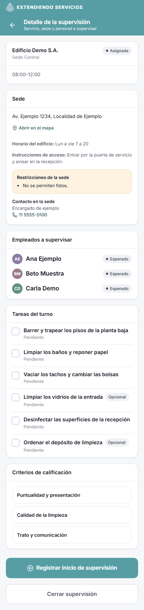

- **Sede:** la dirección (tocá **Abrir en el mapa** para que te lleve el teléfono), el horario del edificio, las instrucciones de acceso, las restricciones (por ejemplo "No se permiten fotos") y el contacto de la sede.
- **Empleados a supervisar:** quiénes trabajan en ese turno y su estado: **Esperado**, **Presente** (con la hora a la que empezó), **Finalizado** o **Ausencia avisada**.
- **Tareas del turno:** qué tiene que hacer el equipo y cómo van. Solo se miran, no se modifican desde acá.
- **Criterios de calificación:** la guía que definió la empresa para calificar. Son una ayuda para que todos califiquen con el mismo criterio. No se les pone puntaje uno por uno: el puntaje es uno solo por empleado.

Solo ves las supervisiones que te asignaron a vos.

## Registrar tu inicio en la sede

Cuando llegás a la sede:

1. Abrí la supervisión y tocá **Registrar inicio de supervisión**.
2. La primera vez, la app te explica el uso de la ubicación. Podés elegir **Aceptar y continuar** (el teléfono te pide permiso) o **Continuar sin ubicación**. **Registrar el inicio funciona igual sin ubicación.**
3. Tocá **Registrar inicio**. La hora que vale es la del servidor, no la del celular.

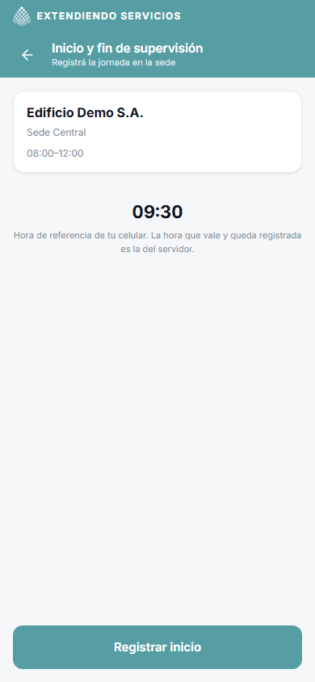

La supervisión pasa a **En curso**. En ese momento la app guarda los criterios de calificación vigentes, así que los criterios que ves son los que valen para esta supervisión aunque la empresa los cambie después.

## Calificar a cada empleado

Con la supervisión en curso, el detalle muestra un botón **Calificar** al lado de cada empleado.

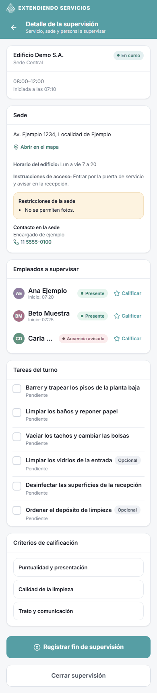

1. Tocá **Calificar** al lado del nombre.
2. Elegí de **1 a 5 estrellas**.
3. Escribí un **Comentario** si querés (es opcional, pero ayuda a Administración).
4. Mirá los **Criterios de calificación** que están abajo como guía.
5. Tocá **Guardar calificación**.

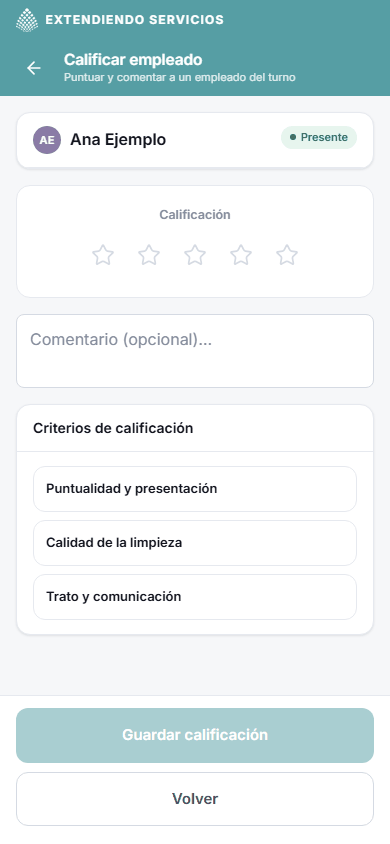

Reglas para tener en cuenta:

- Calificás **a cada empleado del turno**, también a quien avisó una ausencia si corresponde.
- Si volvés a calificar a la misma persona, se **reemplaza** la calificación anterior. En el detalle, el botón pasa a decir **Editar**.
- Podés crear y cambiar tus calificaciones **mientras dure el turno** (o hasta que registres el fin de tu supervisión, lo que ocurra último). Pasado ese plazo ya no se pueden cambiar: si hace falta, Administración puede corregirlas.
- No podés calificarte a vos mismo.
- Los empleados **no ven** sus calificaciones.

## Registrar tu fin y cerrar la supervisión

1. Cuando terminás en la sede, en el detalle tocá **Registrar fin de supervisión**.
2. Después tocá **Cerrar supervisión**.
3. Elegí **Completar**. La app te dice a cuántos empleados calificaste ("Calificaste a 2 de 3 empleados."). Si falta alguno aparece un aviso, pero **podés completar igual**.
4. Si querés, escribí una **Nota general**.
5. Tocá **Completar supervisión**.

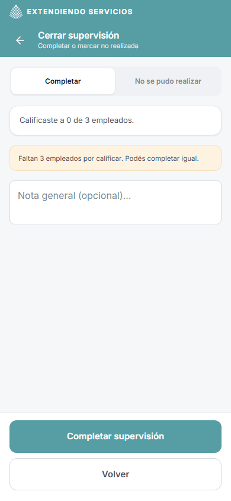

### Si no pudiste hacer la supervisión

1. Abrí la supervisión y tocá **Cerrar supervisión**.
2. Elegí **No se pudo realizar**.
3. Escribí el **Motivo** (es obligatorio).
4. Tocá **Marcar como no realizada**.

Queda en tu historial como **No realizada**, con el motivo, para que Administración lo vea.

## Consultar lo que ya cargaste

En **Historial** ves las supervisiones que ya cerraste: la fecha, el cliente y la sede, y las estrellas (el promedio de lo que calificaste). Tocá una para ver el detalle en solo lectura, con cada calificación y su comentario.

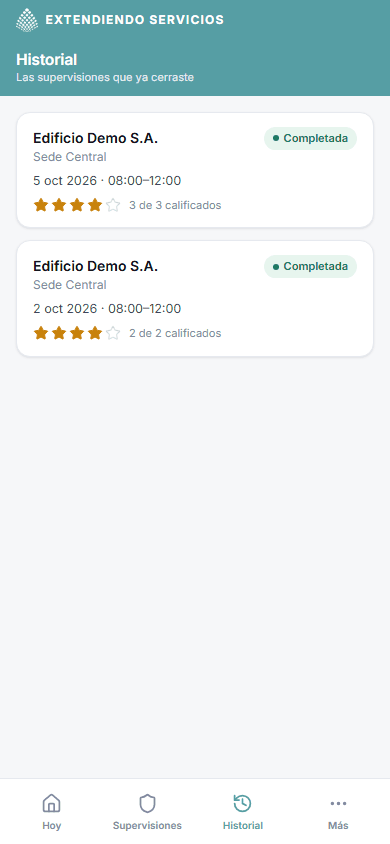

Ves solo tus propias supervisiones.

## Tu perfil

En **Más**, tocá **Mi perfil**. Ahí podés:

- Subir o cambiar tu **foto**.
- Cargar tu **email de contacto** y tu **teléfono**, y tocar **Guardar contacto**.
- **Cambiar tu contraseña**: escribila dos veces (al menos 8 caracteres) y tocá **Cambiar contraseña**.
- **Dar** o **quitar tu consentimiento de ubicación**.

Tu nombre y tu email de ingreso no se cambian desde acá: si hay un error, avisá a Administración.

## Cerrar sesión

En **Más**, tocá **Cerrar sesión**. Usalo si prestás o cambiás el celular. Al pie de la pantalla ves la versión de la aplicación ("Versión x.y.z").

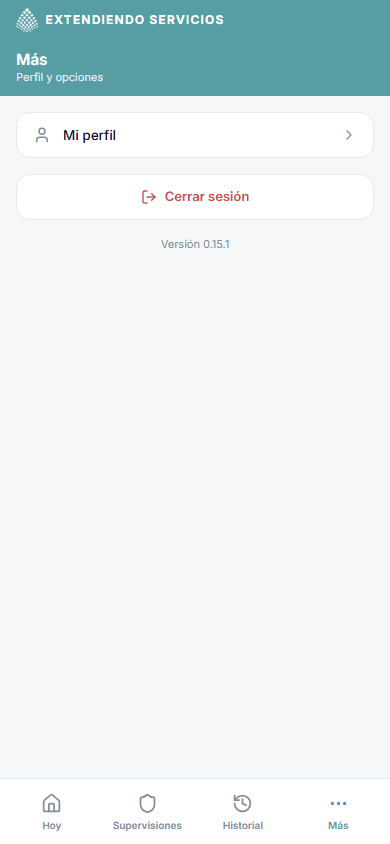

## Cuando algo no anda

- **No ves una supervisión que esperabas:** Administración todavía no te la asignó. Avisales.
- **"El plazo para editar esta calificación terminó.":** el turno ya terminó. Pedile a Administración que la corrija.
- **No tenés internet:** la app abre pero no muestra datos, y los botones para guardar quedan apagados. Nada se guarda para después: conectate y volvé a intentar.
- **Se cerró tu sesión o no podés entrar**, **la ubicación no funciona**, **no se actualiza la app**: mirá [`troubleshooting.md`](troubleshooting.md).

Todos los problemas frecuentes, con su solución, están en [`troubleshooting.md`](troubleshooting.md#6-supervisiones-supervisores).
